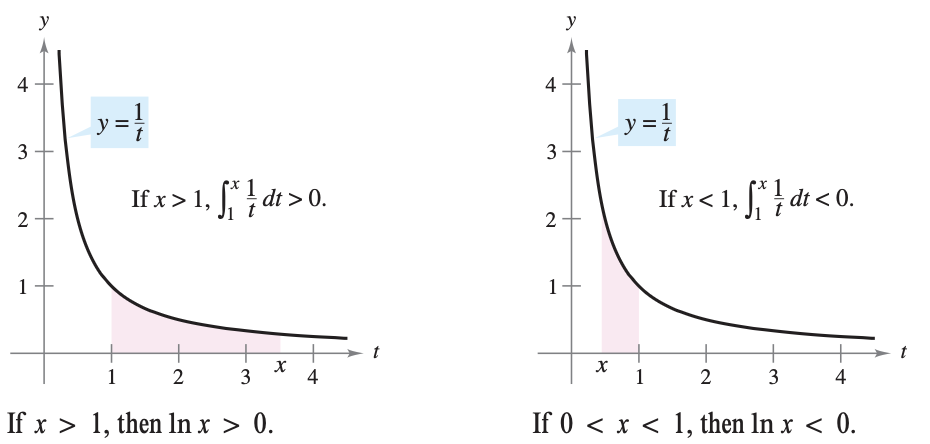
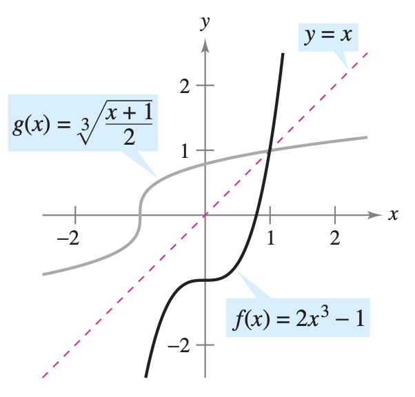
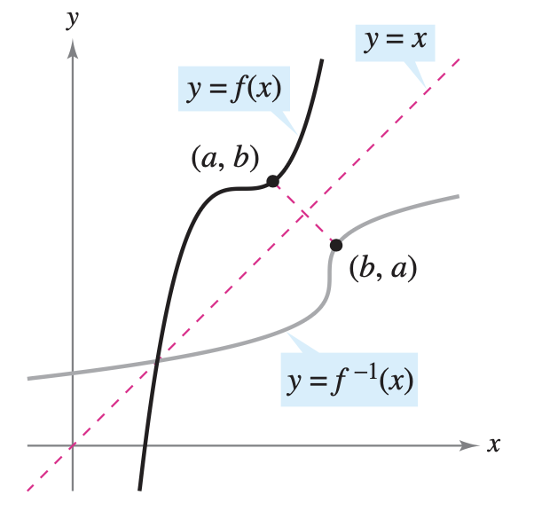
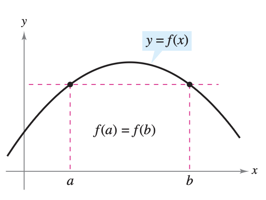
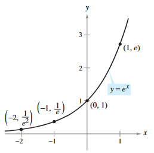
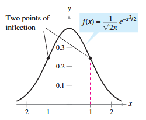
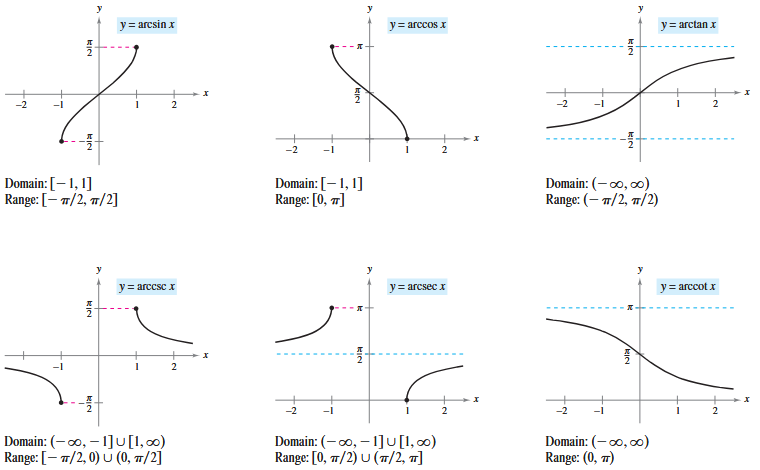
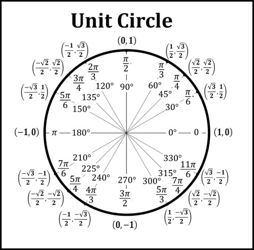
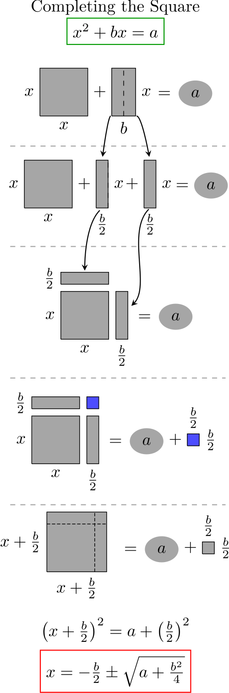

## 5.1 The Natural Logarithmic Function: Differentiation

::: {.callout-tip title="Objectives" icon=false}
| **Key Topics & Formulas** | **Success Criteria** | 
| :--- | :--- |
| Develop and use properties of the natural logarithmic function | I can use the properties of natural logarithms to rewrite, simplify, and solve expressions and equations. |
| Understand the definition of the number $e$ | I can explain what the number $e$ represents and describe how it is defined. |
| Find derivatives of functions involving the natural logarithmic function | I can find derivatives of functions that involve the natural logarithm. |
:::

### The Natural Logarithmic Function
Recall that the General Power Rule 
$$\int x^n dx = \frac{x^{n+1}}{n+1}+C, \quad n \neq -1$$
has an important disclaimer - it doesn't apply when $n = -1$. 

Earlier in the course, when we covered **Chapter 2**, I specifically gave you the rules that covered this. Namely, 
$$\frac{d}{dx} \ln(x) = \frac{1}{x}$$ 
therefore
$$\int x^{-1}dx = \int \frac{1}{x}dx = \ln(x)+C$$ 

In this chapter, we will discuss the **natural logarithm function**. Being neither algebraic nor trigonometric, it is in its own class called *logarithmic functions*.

::: {.callout-note title="Definition of the Natural Logarithmic Function" icon=false}
The **natural logarithmic function** is defined by
$$\ln(x) = \int_1^x \frac{1}{t}dt, \quad x>0$$
The domain of the natural logarithmic function is the set of all positive real numbers.
:::

From the definition, you can see that $\ln(x)$ is positive for $x>1$ and negative for $0<x<1$ as shown below. Moreover, $\ln(1)=0$ because the upper and lower limits of integration are equal when $x=1$.



::: {.callout-note title="Properties of the Natural Logarithmic Function" icon=false}
The natural logarithmic function has the following properties.

1. The domain is $(0,\infty)$ and the range is $(-\infty, \infty)$ 
2. The function is continuous, increasing, and one-to-one.
3. The graph is concave downward.
:::

::: {.proof}
The domain of $f(x)=\ln(x)$ is $(0,\infty)$ by definition. Moreover, the function is continuous because it is differentiable. It is increasing because its derivative
$$f'(x)=\frac{1}{x}$$
is positive for $x>0$. It is concave downward because 
$$f''(x) = -\frac{1}{x^2}$$ 
is negative for $x>0$.

The proof that $f$ is one-to-one is left as an exercise. 
The following limits imply that its range is the entire real line.
$$\lim_{x\to0^+} \ln(x)= -\infty \quad \text{ and } \quad \lim_{x\to \infty} \ln(x)= \infty$$
:::

Using the definition of the natural logarithmic functions, you can prove several important properties involving operations with natural logarithms.

::: {.callout-note title="Logarithmic Properties" icon=false}
If $a$ and $b$ are positive numbers and $n$ is rational, then the following properties are true.

1. $\ln(1) = 0$
2. $\ln(ab) = \ln(a) + \ln(b)$
3. $\ln(a^n) = n \ln(a)$
4. $\ln\left(\frac{a}{b}\right) = \ln(a) - \ln(b)$
:::

::: {.proof}
The first property has already been discussed. The proof of the second property follows from the fact that two antiderivatives of the same function differ at most by a constant. From the Second Fundamental Theorem of Calculus and the definition of the natural logarithmic function, you know that
$$\frac{d}{dx}[\ln(x)] = \frac{d}{dx} \left( \int_1^x \frac{1}{t}dt \right) = \frac{1}{x}$$
So, consider the two derivatives
$$\frac{d}{dx} [\ln(ax)] = \frac{a}{ax} = \frac{1}{x}$$
and 
$$\frac{d}{dx} [\ln(ax) + \ln(bx)] = 0 + \frac{1}{x} = \frac{1}{x}$$
Because $\ln(ax)$ and $\ln(a) +\ln(x)$ are both antiderivatives of $1/x$, they must differ at most by a constant.
$$\ln(ax) = \ln(a)+\ln(x)+C$$
By letting $x=1$, you can see that $C=0$. The third property can be proved similarly by comparing the derivatives of $\ln(x^n)$ and $n\ln(x)$. Finally, using the second and third properties, you can prove the fourth property.
$$\ln \left( \frac{a}{b} \right) = \ln[a(b^{-1})] = \ln(a) + \ln(b^{-1}) = \ln(a) - \ln(b)$$
:::

::: {.callout-warning title="Example" icon=false appearance="simple"}
Evaluate each function.

**a)** $\ln \left( \frac{10}{9} \right)$

::: {.callout-tip collapse="true" title="Show Answer" icon=false}
$\ln \left( \frac{10}{9} \right) = \ln(10)-\ln(9)$ 
:::

**b)** $\ln \left( \sqrt{3x+2} \right)$

::: {.callout-tip collapse="true" title="Show Answer" icon=false}
$\ln \left( \sqrt{3x+2} \right) = \ln \left( (3x+2)^\frac{1}{2} \right) = \frac{1}{2} \ln \left( 3x+2 \right)$
:::

**c)** $\ln \left( \frac{6x}{5}\right)$

::: {.callout-tip collapse="true" title="Show Answer" icon=false}
$\ln \left( \frac{6x}{5}\right) = \ln \left( 6x \right) - \ln(5) = \ln(6) + \ln(x) - \ln(5)$ 
:::
:::

When using the properties of logarithms to rewrite logarithmic functions, you must check to see whether the domain of the rewritten function is the same as the domain of the original. For instance, the domain of $f(x)=\ln(x^2)$ is all real numbers except $x=0$, and the domain of $g(x)=2\ln(x)$ is all positive real numbers.

::: {.practice-box}
#### Practice Exercises
*Use the properties of logarithms to expand the expression.*

1. $\log \left( \frac{5}{6} \right)$
   
   ::: {.callout-tip collapse="true" title="Show Answer" icon=false}
   **Solution:**
   Use the quotient property of logarithms, $\log\left(\frac{u}{v}\right) = \log(u) - \log(v)$:
   $$\log \left( \frac{5}{6} \right) = \log(5) - \log(6)$$
   :::

2. $\log \left( \sqrt{2^3} \right)$
   
   ::: {.callout-tip collapse="true" title="Show Answer" icon=false}
   **Solution:**
   First, rewrite the radical as a fractional exponent:
   $$\log \left( (2^3)^{1/2} \right) = \log \left( 2^{3/2} \right)$$
   Use the power property of logarithms, $\log(u^n) = n\log(u)$, to bring the exponent to the front:
   $$\frac{3}{2} \log(2)$$
   :::

3. $\log \left( \sqrt[3]{b^2+2} \right)$
   
   ::: {.callout-tip collapse="true" title="Show Answer" icon=false}
   **Solution:**
   Rewrite the cube root as a fractional exponent:
   $$\log \left( (b^2+2)^{1/3} \right)$$
   Use the power property of logarithms to bring the exponent to the front:
   $$\frac{1}{3} \log(b^2+2)$$
   :::

4. $\log \left( z(z-1)^2 \right)$
   
   ::: {.callout-tip collapse="true" title="Show Answer" icon=false}
   **Solution:**
   First, use the product property of logarithms, $\log(uv) = \log(u) + \log(v)$, to separate the terms:
   $$\log(z) + \log \left( (z-1)^2 \right)$$
   Then, use the power property on the second term to bring the exponent to the front:
   $$\log(z) + 2\log(z-1)$$
   :::
:::

### The Number $e$
Without the benefit of calculus, logarithms would have been defined in terms of a **base** number. For example, common logarithms have a base of 10 and therefore $\log_{10}(10)=1$. 
The **base for the natural logarithm** is defined using the fact that the natural logarithmic function is continuous, is one-to-one, and has a range of $(-\infty, \infty)$. So, there must be a unique real number $x$ such that $\ln(x)=1$. This number is denoted by the letter $e$. It can be shown that $e$ is irrational and has the following decimal approximation:
$$e \approx 2.71828182846$$

::: {.callout-note title="Definition of $e$" icon=false}
The letter $e$ denotes the positive real number such that 
$$\ln(e) = \int_1^e \frac{1}{t}dt = 1$$
:::

Once you know that $\ln(e)=1$, you can use logarithmic properties to evaluate the natural logarithms of several other numbers. For example, by using the property 
$$\begin{aligned} \ln(e^n) &= n \ln(e) \\ &= n(1) \\ &= n \end{aligned}$$
you can evaluate $\ln(e^n)$ for various values of $n$, as shown below.

| $x$ | $\frac{1}{e^3} \approx 0.050$ | $\frac{1}{e^2} \approx 0.135$ | $\frac{1}{e} \approx 0.368$ | $e^0 =1$ | $e \approx 2.718$ | $e^2 \approx 7.389$ |
| :---: | :---: | :---: | :---: | :---: | :---: | :---: |
| $\ln(x)$ | $-3$ | $-2$ | $-1$ | $0$ | $1$ | $2$ |

The logarithms shown in the table above are convenient because the x-values are integer powers of $e$. Most logarithmic expressions are, however, best evaluated with a calculator.

::: {.callout-warning title="Example" icon=false appearance="simple"}
Evaluate each logarithm using a calculator.

**a)** $\ln(2)$

::: {.callout-tip collapse="true" title="Show Answer" icon=false}
$\ln(2) \approx 0.693$
:::

**b)** $\ln(32)$

::: {.callout-tip collapse="true" title="Show Answer" icon=false}
$\ln(32) \approx 3.466$
:::

**c)** $\ln(0.1)$

::: {.callout-tip collapse="true" title="Show Answer" icon=false}
$\ln(0.1) \approx -2.303$
:::
:::

### The Derivative of the Natural Logarithmic Function

::: {.callout-note title="Derivative of the Natural Logarithmic Function" icon=false}
Let $u$ be a differentiable function of $x$.

1. $\displaystyle \frac{d}{dx}[\ln(x)] = \frac{1}{x}, \quad x>0$
2. $\displaystyle \frac{d}{dx}[\ln(u)] = \frac{1}{u} \frac{du}{dx} = \frac{u'}{u}, \quad u>0$
:::

We have already discussed this derivative and used it before. However, now we can see the first part of the theorem follows from the definition of the natural logarithmic function as an antiderivative. The second part of the theorem is simply the Chain Rule version of the first part.

::: {.callout-warning title="Example" icon=false appearance="simple"}
Find the derivative of $\ln(x^2+1)$.

::: {.callout-tip collapse="true" title="Show Answer" icon=false}
Let $u=x^2+1$
$$\frac{d}{dx}[\ln(x^2+1)] = \frac{u'}{u} = \frac{2x}{x^2+1}$$
:::
:::

It is often easier to apply the rules of logarithms first, then differentiate.

::: {.callout-warning title="Example" icon=false appearance="simple"}
Differentiate $f(x)=\ln(\sqrt{x+1})$. 

::: {.callout-tip collapse="true" title="Show Answer" icon=false}
We can use the properties of logarithms to rewrite:
$$f(x) = \ln(\sqrt{x+1})= \ln(x+1)^{\frac{1}{2}} = \frac{1}{2} \ln(x+1)$$
and now differentiate:
$$f'(x) = \frac{1}{2}\left( \frac{1}{x+1} \right) = \frac{1}{2(x+1)}$$
:::
:::

On occasion, it is convenient to use logarithms as aids in differentiating nonlogarithmic functions. This procedure is called **logarithmic differentiation**.

::: {.callout-warning title="Example" icon=false appearance="simple"}
Find the derivative of $y= \frac{(x-2)^2}{\sqrt{x^2+1}}, \quad x\neq 2.$ 

::: {.callout-tip collapse="true" title="Show Answer" icon=false}
Note that $y>0$ for all $x\neq 2$. So, $\ln(y)$ is defined. Begin by taking the natural logarithm of each side of the equation. Then apply logarithmic properties and differentiate implicitly. Finally, solve for $y'$. 
$$\begin{aligned} y &= \frac{(x-2)^2}{\sqrt{x^2+1}}, \quad x \neq 2 &&  \text{Write original equation.} \\ \ln y &= \ln \frac{(x-2)^2}{\sqrt{x^2+1}} &&  \text{Take natural log of each side.} \\ \ln y &= 2 \ln(x-2) - \frac{1}{2} \ln(x^2+1) &&  \text{Logarithmic properties} \\ \frac{y'}{y} &= 2\left(\frac{1}{x-2}\right) - \frac{1}{2}\left(\frac{2x}{x^2+1}\right) &&  \text{Differentiate.} \\ &= \frac{2}{x-2} - \frac{x}{x^2+1} \\ y' &= y\left( \frac{2}{x-2} - \frac{x}{x^2+1} \right) && \text{Solve for } y'.\\ &= \frac{(x-2)^2}{\sqrt{x^2+1}} \left[ \frac{x^2+2x+2}{(x-2)(x^2+1)} \right] && \text{Substitute for } y \text{ and get common denominator.} \\ &= \frac{(x-2)(x^2+2x+2)}{(x^2+1)^\frac{3}{2}} && \text{Simplify.} \end{aligned}$$
:::
:::

Because the natural logarithm is undefined for negative numbers, you will often encounter expressions of the form $\ln |u|$. The following theorem states that you can differentiate functions of the form $y=\ln|u|$ as if the absolute value sign were not present.

::: {.callout-note title="Derivative involving Absolute Value" icon=false}
If $u$ is a differentiable function of $x$ such that $u\neq 0$, then
$$\frac{d}{dx}[\ln|u|] = \frac{u'}{u}$$
:::

::: {.proof}
If $u>0$ then $|u| = u$, and the result follows from Theorem 5.3. If $u<0$, then $|u| = -u$, and you have 
$$\begin{aligned} \frac{d}{dx}[\ln|u|] &= \frac{d}{dx}[\ln(-u)] \\ &= \frac{-u'}{-u} \\ &= \frac{u'}{u} \end{aligned}$$
:::

::: {.callout-warning title="Example" icon=false appearance="simple"}
Find the derivative of $f(x) = \ln|\cos(x)|$

::: {.callout-tip collapse="true" title="Show Answer" icon=false}
Using Theorem 5.4, let $u=\cos(x)$ and write
$$\begin{aligned} \frac{d}{dx} [\ln|\cos(x)|] &= \frac{u'}{u} \\ &= \frac{-\sin(x)}{\cos(x)} \\ &= -\tan(x) \end{aligned}$$
:::
:::

::: {.practice-box}
#### Practice Exercises
*Find the derivative of each of the functions.*

1. $g(x)=\log(x^2)$
   
   ::: {.callout-tip collapse="true" title="Show Answer" icon=false}
   **Solution:**
   Use the properties of logarithms to simplify the function before differentiating:
   $$g(x) = 2\log(x)$$
   Now, take the derivative:
   $$g'(x) = 2 \left( \frac{1}{x} \right)$$
   $$g'(x) = \frac{2}{x}$$
   *Alternatively, using the chain rule directly: $g'(x) = \frac{1}{x^2} \cdot 2x = \frac{2}{x}$.*
   :::

2. $y= x\log(x)$
   
   ::: {.callout-tip collapse="true" title="Show Answer" icon=false}
   **Solution:**
   Use the product rule, where $u = x$ and $v = \log(x)$:
   $$y' = (1)\log(x) + x \left( \frac{1}{x} \right)$$
   $$y' = \log(x) + 1$$
   :::

3. $y=\log|\sin(x)|$
   
   ::: {.callout-tip collapse="true" title="Show Answer" icon=false}
   **Solution:**
   Recall that the derivative of $\log|u|$ is $\frac{u'}{u}$. Let $u = \sin(x)$, so $u' = \cos(x)$:
   $$y' = \frac{1}{\sin(x)} \cdot \cos(x)$$
   $$y' = \frac{\cos(x)}{\sin(x)}$$
   $$y' = \cot(x)$$
   :::

4. $f(x)=\log \left( \frac{2x}{x+2} \right)$
   
   ::: {.callout-tip collapse="true" title="Show Answer" icon=false}
   **Solution:**
   Use the quotient property of logarithms to expand the expression first:
   $$f(x) = \log(2x) - \log(x+2)$$
   Now, find the derivative using the chain rule for each term:
   $$f'(x) = \frac{1}{2x} \cdot 2 - \frac{1}{x+2} \cdot 1$$
   $$f'(x) = \frac{1}{x} - \frac{1}{x+2}$$
   Find a common denominator, $x(x+2)$, to simplify:
   $$f'(x) = \frac{x+2}{x(x+2)} - \frac{x}{x(x+2)}$$
   $$f'(x) = \frac{2}{x(x+2)}$$
   :::

5. $y=\log \left( \frac{\sqrt{4+x^2}}{x} \right)$ *(Hint: Use log properties)*
   
   ::: {.callout-tip collapse="true" title="Show Answer" icon=false}
   **Solution:**
   First, use the logarithmic properties to expand the expression:
   $$y = \log\left(\sqrt{4+x^2}\right) - \log(x)$$
   Rewrite the square root as a fractional exponent and use the power property:
   $$y = \log\left((4+x^2)^{1/2}\right) - \log(x)$$
   $$y = \frac{1}{2}\log(4+x^2) - \log(x)$$
   Now, take the derivative:
   $$y' = \frac{1}{2} \cdot \frac{1}{4+x^2} \cdot 2x - \frac{1}{x}$$
   $$y' = \frac{x}{4+x^2} - \frac{1}{x}$$
   Find a common denominator, $x(4+x^2)$, to combine the terms:
   $$y' = \frac{x \cdot x}{x(4+x^2)} - \frac{1(4+x^2)}{x(4+x^2)}$$
   $$y' = \frac{x^2 - (4+x^2)}{x(4+x^2)}$$
   $$y' = \frac{-4}{x(4+x^2)}$$
   :::
:::

---

## 5.2 The Natural Logarithmic Function: Integration

::: {.callout-tip title="Objectives" icon=false}
| **Key Topics & Formulas** | **Success Criteria** | 
| :--- | :--- |
| Use the Log Rule for Integration to integrate a rational function. | I can recognize when a rational function fits the Log Rule and write its integral. |
| Integrate trigonometric functions. | I can choose the correct antiderivative for basic trigonometric functions. |
:::

### Log Rule for Integration

::: {.callout-note title="Log Rule for Integration" icon=false}
Let $u$ be a differentiable function of $x$.

1. $\displaystyle \int \frac{1}{x}dx = \ln|x| +C$
2. $\displaystyle \int \frac{1}{u} du = \ln|u|+C$
:::

**Alternate Form:** Since $du = u' dx$, we can often recognize the pattern:
$$\int \frac{u'}{u} dx = \ln|u|+C$$
*Strategy: If the numerator is the derivative of the denominator, the integral is the natural log of the denominator.*

::: {.callout-warning title="Example" icon=false appearance="simple"}
Evaluate the integral $\displaystyle \int \frac{2}{x}dx$

::: {.callout-tip collapse="true" title="Show Answer" icon=false}
$$\begin{aligned} \int \frac{2}{x}dx &= 2 \int \frac{1}{x}dx \\ &= 2 \ln|x|+C \\ &= \ln(x^2)+C \end{aligned}$$
Because $x^2$ cannot be negative, the absolute value is unnecessary in the final form of the antiderivative.
:::
:::

::: {.callout-warning title="Example" icon=false appearance="simple"}
Find $\displaystyle\int \frac{1}{4x-1}dx$. 

::: {.callout-tip collapse="true" title="Show Answer" icon=false}
If you let $u=4x-1$ then $du=4dx$.
$$\begin{aligned} \int \frac{1}{4x-1}dx &= \frac{1}{4} \int\left( \frac{1}{4x-1} \right) 4dx && \text{Multiply and divide by 4.} \\ &= \frac{1}{4} \int \frac{1}{u}du && \text{Substitute } u=4x-1. \\ &= \frac{1}{4} \ln|u| + C && \text{Apply Log Rule.}\\ &= \frac{1}{4} \ln|4x-1|+C && \text{Back substitute.} \end{aligned}$$
:::
:::

The next example uses the alternative form of the Log Rule. To apply this rule, look for quotients in which the numerator is the derivative of the denominator.

::: {.callout-warning title="Example" icon=false appearance="simple"}
Find the area of the region bounded by the graph of $y=\frac{x}{x^2+1}$, the $x$-axis, and the line $x=3$.

::: {.callout-tip collapse="true" title="Show Answer" icon=false}
The area is given by the definite integral $\int_0^3 \frac{x}{x^2+1}dx$. If you let $u=x^2+1$, then $u'=2x$. To apply the Log Rule, multiply and divide by $2$ to get
$$\begin{aligned} \int_0^3 \frac{x}{x^2+1}dx &= \frac{1}{2} \int_0^3 \frac{2x}{x^2+1}dx \\ &= \frac{1}{2} \biggl[ \ln(x^2+1) \biggr]_0^3 \\ &= \frac{1}{2} (\ln(10) - \ln(1))\\ &= \frac{1}{2} \ln(10) \\ &\approx 1.151 \end{aligned}$$
:::
:::

::: {.callout-note title="Guidelines for Integration" icon=false}
1. Learn a basic list of integration formulas. (Including those given in this section, you now have 12 formulas: the Power Rule, the Log Rule, and ten trigonometric rules. By the end of Section 5.7, this list will have expanded to 20 basic rules.)
2. Find an integration formula that resembles all or part of the integrand, and, by trial and error, find a choice of $u$ that will make the integrand conform to the formula.
3. If you cannot find a $u$-substitution that works, try altering the integrand. You might try a trigonometric identity, multiplication and division by the same quantity, or addition and subtraction of the same quantity. Be creative.
:::

::: {.callout-warning title="Example" icon=false appearance="simple"}
Solve the differential equation $\frac{dy}{dx} = \frac{1}{x\ln(x)}$

::: {.callout-tip collapse="true" title="Show Answer" icon=false}
Begin by rewriting as an indefinite integral.
$$y = \int \frac{1}{x\ln(x)}dx$$
Because the integrand is a quotient whose denominator is raised to the first power, you should try the Log Rule. There are three basic choices for $u$. The choices $u=x$ and $u=x\ln(x)$ fail to fit the $u'/u$ form of the Log Rule. However, the third choice does fit. Letting $u=\ln(x)$ produces $u'=1/x$, and you obtain the following:
$$\begin{aligned} \int \frac{1}{x\ln(x)}dx &= \int \frac{1/x}{\ln(x)}dx \\ &= \int \frac{u'}{u}dx \\ &= \ln|u| +C \\ &= \ln|\ln (x)| +C \end{aligned}$$
Thus, the solution is $y=\ln|\ln (x)| +C$
:::
:::

### Integrals of Trigonometric Functions
In Section 4.1, you looked at six trigonometric integration rules—the six that correspond directly to differentiation rules. With the Log Rule, you can now complete the set of basic trigonometric integration formulas.

::: {.callout-warning title="Example" icon=false appearance="simple"}
Find $\displaystyle \int \tan(x)dx$. 

::: {.callout-tip collapse="true" title="Show Answer" icon=false}
The Integral does not seem to fit any formulas on our basic list. However, by using a trigonometric identity, you obtain
$$\int \tan(x)dx = \int \frac{\sin(x)}{\cos(x)}dx$$
Knowing that $\frac{d}{dx}\cos(x) = -\sin(x)$, you can let $u=\cos(x)$
$$\begin{aligned} \int \tan(x)dx &= - \int \frac{-\sin(x)}{\cos(x)}dx \\ &= - \int \frac{u'}{u}dx \\ &= -\ln|u| +C \\ &= -\ln |\cos(x)| +C \end{aligned}$$
:::
:::

The previous example uses a trigonometric identity to derive an integration rule for the tangent function. The next example takes a rather unusual step (multiplying and dividing by the same quantity) to derive an integration rule for the secant function.

::: {.callout-warning title="Example" icon=false appearance="simple"}
Find $\displaystyle \int \sec(x) dx$.

::: {.callout-tip collapse="true" title="Show Answer" icon=false}
$$\begin{aligned} \int \sec(x)dx &= \int \sec(x) \left( \frac{\sec(x)+\tan(x)}{\sec(x)+\tan(x)} \right) dx \\ &= \int \frac{\sec^2(x) + \sec(x)\tan(x)}{\sec(x)+\tan(x)}dx \end{aligned}$$
Letting $u$ be the denominator of this quotient produces $u = \sec(x)+\tan(x) \Rightarrow u' = \sec(x)\tan(x)+\sec^2(x)$. So, you can conclude that:
$$\begin{aligned} \int \sec(x)dx &= \int \frac{\sec^2(x) + \sec(x)\tan(x)}{\sec(x)+\tan(x)}dx \\ &= \ln|u| + C \\ &= \ln|\sec(x)+\tan(x)|+C \end{aligned}$$
:::
:::

With the results of the last two examples, you now have integration formulas for all six trigonometric functions.

::: {.callout-note title="Integrals of the Six Basic Trigonometric Functions" icon=false}
$$\begin{aligned} \int \sin(u) \, du &= -\cos(u) + C & \int \cos(u) \, du &= \sin(u) + C \\ \int \tan(u) \, du &= -\ln|\cos(u)| + C & \int \cot(u) \, du &= \ln|\sin(u)| + C \\ \int \sec(u) \, du &= \ln|\sec(u) + \tan(u)| + C & \int \csc(u) \, du &= -\ln|\csc(u) + \cot(u)| + C \end{aligned}$$
:::

::: {.callout-warning title="Example" icon=false appearance="simple"}
Evaluate $\displaystyle \int_0^\frac{\pi}{4} \sqrt{1+\tan^2(x)}dx$ 

::: {.callout-tip collapse="true" title="Show Answer" icon=false}
Using $1+\tan^2(x) = \sec^2(x)$ you can write
$$\begin{aligned} \int_0^\frac{\pi}{4} \sqrt{1+\tan^2(x)}dx &= \int_0^\frac{\pi}{4} \sqrt{\sec^2(x)}dx \\ &= \int_0^\frac{\pi}{4} \sec(x) dx \\ &= \ln|\sec(x)+\tan(x)| \Bigg]_0^\frac{\pi}{4} \\ &= \ln(\sqrt{2}+1 ) - \ln(1) \\ &\approx 0.881 \end{aligned}$$
:::
:::

::: {.practice-box}
#### Practice Exercises
*Evaluate the following definite and indefinite integrals.*

1. $\displaystyle \int \cot(4x) \, dx$
   
   ::: {.callout-tip collapse="true" title="Show Answer" icon=false}
   **Solution:**
   Use $u$-substitution. Let $u = 4x$, then $du = 4 \, dx$, which means $dx = \frac{du}{4}$.
   Substitute into the integral:
   $$\int \cot(4x) \, dx = \frac{1}{4} \int \cot(u) \, du$$
   The antiderivative of $\cot(u)$ is $\ln|\sin(u)|$:
   $$= \frac{1}{4} \ln|\sin(u)| + C$$
   Substitute back $u = 4x$:
   $$= \frac{1}{4} \ln|\sin(4x)| + C$$
   :::

2. $\displaystyle \int \frac{\tan(\ln(x))}{x} \, dx$
   
   ::: {.callout-tip collapse="true" title="Show Answer" icon=false}
   **Solution:**
   Use $u$-substitution. Let $u = \ln(x)$, then $du = \frac{1}{x} \, dx$.
   Substitute into the integral:
   $$\int \frac{\tan(\ln(x))}{x} \, dx = \int \tan(u) \, du$$
   The antiderivative of $\tan(u)$ is $-\ln|\cos(u)|$ or $\ln|\sec(u)|$:
   $$= -\ln|\cos(u)| + C$$
   Substitute back $u = \ln(x)$:
   $$= -\ln|\cos(\ln(x))| + C \quad \text{or} \quad \ln|\sec(\ln(x))| + C$$
   :::

3. $\displaystyle \int e^x \sec(e^x) \, dx$
   
   ::: {.callout-tip collapse="true" title="Show Answer" icon=false}
   **Solution:**
   Use $u$-substitution. Let $u = e^x$, then $du = e^x \, dx$.
   Substitute into the integral:
   $$\int e^x \sec(e^x) \, dx = \int \sec(u) \, du$$
   The antiderivative of $\sec(u)$ is $\ln|\sec(u) + \tan(u)|$:
   $$= \ln|\sec(u) + \tan(u)| + C$$
   Substitute back $u = e^x$:
   $$= \ln|\sec(e^x) + \tan(e^x)| + C$$
   :::

4. $\displaystyle \int x \csc(x^2) \, dx$
   
   ::: {.callout-tip collapse="true" title="Show Answer" icon=false}
   **Solution:**
   Use $u$-substitution. Let $u = x^2$, then $du = 2x \, dx$, which means $x \, dx = \frac{du}{2}$.
   Substitute into the integral:
   $$\int x \csc(x^2) \, dx = \frac{1}{2} \int \csc(u) \, du$$
   The antiderivative of $\csc(u)$ is $-\ln|\csc(u) + \cot(u)|$:
   $$= -\frac{1}{2} \ln|\csc(u) + \cot(u)| + C$$
   Substitute back $u = x^2$:
   $$= -\frac{1}{2} \ln|\csc(x^2) + \cot(x^2)| + C$$
   :::

5. $\displaystyle \int_{0}^{\frac{\pi}{3}} \tan(x) \, dx$
   
   ::: {.callout-tip collapse="true" title="Show Answer" icon=false}
   **Solution:**
   Find the general antiderivative of $\tan(x)$, which is $\ln|\sec(x)|$:
   $$\int_{0}^{\pi/3} \tan(x) \, dx = \left[ \ln|\sec(x)| \right]_{0}^{\pi/3}$$
   Evaluate using the Fundamental Theorem of Calculus:
   $$= \ln\left|\sec\left(\frac{\pi}{3}\right)\right| - \ln|\sec(0)|$$
   Since $\sec(\pi/3) = 2$ and $\sec(0) = 1$:
   $$= \ln(2) - \ln(1)$$
   $$= \ln(2) - 0 = \ln(2)$$
   :::

6. $\displaystyle \int_{\frac{\pi}{6}}^{\frac{\pi}{4}} \sec(2t) \, dt$
   
   ::: {.callout-tip collapse="true" title="Show Answer" icon=false}
   **Solution:**
   Notice that the upper bound creates an asymptote. When $t = \frac{\pi}{4}$, $2t = \frac{\pi}{2}$, and $\sec\left(\frac{\pi}{2}\right)$ is undefined. This is an improper integral that must be evaluated using a limit:
   $$\lim_{b \to \pi/4^-} \int_{\pi/6}^{b} \sec(2t) \, dt$$
   Use $u$-substitution where $u = 2t$ and $du = 2 \, dt$ to find the antiderivative:
   $$\frac{1}{2} \int \sec(u) \, du = \frac{1}{2} \ln|\sec(2t) + \tan(2t)|$$
   Evaluate the limit with the bounds:
   $$\frac{1}{2} \lim_{b \to \pi/4^-} \left[ \ln|\sec(2t) + \tan(2t)| \right]_{\pi/6}^{b}$$
   $$\frac{1}{2} \lim_{b \to \pi/4^-} \left( \ln|\sec(2b) + \tan(2b)| - \ln\left|\sec\left(\frac{\pi}{3}\right) + \tan\left(\frac{\pi}{3}\right)\right| \right)$$
   As $b$ approaches $\frac{\pi}{4}$ from the left, both $\sec(2b)$ and $\tan(2b)$ approach infinity:
   $$\lim_{b \to \pi/4^-} \ln|\sec(2b) + \tan(2b)| \to \infty$$
   Because the limit approaches infinity, **the integral diverges**.
   :::
:::
---

## 5.3 Inverse Functions

::: {.callout-tip title="Objectives" icon=false}
| **Key Topics & Formulas** | **Success Criteria** | 
| :--- | :--- |
| Verify that one function is the inverse function of another function. | I can show that two functions are inverses by composing them and obtaining the identity function. |
| Determine whether a function has an inverse function. | I can determine whether a function has an inverse by checking if it is one-to-one. |
| Find the derivative of an inverse function. | I can find the derivative of an inverse function using the inverse function theorem. |
:::

### Inverse Functions

Recall from Section P.3 that a function can be represented by a set of ordered pairs. For instance, the function $f(x)=x+3$ from $A=\{1,2,3,4\}$ to $B=\{4,5,6,7\}$ can be written as 
$$f: \{ (1,4),(2,5),(3,6),(4,7) \}.$$
By interchanging the first and second coordinates of each ordered pair, you can form the **inverse function** of $f$. This function is denoted by $f^{-1}$. It is a function from $B$ to $A$, and can be written as 
$$f^{-1}: \{(4,1),(5,2),(6,3),(7,4)\}.$$
Note that the domain of $f$ is equal to the range of $f^{-1}$, and vice versa. The functions $f$ and $f^{-1}$ have the effect of "undoing" each other. That is, when you form the composition of $f$ with $f^{-1}$ or the composition of $f^{-1}$ with $f$. you obtain the identity function.
$$f(f^{-1}(x))=x \quad \text{ and } \quad f^{-1}(f(x))=x$$

::: {.callout-note title="Definition of Inverse Function" icon=false}
A function $g$ is the **inverse function** of the function $f$ if
$$f(g(x))=x \quad \text{for each } x \text{ in the domain of } g$$
and
$$g(f(x)) = x \quad \text{for each } x \text{ in the domain of } f.$$
The function $g$ is denoted by $f^{-1}$ (read "$f$ inverse").
:::

Inverse operations "undo" operations. For example, subtraction undoes addition and division undoes multiplication.

::: {.callout-warning title="Example" icon=false appearance="simple"}
Show that the functions are inverse functions of each other.
$$f(x)=2x^3-1 \quad \text{ and } \quad g(x)=\sqrt[3]{\frac{x+1}{2}}$$

::: {.callout-tip collapse="true" title="Show Answer" icon=false}
Because the domains and ranges of both $f$ and $g$ consist of all real  numbers, you can conclude that both composite functions exist for all $x$. The composition of $f$ with $g$ is given by
$$\begin{aligned} f(g(x)) &= 2\left( \sqrt[3]{\frac{x+1}{2}} \right)^3 -1 \\ &= 2 \left( \frac{x+1}{2} \right) -1 \\ &= x+1-1 \\ &= x \end{aligned}$$
The composition of $g$ with $f$ is given by 
$$\begin{aligned} g(f(x)) &= \sqrt[3]{\frac{(2x^3-1)+1}{2}} \\ &= \sqrt[3]{\frac{2x^3}{2}} \\ &= x \end{aligned}$$
Because $f(g(x))=x$ and $g(f(x))=x$, you can conclude that $f$ and $g$ are inverse functions of each other. 


:::
:::

Notice from the figure that the graphs are **reflections** of one another over the line $y=x$.

::: {.callout-note title="Reflective Property of Inverse Functions" icon=false}
The graph of $f$ contains the point $(a,b)$ if and only if the graph of $f^{-1}$ contains the point $(b,a)$.
:::

::: {.proof}
If $(a,b)$ is on the graph of $f$, then $f(a)=b$ and you can write 
$$f^{-1}(b)=f^{-1}(f(a))=a$$
So, $(b,a)$ is on the graph of $f^{-1}$, as shown in the figure below. A similar argument will prove the theorem in the other direction.


:::

### Existence of an Inverse Function
Not every function has an inverse function, and Theorem 5.6 suggests a graphical test for those that do—the Horizontal Line Test for an inverse function. This test states that a function $f$ has an inverse function if and only if every horizontal line intersects the graph of $f$ at most once (see the figure below). The following theorem formally states why the horizontal line test is valid. (Recall from Section 3.3 that a function is strictly monotonic if it is either increasing on its entire domain or decreasing on its entire domain.)



::: {.callout-note title="The Existence of an Inverse Function" icon=false}
1. A function has an inverse function if and only if it is one-to-one.
2. If $f$ is strictly monotonic on its entire domain, then it is one-to-one and therefore has an inverse function.
:::

::: {.proof}
To prove the second part of the theorem, recall that Section P.3 that $f$ is one-to-one if for $x_1$ and $x_2$ in its domain
$$f(x_1) = f(x_2) \quad \Rightarrow \quad x_1 = x_2$$
The *contrapositive* of this implication is logically equivalent and states that 
$$x_1 \neq x_2 \quad \Rightarrow \quad f(x_1) \neq f(x_2).$$
Now, choose $x_1$ and $x_2$ in the domain of $f$. If $x_1 \neq x_2$, then, because $f$ is strictly monotonic, it follows that either 
$$f(x_1) < f(x_2) \quad \text{ or } \quad f(x_1) > f(x_2)$$
In either case, $f(x_1) \neq f(x_2)$. So, $f$ is one-to-one on the interval. The proof of the first part of the theorem is left as an exercise.
:::

::: {.callout-warning title="Example" icon=false appearance="simple"}
Which of the functions has an inverse function? 

**a)** $f(x)=x^3 + x-1$ 

::: {.callout-tip collapse="true" title="Show Answer" icon=false}
By graphing, you can see that (a) increases over its entire domain. Because it is strictly monotonic, it passes the horizontal line test and **does have an inverse**.
:::

**b)** $f(x) = x^3-x+1$ 

::: {.callout-tip collapse="true" title="Show Answer" icon=false}
By graphing, you can see that (b) increases, decreases, then increases again. Therefore, it does not pass the horizontal line test. In other words, it is not one-to-one. Therefore, by Theorem 5.7, $f(x)=x^3-x+1$ **does not have an inverse**.
:::
:::

The following guidelines suggest a procedure for finding an inverse function.

::: {.callout-note title="Guidelines for Finding an Inverse Function" icon=false}
1. Use Theorem 5.7 to determine whether the function given by $y=f(x)$ has an inverse function.
2. Interchange (swap) $x$ and $y$. 
3. Solve the equation for $y$. The resulting equation is $y=f^{-1}(x)$.
4. Define the domain of $f^{-1}$ to be the range of $f$. 
5. Verify that $f(f^{-1}(x))=x$ and $f^{-1}(f(x))=x$.
:::

::: {.callout-warning title="Example" icon=false appearance="simple"}
Find the inverse function of $f(x)=\sqrt{2x-3}$.

::: {.callout-tip collapse="true" title="Show Answer" icon=false}
The function has an inverse function because it is increasing on its entire domain. To find an equation for the inverse function, let $y=f(x)$, swap $x$ and $y$, then solve for $y$.
$$\begin{aligned} y &= \sqrt{2x-3} \end{aligned}$$
Swap $x$ and $y$:
$$\begin{aligned} x &= \sqrt{2y-3} \\ x^2 &= 2y-3 \\ x^2+3 &= 2y \\ \frac{x^2+3}{2} &= y \end{aligned}$$
Replace $y$ by $f^{-1}(x)$:
$$\begin{aligned} \frac{x^2+3}{2} &= f^{-1}(x) \end{aligned}$$
The domain of $f^{-1}$ is the range of $f$, which is $[0,\infty)$. 
:::
:::

Theorem 5.7 is useful in the following type of problem. Suppose you are given a function that is *not* one-to-one on its domain. By restricting the domain to an interval on which the function is strictly monotonic, you can conclude that the new function *is* one-to-one on the restricted domain.

::: {.callout-warning title="Example" icon=false appearance="simple"}
Show that the sine function, $f(x)=\sin(x)$ is not one-to-one on the entire real line. Then show that $[ -\pi/2, \pi/2 ]$ is the largest interval, centered at the origin, for which $f$ is strictly monotonic. 

::: {.callout-tip collapse="true" title="Show Answer" icon=false}
It is clear that $f$ is not one-to-one, because many different $x$-values yield the same $y$-values. For instance,
$$\sin(0)=0=\sin(\pi)$$
Moreover, $f$ is increasing on the open interval $(-\pi/2, \pi/2)$, because its derivative 
$$f'(x)=\cos(x)$$
is positive there. 
Finally, because the left and right endpoints correspond to relative extrema of the sine function, you can conclude that $f$ is increasing on the closed interval $[-\pi/2, \pi/2]$ *and* that in any larger interval the function is not strictly monotonic.
:::
:::

::: {.practice-box}
#### Practice Exercises

1. Use the derivative to determine if the function $f(x) = 2x^3 + 5x - 3$ has an inverse function on the entire real line. Explain your reasoning.
   
   ::: {.callout-tip collapse="true" title="Show Answer" icon=false}
   **Solution:**
   To determine if the function has an inverse on the entire real line, check if it is strictly monotonic (always increasing or always decreasing) by finding its derivative:
   $$f'(x) = 6x^2 + 5$$
   Because $x^2 \geq 0$ for all real numbers $x$, it follows that $6x^2 \geq 0$. 
   Therefore, $6x^2 + 5 \geq 5 > 0$ for all real numbers.
   Since $f'(x) > 0$ for all $x \in (-\infty, \infty)$, the function $f(x)$ is strictly increasing on its entire domain. 
   Because it is strictly increasing, it is a one-to-one function, which means it **does have an inverse function** on the entire real line.
   :::

2. Determine whether the function $f(x) = x^4 - 2x^2$ has an inverse function on the interval $(-\infty, \infty)$. If not, find a restricted domain $x \geq c$ where the function would have an inverse.
   
   ::: {.callout-tip collapse="true" title="Show Answer" icon=false}
   **Solution:**
   First, find the derivative to check for monotonicity:
   $$f'(x) = 4x^3 - 4x$$
   Set the derivative equal to zero to find critical points:
   $$4x(x^2 - 1) = 0$$
   $$4x(x - 1)(x + 1) = 0 \implies x = 0, x = 1, x = -1$$
   Because the derivative changes signs at these critical points (meaning the function changes between increasing and decreasing), the function is not strictly monotonic. Therefore, **it does not have an inverse function** on $(-\infty, \infty)$.
   
   To find a restricted domain $x \geq c$ where it has an inverse, we need an interval where the function is strictly increasing or strictly decreasing. Looking at the rightmost interval from our critical points ($x \geq 1$), we test a value like $x = 2$:
   $$f'(2) = 4(2)^3 - 4(2) = 32 - 8 = 24 > 0$$
   Since $f'(x) > 0$ for all $x > 1$, the function is strictly increasing on $[1, \infty)$. 
   Therefore, a restricted domain where the function has an inverse is **$x \geq 1$** (so $c = 1$).
   :::

3. Find the inverse function $f^{-1}(x)$ for the function $f(x) = \sqrt[3]{3x-5}$.
   
   ::: {.callout-tip collapse="true" title="Show Answer" icon=false}
   **Solution:**
   Replace $f(x)$ with $y$:
   $$y = \sqrt[3]{3x-5}$$
   Swap $x$ and $y$ to solve for the inverse:
   $$x = \sqrt[3]{3y-5}$$
   Cube both sides to eliminate the radical:
   $$x^3 = 3y - 5$$
   Add 5 to both sides:
   $$x^3 + 5 = 3y$$
   Divide by 3:
   $$y = \frac{x^3 + 5}{3}$$
   Write using inverse notation:
   $$f^{-1}(x) = \frac{x^3 + 5}{3}$$
   :::

4. Find the inverse function of the rational function $f(x) = \frac{x+2}{3x-1}$.
   
   ::: {.callout-tip collapse="true" title="Show Answer" icon=false}
   **Solution:**
   Replace $f(x)$ with $y$:
   $$y = \frac{x+2}{3x-1}$$
   Swap $x$ and $y$:
   $$x = \frac{y+2}{3y-1}$$
   Multiply both sides by $(3y - 1)$ to clear the fraction:
   $$x(3y - 1) = y + 2$$
   Distribute the $x$:
   $$3xy - x = y + 2$$
   Gather all terms containing $y$ on one side of the equation:
   $$3xy - y = x + 2$$
   Factor out the $y$:
   $$y(3x - 1) = x + 2$$
   Divide by $(3x - 1)$:
   $$y = \frac{x+2}{3x-1}$$
   Write using inverse notation:
   $$f^{-1}(x) = \frac{x+2}{3x-1}$$ 
   *(Note: This function is its own inverse!)*
   :::

5. The function $f(x) = \sqrt{x-4}$ is defined on the domain $[4, \infty)$. Find the equation for $f^{-1}(x)$ and state the domain of $f^{-1}$.
   
   ::: {.callout-tip collapse="true" title="Show Answer" icon=false}
   **Solution:**
   Replace $f(x)$ with $y$:
   $$y = \sqrt{x-4}$$
   Note that the range of the original function $f(x)$ is $y \geq 0$.
   Swap $x$ and $y$:
   $$x = \sqrt{y-4}$$
   Square both sides:
   $$x^2 = y - 4$$
   Add 4 to both sides:
   $$y = x^2 + 4$$
   $$f^{-1}(x) = x^2 + 4$$
   The domain of the inverse function is exactly the range of the original function. Therefore, the domain of $f^{-1}$ is **$[0, \infty)$** or **$x \geq 0$**.
   :::

6. Let $f(x) = (x-2)^2$ for $x \leq 2$. Find an expression for $f^{-1}(x)$.
   
   ::: {.callout-tip collapse="true" title="Show Answer" icon=false}
   **Solution:**
   Replace $f(x)$ with $y$:
   $$y = (x-2)^2$$
   Swap $x$ and $y$:
   $$x = (y-2)^2$$
   Take the square root of both sides. Remember to include the $\pm$ symbol:
   $$\pm\sqrt{x} = y - 2$$
   Add 2 to both sides:
   $$y = 2 \pm \sqrt{x}$$
   To determine whether to use the positive or negative root, look at the domain restriction of the original function. The original function was restricted to $x \leq 2$, which means the *range* of the inverse function must be $y \leq 2$. 
   To ensure the output is less than or equal to 2, we must subtract the square root. Therefore, we choose the negative case:
   $$f^{-1}(x) = 2 - \sqrt{x}$$
   :::
:::

### Derivative of an Inverse Function

The next two theorems discuss the derivative of an inverse function. The reasonableness of Theorem 5.8 follows from the reflective property of inverse functions as shown in Figure 5.12.

::: {.callout-note title="Continuity and Differentiability of Inverse Functions" icon=false}
Let $f$ be a function whose domain is an interval $I$. If $f$ has an inverse function, then the following statements are true.

1. If $f$ is continuous on its domain, then $f^{-1}$ is continuous on its domain.
2. If $f$ is increasing on its domain, then $f^{-1}$ is increasing on its domain.
3. If $f$ is decresaing on its domain, then $f^{-1}$ is decreasing on its domain.
4. If $f$ is differentiable at $c$ and $f'(c)\neq 0$, then $f^{-1}$ is differentiable at $f(c)$.
:::

::: {.callout-note title="The Derivative of an Inverse Function" icon=false}
Let $f$ be a function that is differentiable on an interval $I$. If $f$ has an inverse function $g$, then $g$ is differentiable at any $x$ for which $f'(g(x))\neq 0$. Moreover,
$$g'(x)=\frac{1}{f'(g(x))}, \quad f'(g(x)) \neq 0$$
:::

::: {.callout-warning title="Example" icon=false appearance="simple"}
Let $f(x)= \frac{1}{4}x^3 + x -1$. 

**a)** What is the value of $f^{-1}(x)$ when $x=3$?

::: {.callout-tip collapse="true" title="Show Answer" icon=false}
Notice that $f$ is one-to-one and therefore has an inverse function. 
Because $f(x)=3$ when $x=2$, you know that $f^{-1}(3)=2$.
:::

**b)** What is the value of $(f^{-1})'(x)$ when $x=3$?

::: {.callout-tip collapse="true" title="Show Answer" icon=false}
Because the function $f$ is differentiable and has an inverse function, you can apply Theorem 5.9 (with $g = f^{-1}$) to write
$$(f^{-1})'(3) = \frac{1}{f'(f^{-1}(3))} = \frac{1}{f'(2)}$$
Moreover, using $f'(x)=\frac{3}{4}x^2+1$, you can conclude that 
$$(f^{-1})'(3) = \frac{1}{f'(2)} = \frac{1}{\frac{3}{4}(2^2)+1} = \frac{1}{4}$$
:::
:::

In the previous example, note that the point $(2,3)$ the slope of the graph of $f$ is 4 and at the point $(3,2)$ the slope of the graph of $f^{-1}$ is $\frac{1}{4}$. This reciprocal relationship (which follows from Theorem 5.9) can be written as shown below. 
If $y=g(x)=f^{-1}(x)$, then $f(y)=x$ and $f'(y) = \frac{dx}{dy}$. Theorem 5.9 says that 
$$g'(x) = \frac{dy}{dx} = \frac{1}{f'(g(x))} = \frac{1}{f'(y)} = \frac{1}{(dx/dy)}$$
So,
$$\frac{dy}{dx} = \frac{1}{dx/dy}$$

::: {.practice-box}
#### Practice Exercises

1. Given $f(x) = x^3 + 2x - 1$. Notice that $f(1)=2$. Find the value of $(f^{-1})'(2)$.
   
   ::: {.callout-tip collapse="true" title="Show Answer" icon=false}
   **Solution:**
   Recall the formula for the derivative of an inverse function: $(f^{-1})'(a) = \frac{1}{f'(f^{-1}(a))}$.
   Here, $a = 2$. We are given that $f(1) = 2$, which means $f^{-1}(2) = 1$.
   Find the derivative of $f(x)$:
   $$f'(x) = 3x^2 + 2$$
   Evaluate $f'(x)$ at $x = 1$:
   $$f'(1) = 3(1)^2 + 2 = 5$$
   Substitute this into the formula:
   $$(f^{-1})'(2) = \frac{1}{f'(1)} = \frac{1}{5}$$
   :::

2. Let $f$ be the function defined by $f(x) = \sqrt{x-4}$. Find the value of the derivative of $f^{-1}$ at $x=2$.
   
   ::: {.callout-tip collapse="true" title="Show Answer" icon=false}
   **Solution:**
   Use the inverse derivative formula: $(f^{-1})'(2) = \frac{1}{f'(f^{-1}(2))}$.
   First, find $x$ such that $f(x) = 2$:
   $$\sqrt{x-4} = 2 \implies x-4 = 4 \implies x = 8$$
   So, $f^{-1}(2) = 8$.
   Next, find the derivative of $f(x) = (x-4)^{1/2}$:
   $$f'(x) = \frac{1}{2}(x-4)^{-1/2} = \frac{1}{2\sqrt{x-4}}$$
   Evaluate $f'(x)$ at $x = 8$:
   $$f'(8) = \frac{1}{2\sqrt{8-4}} = \frac{1}{2(2)} = \frac{1}{4}$$
   Substitute this into the formula:
   $$(f^{-1})'(2) = \frac{1}{f'(8)} = \frac{1}{1/4} = 4$$
   :::

3. Let $g(x) = f^{-1}(x)$. The table below gives values of the differentiable one-to-one function $f$ and its derivative $f'$.
   
   | $x$ | $1$ | $2$ | $3$ | $4$ |
   | :---: | :---: | :---: | :---: | :---: |
   | $f(x)$ | $4$ | $6$ | $2$ | $5$ |
   | $f'(x)$ | $5$ | $\frac{1}{2}$ | $-3$ | $4$ |

   Using the table, calculate $g'(6)$.
   
   ::: {.callout-tip collapse="true" title="Show Answer" icon=false}
   **Solution:**
   Since $g(x) = f^{-1}(x)$, we need to find $g'(6) = \frac{1}{f'(f^{-1}(6))}$.
   Look at the table to find the $x$-value where $f(x) = 6$. The table shows $f(2) = 6$, so $f^{-1}(6) = 2$.
   Now we need to find $f'(2)$. Looking at the table, $f'(2) = \frac{1}{2}$.
   Substitute this into the formula:
   $$g'(6) = \frac{1}{f'(2)} = \frac{1}{1/2} = 2$$
   :::

4. The function $h$ is differentiable and one-to-one. If the point $(3, 8)$ lies on the graph of $h$ and $h'(3) = \frac{4}{5}$, find the slope of the tangent line to the graph of $h^{-1}$ at $x=8$.
   
   ::: {.callout-tip collapse="true" title="Show Answer" icon=false}
   **Solution:**
   The slope of the tangent line to $h^{-1}$ at $x=8$ is given by $(h^{-1})'(8)$.
   Using the formula: $(h^{-1})'(8) = \frac{1}{h'(h^{-1}(8))}$.
   Because the point $(3, 8)$ lies on $h$, we know $h(3) = 8$, which means $h^{-1}(8) = 3$.
   We are given that $h'(3) = \frac{4}{5}$.
   Substitute these values into the formula:
   $$(h^{-1})'(8) = \frac{1}{h'(3)} = \frac{1}{4/5} = \frac{5}{4}$$
   :::

5. Let $f(x) = \sin(x)$ on the interval $\left[-\frac{\pi}{2}, \frac{\pi}{2}\right]$. Find $(f^{-1})'\left(\frac{\sqrt{3}}{2}\right)$.
   
   ::: {.callout-tip collapse="true" title="Show Answer" icon=false}
   **Solution:**
   Use the formula: $(f^{-1})'\left(\frac{\sqrt{3}}{2}\right) = \frac{1}{f'\left(f^{-1}\left(\frac{\sqrt{3}}{2}\right)\right)}$.
   Find $x$ in the interval $\left[-\frac{\pi}{2}, \frac{\pi}{2}\right]$ such that $\sin(x) = \frac{\sqrt{3}}{2}$.
   $$x = \frac{\pi}{3}$$
   So, $f^{-1}\left(\frac{\sqrt{3}}{2}\right) = \frac{\pi}{3}$.
   Find the derivative of $f(x)$:
   $$f'(x) = \cos(x)$$
   Evaluate $f'(x)$ at $x = \frac{\pi}{3}$:
   $$f'\left(\frac{\pi}{3}\right) = \cos\left(\frac{\pi}{3}\right) = \frac{1}{2}$$
   Substitute into the formula:
   $$(f^{-1})'\left(\frac{\sqrt{3}}{2}\right) = \frac{1}{1/2} = 2$$
   :::

6. Let $f(x) = e^x + x$. Find the value of $(f^{-1})'(1)$.
   
   ::: {.callout-tip collapse="true" title="Show Answer" icon=false}
   **Solution:**
   Use the formula: $(f^{-1})'(1) = \frac{1}{f'(f^{-1}(1))}$.
   Find $x$ such that $f(x) = 1$:
   $$e^x + x = 1$$
   By inspection, $x = 0$ is the solution because $e^0 + 0 = 1 + 0 = 1$. So, $f^{-1}(1) = 0$.
   Find the derivative of $f(x)$:
   $$f'(x) = e^x + 1$$
   Evaluate $f'(x)$ at $x = 0$:
   $$f'(0) = e^0 + 1 = 1 + 1 = 2$$
   Substitute into the formula:
   $$(f^{-1})'(1) = \frac{1}{f'(0)} = \frac{1}{2}$$
   :::
:::

---

## 5.4 Exponential Functions: Differentiation and Integration

::: {.callout-tip title="Objectives" icon=false}
| **Key Topics & Formulas** | **Success Criteria** | 
| :--- | :--- |
| Develop properties of the natural exponential function. | I can explain the key properties of the natural exponential function and use them to rewrite expressions. |
| Differentiate natural exponential functions. | I can find the derivative of functions involving $e^x$ and apply the result in context. |
| Integrate natural exponential functions. | I can evaluate integrals involving $e^x$ and use them to solve problems. |
:::

### The Natural Exponential Function

The function $f(x)=\ln(x)$ is increasing on its entire domain, and therefore it has an inverse function $f^{-1}$. The domain of $f^{-1}$ is the set of all reals, and the range is the set of positive reals. So, for any real number $x$,
$$f(f^{-1}(x)) = \ln[f^{-1}(x)] = x$$
If $x$ happens to be rational, then
$$\ln(e^x) = x \ln(e) = x$$
Because the natural logarithmic function is one-to-one, you can conclude that $f^{-1}(x)$ and $e^x$ agree for *rational* values of $x$. The following definition extends the meaning of $e^x$ to include *all* real values of $x$.

::: {.callout-note title="Definition of the Natural Exponential Function" icon=false}
The inverse function of the natural logarithmic function $f(x)=\ln(x)$ is called the **natural exponential function** and is denoted by
$$f^{-1}(x) = e^x$$
That is,
$$y=e^x \quad \text{ if and only if } \quad x = \ln(y)$$
:::

The inverse relationship between the natural logarithmic function and the natural exponential function can be summarized as follows:
$$\ln(e^x) = x \quad \text{ and } \quad e^{\ln(x)} = x$$

::: {.callout-warning title="Example" icon=false appearance="simple"}
Solve $7 = e^{x+1}$.

::: {.callout-tip collapse="true" title="Show Answer" icon=false}
You can convert the exponential form to logarithmic form by *taking the natural logarithm of each side* of the equation.
$$\begin{aligned} 7 &= e^{x+1} \\ \ln(7) &= \ln(e^{x+1}) && \text{Take natural logarithm of each side.} \\ \ln(7) &= x+1 && \text{Apply inverse property.} \\ -1 + \ln(7) &= x && \text{Solve for } x. \\ 0.946 &\approx x \end{aligned}$$
:::
:::

::: {.callout-warning title="Example" icon=false appearance="simple"}
Solve $\ln(2x-3)=5$.

::: {.callout-tip collapse="true" title="Show Answer" icon=false}
To convert from logarithmic form to exponential form, you can *exponentiate each side* of the equation. 
$$\begin{aligned} \ln(2x-3) &= 5 \\ e^{\ln(2x-3)} &= e^5 && \text{Exponentiate each side.} \\ 2x-3 &= e^5 && \text{Apply inverse property.} \\ x &= \frac{e^5+3}{2} && \text{Solve for } x.\\ x & \approx 75.707 \end{aligned}$$
:::
:::

The familiar rules for operating with rational exponents can be extended to the natural exponential function, as shown in the following theorem.

::: {.callout-note title="Operations with Exponential Functions" icon=false}
Let $a$ and $b$ be any real numbers. 

1. $e^ae^b = e^{a+b}$ 
2. $\frac{e^a}{e^b} = e^{a-b}$
:::

::: {.proof}
To prove Property 1, you can write 
$$\begin{aligned} \ln(e^ae^b) &= \ln(e^a)+\ln(e^b) \\ &= a+b \\ &= \ln(e^{a+b}) \end{aligned}$$
Because the natural logarithmic function is one-to-one, you can conclude that 
$$e^ae^b = e^{a+b}$$
The proof of the second property is left to you.
:::

In Section 5.3, you learned that an inverse function $f^{-1}$ shares many properties with $f$. So, the natural exponential function inherits the following properties from the natural logarithmic function. See the figure below:



::: {.callout-note title="Properties of the Natural Exponential Function" icon=false}
1. The domain of $f(x)=e^x$ is $(-\infty, \infty)$ and the range is $(0,\infty)$.
2. The function $f(x)=e^x$ is continuous, increasing, and one-to-one on its entire domain. 
3. The graph of $f(x)=e^x$ is concave upward on its entire domain. 
4. $\lim_{x\to -\infty} e^x = 0$ and $\lim_{x\to \infty} e^x = \infty$
:::

### Derivatives of Exponential Functions

One of the most intriguing (and useful) characteristics of the natural exponential function is that *it is its own derivative*. In other words, it is a solution to the differential equation $y'=y$. 

::: {.callout-note title="Derivative of the Natural Exponential Function" icon=false}
Let $u$ be a differentiable function of $x$.

1. $\frac{d}{dx}[e^x] = e^x$ 
2. $\frac{d}{dx}[e^u] = \frac{du}{dx}e^u$
:::

::: {.proof}
To prove Property 1, use the fact that $\ln(e^x) = x$ and differentiate each side of the equation.
$$\begin{aligned} \ln(e^x) &= x \\ \frac{d}{dx} [ \ln(e^x)] &= \frac{d}{dx}[x] \\ \frac{1}{e^x} \frac{d}{dx}[e^x] &= 1 \\ \frac{d}{dx}[e^x] &= e^x \end{aligned}$$
The derivative of $e^u$ follows from the Chain Rule.
:::

Since we have already been using this derivative, we will not be going through a bunch of examples. However, below is one example which I think will be fun for the people taking statistics.

::: {.callout-warning title="Example" icon=false appearance="simple"}
Show that the *standard normal probability density function*
$$f(x)=\frac{1}{\sqrt{2\pi}} e^{-x^2/2}$$
has points of inflection when $x=\pm 1$.

::: {.callout-tip collapse="true" title="Show Answer" icon=false}
To locate possible points of inflection, find the $x$-values for which the second derivative is $0$.
$$\begin{aligned} f(x) &= \frac{1}{\sqrt{2\pi}} e^{-x^2/2} \\ f'(x) &= \frac{1}{\sqrt{2\pi}}(-x) e^{-x^2/2} \\ f''(x) &= \frac{1}{\sqrt{2\pi}} \left[ (-x)(-x)e^{-x^2/2}+ (-1)e^{-x^2/2} \right] && \text{Product Rule} \\ &= \frac{1}{\sqrt{2\pi}}(e^{-x^2/2})(x^2-1) \end{aligned}$$
So, $f''(x) = 0$ when $x=\pm1$, and you can apply the techniques of Chapter 4 to conclude that these values yield two points of inflection as shown in the figure.



As another note, the probability density function for a normal distribution with mean $\mu=0$ is given by:
$$f(x) = \frac{1}{\sigma \sqrt{2\pi}} e^{-\frac{x^2}{2\sigma^2}}$$
where $\sigma$ is the standard deviation. This "bell-shaped curve" has points of inflection at $x=\pm \sigma$. The region below the curve has a total area equal to 1, representing the entire sample space. 
Computing the integral on the interval $(-\infty, z)$ yields the **cumulative probability** (the value found in the body of standard lookup tables) associated with the given $z$-score:
$$P(X < z) = \int_{-\infty}^{z} \frac{1}{\sigma \sqrt{2\pi}} e^{-\frac{x^2}{2\sigma^2}} \, dx$$
:::
:::

::: {.practice-box}
#### Practice Exercises
*Find the derivative of the following functions.*

1. $y = e^{-x^2}$
   
   ::: {.callout-tip collapse="true" title="Show Answer" icon=false}
   **Solution:**
   Use the chain rule. Let the inner function be $u = -x^2$. The derivative of $\exp(u)$ is $\exp(u) \cdot u'$.
   $$y' = \exp(-x^2) \cdot \frac{d}{dx}(-x^2)$$
   $$y' = \exp(-x^2) \cdot (-2x)$$
   $$y' = -2x \exp(-x^2)$$
   :::

2. $f(x) = x^3 e^{4x}$
   
   ::: {.callout-tip collapse="true" title="Show Answer" icon=false}
   **Solution:**
   Use the product rule, where $u = x^3$ and $v = \exp(4x)$. Remember to use the chain rule for $v$.
   $$f'(x) = (3x^2)\exp(4x) + x^3(4\exp(4x))$$
   $$f'(x) = 3x^2\exp(4x) + 4x^3\exp(4x)$$
   Factor out the common terms to simplify:
   $$f'(x) = x^2\exp(4x)(3 + 4x)$$
   :::

3. $g(t) = \frac{e^t}{e^t + 2}$
   
   ::: {.callout-tip collapse="true" title="Show Answer" icon=false}
   **Solution:**
   Use the quotient rule, where $u = \exp(t)$ and $v = \exp(t) + 2$. The derivative of both $u$ and $v$ is $\exp(t)$.
   $$g'(t) = \frac{\exp(t)(\exp(t) + 2) - \exp(t)(\exp(t))}{(\exp(t) + 2)^2}$$
   Distribute and simplify the numerator:
   $$g'(t) = \frac{\exp(2t) + 2\exp(t) - \exp(2t)}{(\exp(t) + 2)^2}$$
   $$g'(t) = \frac{2\exp(t)}{(\exp(t) + 2)^2}$$
   :::

4. Find the equation of the tangent line to the graph of $y = (x-1)e^{x}$ at the point where $x=1$.
   
   ::: {.callout-tip collapse="true" title="Show Answer" icon=false}
   **Solution:**
   First, find the $y$-coordinate of the point by substituting $x = 1$ into the original equation:
   $$y(1) = (1 - 1)\exp(1) = 0 \cdot \exp(1) = 0$$
   The point of tangency is $(1, 0)$.
   Next, find the derivative using the product rule to determine the slope:
   $$y' = (1)\exp(x) + (x - 1)\exp(x)$$
   Factor out $\exp(x)$:
   $$y' = \exp(x)(1 + x - 1) = x\exp(x)$$
   Evaluate the derivative at $x = 1$ to find the slope $m$:
   $$m = y'(1) = (1)\exp(1) = \exp(1)$$
   Use the point-slope form $(y - y_1 = m(x - x_1))$ to write the equation of the line:
   $$y - 0 = \exp(1)(x - 1)$$
   $$y = \exp(1) \cdot x - \exp(1)$$
   :::

5. Find $\frac{dy}{dx}$ implicitly for the equation $e^{xy} + x = y^2$.
   
   ::: {.callout-tip collapse="true" title="Show Answer" icon=false}
   **Solution:**
   Differentiate both sides with respect to $x$. Use the product rule and chain rule for the $\exp(xy)$ term:
   $$\frac{d}{dx}[\exp(xy) + x] = \frac{d}{dx}[y^2]$$
   $$\exp(xy) \cdot \left( 1 \cdot y + x \cdot \frac{dy}{dx} \right) + 1 = 2y \frac{dy}{dx}$$
   Distribute $\exp(xy)$:
   $$y\exp(xy) + x\exp(xy)\frac{dy}{dx} + 1 = 2y\frac{dy}{dx}$$
   Group all terms containing $\frac{dy}{dx}$ on one side:
   $$x\exp(xy)\frac{dy}{dx} - 2y\frac{dy}{dx} = -y\exp(xy) - 1$$
   Factor out $\frac{dy}{dx}$:
   $$\frac{dy}{dx}(x\exp(xy) - 2y) = -(y\exp(xy) + 1)$$
   Divide to isolate $\frac{dy}{dx}$:
   $$\frac{dy}{dx} = \frac{-(y\exp(xy) + 1)}{x\exp(xy) - 2y}$$
   $$\frac{dy}{dx} = \frac{y\exp(xy) + 1}{2y - x\exp(xy)}$$
   :::

6. Find the $x$-coordinate of the point where the tangent line to the graph of $f(x) = 2x e^{-x}$ is horizontal.
   
   ::: {.callout-tip collapse="true" title="Show Answer" icon=false}
   **Solution:**
   A horizontal tangent line means the derivative (slope) is equal to $0$. 
   Find the derivative using the product rule and chain rule:
   $$f'(x) = (2)\exp(-x) + (2x)(-\exp(-x))$$
   $$f'(x) = 2\exp(-x) - 2x\exp(-x)$$
   Factor out the common term $2\exp(-x)$:
   $$f'(x) = 2\exp(-x)(1 - x)$$
   Set the derivative equal to $0$:
   $$2\exp(-x)(1 - x) = 0$$
   Since an exponential function $\exp(-x)$ is never equal to $0$, we only need to set the other factor to $0$:
   $$1 - x = 0 \implies x = 1$$
   The tangent line is horizontal at $x = 1$.
   :::
:::
### Integrals of Exponential Functions
Each differentiation formula in Theorem 5.11 has a corresponding integration formula.

::: {.callout-note title="Integration Rules for Exponential Functions" icon=false}
Let $u$ be a differentiable function of $x$.

1. $\displaystyle \int e^x dx = e^x +C$
2. $\displaystyle \int e^u du = e^u +C$
:::

::: {.callout-warning title="Example" icon=false appearance="simple"}
Find $\displaystyle \int e^{3x+1} dx$. 

::: {.callout-tip collapse="true" title="Show Answer" icon=false}
If you let $u=3x+1$, then $du=3dx$. 
$$\begin{aligned} \int e^{3x+1} dx  &= \frac{1}{3} \int e^{3x+1} (3)dx && \text{Multiply and divide by 3.} \\ &= \frac{1}{3} \int e^u du && \text{Substitute } u=3x+1. \\ &= \frac{1}{3} e^u + C && \text{Apply Exponential Rule.}\\ &= \frac{e^{3x+1}}{3} +C && \text{Back-substitute.} \end{aligned}$$
:::
:::

::: {.callout-warning title="Example" icon=false appearance="simple"}
Find $\displaystyle \int 5xe^{-x^2}dx$. 

::: {.callout-tip collapse="true" title="Show Answer" icon=false}
If you let $u=-x^2$, then $du = -2x dx$, or $xdx = \frac{-1}{2}du$.
$$\begin{aligned} \int 5xe^{-x^2}dx &= \int 5e^{-x^2} xdx && \text{Regroup integrand.} \\ &= \int 5e^{u} \left(\frac{-1}{2}\right)du && \text{Substitute: } u=-x^2. \\ &= -\frac{5}{2} \int e^u du && \text{Constant Multiple Rule.} \\ &= -\frac{5}{2} e^u +C && \text{Apply Exponential Rule.} \\ &= -\frac{5}{2} e^{-x^2} + C && \text{Back-substitute.} \end{aligned}$$
:::
:::

::: {.callout-warning title="Example" icon=false appearance="simple"}
Evaluate the definite integral $\displaystyle \int_{-1}^0 e^x \cos(e^x)dx$.

::: {.callout-tip collapse="true" title="Show Answer" icon=false}
$$\begin{aligned} \int_{-1}^0 e^x \cos(e^x)dx &= \sin(e^x) \bigg|_{-1}^0 \\ &= \sin(1) - \sin(e^{-1}) \\ &\approx 0.482 \end{aligned}$$
:::
:::

::: {.practice-box}
#### Practice Exercises
*Evaluate the following definite and indefinite integrals.*

1. Find the indefinite integral $\displaystyle \int \exp(4-2x) \, dx$.
   
   ::: {.callout-tip collapse="true" title="Show Answer" icon=false}
   **Solution:**
   Use $u$-substitution. Let $u = 4 - 2x$, then $du = -2 \, dx$, which means $dx = -\frac{1}{2} \, du$.
   Substitute into the integral:
   $$\int \exp(4-2x) \, dx = -\frac{1}{2} \int \exp(u) \, du$$
   The antiderivative of $\exp(u)$ is $\exp(u)$:
   $$= -\frac{1}{2} \exp(u) + C$$
   Substitute back $u = 4 - 2x$:
   $$= -\frac{1}{2} \exp(4-2x) + C$$
   :::

2. Find $\displaystyle \int x^2 \exp(x^3+1) \, dx$.
   
   ::: {.callout-tip collapse="true" title="Show Answer" icon=false}
   **Solution:**
   Use $u$-substitution. Let $u = x^3 + 1$, then $du = 3x^2 \, dx$, which means $x^2 \, dx = \frac{1}{3} \, du$.
   Substitute into the integral:
   $$\int x^2 \exp(x^3+1) \, dx = \frac{1}{3} \int \exp(u) \, du$$
   $$= \frac{1}{3} \exp(u) + C$$
   Substitute back $u = x^3 + 1$:
   $$= \frac{1}{3} \exp(x^3+1) + C$$
   :::

3. Evaluate $\displaystyle \int \frac{\exp(\sqrt{x})}{\sqrt{x}} \, dx$.
   
   ::: {.callout-tip collapse="true" title="Show Answer" icon=false}
   **Solution:**
   Use $u$-substitution. Let $u = \sqrt{x} = x^{1/2}$, then $du = \frac{1}{2\sqrt{x}} \, dx$, which means $\frac{1}{\sqrt{x}} \, dx = 2 \, du$.
   Substitute into the integral:
   $$\int \frac{\exp(\sqrt{x})}{\sqrt{x}} \, dx = 2 \int \exp(u) \, du$$
   $$= 2 \exp(u) + C$$
   Substitute back $u = \sqrt{x}$:
   $$= 2 \exp(\sqrt{x}) + C$$
   :::

4. Find $\displaystyle \int (\exp(x) + \exp(-x))^2 \, dx$.
   
   ::: {.callout-tip collapse="true" title="Show Answer" icon=false}
   **Solution:**
   First, expand the integrand algebraically:
   $$(\exp(x) + \exp(-x))^2 = (\exp(x))^2 + 2(\exp(x))(\exp(-x)) + (\exp(-x))^2$$
   $$= \exp(2x) + 2\exp(0) + \exp(-2x)$$
   $$= \exp(2x) + 2 + \exp(-2x)$$
   Now, integrate each term separately:
   $$\int (\exp(2x) + 2 + \exp(-2x)) \, dx$$
   $$= \frac{1}{2}\exp(2x) + 2x - \frac{1}{2}\exp(-2x) + C$$
   :::

5. Evaluate the definite integral $\displaystyle \int_{0}^{\log(2)} \exp(3x) \, dx$.
   
   ::: {.callout-tip collapse="true" title="Show Answer" icon=false}
   **Solution:**
   Find the general antiderivative using $u$-substitution with $u = 3x$:
   $$\int \exp(3x) \, dx = \frac{1}{3}\exp(3x)$$
   Evaluate the definite integral from $0$ to $\log(2)$:
   $$\left[ \frac{1}{3}\exp(3x) \right]_{0}^{\log(2)}$$
   $$= \frac{1}{3}\exp(3\log(2)) - \frac{1}{3}\exp(3(0))$$
   Use the power property of logarithms, $3\log(2) = \log(2^3) = \log(8)$:
   $$= \frac{1}{3}\exp(\log(8)) - \frac{1}{3}\exp(0)$$
   Since $\exp$ and $\log$ are inverse functions, $\exp(\log(8)) = 8$. Also, $\exp(0) = 1$:
   $$= \frac{1}{3}(8) - \frac{1}{3}(1)$$
   $$= \frac{8}{3} - \frac{1}{3} = \frac{7}{3}$$
   :::

6. Evaluate $\displaystyle \int \exp(x) \sin(\exp(x)) \, dx$.
   
   ::: {.callout-tip collapse="true" title="Show Answer" icon=false}
   **Solution:**
   Use $u$-substitution. Let $u = \exp(x)$, then $du = \exp(x) \, dx$.
   Substitute into the integral:
   $$\int \exp(x) \sin(\exp(x)) \, dx = \int \sin(u) \, du$$
   The antiderivative of $\sin(u)$ is $-\cos(u)$:
   $$= -\cos(u) + C$$
   Substitute back $u = \exp(x)$:
   $$= -\cos(\exp(x)) + C$$
   :::
:::

---

## 5.5 Bases Other than $e$ and Applications

::: {.callout-tip title="Objectives" icon=false}
| **Key Topics & Formulas** | **Success Criteria** | 
| :--- | :--- |
| Define exponential functions that have bases other than $e$. | I can define and rewrite exponential functions with any positive base using properties of exponents and logarithms. |
| Differentiate and integrate exponential functions that have bases other than $e$. | I can differentiate and integrate exponential functions with bases other than $e$ by rewriting them in terms of $e$. |
| Use exponential functions to model compound interest and exponential growth. | I can use exponential functions to model compound interest and real-world exponential growth situations. |
:::

### Bases Other than $e$

The **base** of the natural exponential function is $e$. This "natural" base can be used to assign a meaning to a general base $a$.

::: {.callout-note title="Definition of Exponential Function to Base $a$" icon=false}
If $a$ is a positive real number ($a\neq1$) and $x$ is any real number, then the **exponential function to the base $a$** is denoted by $a^x$ and is defined by 
$$a^x = e^{\ln(a)x}$$
If $a=1$, then $y=1^x=1$ is a constant function.
:::

::: {.callout-warning title="Example" icon=false appearance="simple"}
The half life of carbon-14 is about 5715 years. A sample contains 1 gram of carbon-14. How much will be present in 10,000 years? 

::: {.callout-tip collapse="true" title="Show Answer" icon=false}
Let $t=0$ represent the present time and let $y$ represent the amount (in grams) of carbon-14 in the sample. Using a base of $\frac{1}{2}$, you can model $y$ by the equation
$$y = \left(\frac{1}{2}\right)^{t/5715}$$
Notice that when $t=5715$, the amount is reduced to half of the original amount.
$$y = \left(\frac{1}{2}\right)^{5715/5715} = \frac{1}{2} \text{ gram}$$
When $t=11,430$, the amount is reduced to a quarter of the original amount, and so on. To find the amount of carbon-14 after 10,000 years, substitute 10,000 in for $t$.
$$y = \left(\frac{1}{2}\right)^{10,000/5715} \approx 0.30 \text{ gram}$$
:::
:::

::: {.callout-note title="Definition of Logarithmic Function to Base $a$" icon=false}
If $a$ is a positive real number ($a \neq 1$) and $x$ is any positive real number, then the **logarithmic function to the base $a$** is denoted by $\log_a(x)$ and is defined as 
$$\log_a(x) = \frac{1}{\ln(a)} \ln(x)$$
:::

Logarithmic functions to the base $a$ have properties similar to those of the natural logarithmic function given in Theorem 5.2.

1. $\log_a(1) = 0$
2. $\log_a(xy) = \log_a(x)+\log_a(y)$
3. $\log_a(x^n) = n \log_a(x)$
4. $\log_a\left(\frac{x}{y}\right) = \log_a(x)-\log_a(y)$

From the definitions of the exponential and logarithmic functions to the base $a$, it follows that $f(x)=a^x$ and $g(x)=\log_a(x)$ are inverse functions of each other.

::: {.callout-note title="Properties of Inverse Functions" icon=false}
1. $\displaystyle y=a^x$ if and only if $x=\log_a(y)$
2. $\displaystyle a^{\log_a(x)} = x$, for all $x>0$
3. $\displaystyle \log_a(a^x) = x$, for all $x$
:::

The logarithmic function to the base 10 is called the **common logarithmic function**. So, for common logarithms, $y=10^x$ if and only if $x=\log_{10}(y)$.

::: {.callout-warning title="Example" icon=false appearance="simple"}
Solve for $x$ in each equation.

**a)** $3^x = \frac{1}{81}$ 

::: {.callout-tip collapse="true" title="Show Answer" icon=false}
To solve this equation, you can apply the logarithmic function to the base 3 to each side of the equation.
$$\begin{aligned} 3^x &= \frac{1}{81} \\ \log_3(3^x) &= \log_3 \left(\frac{1}{81} \right) \\ x &= \log_3 \left(3^{-4}\right) \\ x &= -4 \end{aligned}$$
:::

**b)** $\log_2(x)=-4$ 

::: {.callout-tip collapse="true" title="Show Answer" icon=false}
To solve this equation, you can apply the exponential function to the base 2 to each side of the equation.
$$\begin{aligned} \log_2(x) &= -4 \\ 2^{\log_2(x)} &= 2^{-4} \\ x &= \frac{1}{2^4} \\ x &= \frac{1}{16} \end{aligned}$$
:::
:::

### Differentiation and Integration

To differentiate exponential and logarithmic functions to other bases, you have three options: (1) use the definitions of $a^x$ and $\log_a(x)$ and differentiate using the rules for the natural exponential and logarithmic functions, (2) use logarithmic differentiation, or (3) use the following differentiation rules for bases other than $e$.

::: {.callout-note title="Derivatives for Bases Other than $e$" icon=false}
Let $a$ be a positive real number ($a\neq 1$) and let $u$ be a differentiable function of $x$.

1. $\displaystyle \frac{d}{dx}[a^x] = (\ln(a))a^x$
2. $\displaystyle \frac{d}{dx}[a^u] = (\ln(a))a^u \frac{du}{dx}$
3. $\displaystyle \frac{d}{dx} [\log_a(x)] = \frac{1}{(\ln(a))x}$
4. $\displaystyle \frac{d}{dx} [\log_a(u)] = \frac{1}{(\ln(a))u}\frac{du}{dx}$
:::

::: {.callout-warning title="Example" icon=false appearance="simple"}
Find the derivative of each function.

**a)** $y=2^x$

::: {.callout-tip collapse="true" title="Show Answer" icon=false}
$$y' = \frac{d}{dx}[2^x] = (\ln(2))2^x$$
:::

**b)** $y=2^{3x}$

::: {.callout-tip collapse="true" title="Show Answer" icon=false}
$$y' = \frac{d}{dx}[2^{3x}] = (\ln(2))2^{3x}(3) = (3\ln(2))2^{3x}$$
:::

**c)** $y=\log_{10}\cos(x)$

::: {.callout-tip collapse="true" title="Show Answer" icon=false}
$$y' = \frac{d}{dx}[\log_{10}\cos(x)] = \frac{-\sin(x)}{(\ln(10))\cos(x)} = - \frac{1}{\ln(10)}\tan(x)$$
:::
:::

Occasionally, an integrand involves an exponential function to a base other than $e$. When this occurs, there are two options: (1) convert to base $e$ using the formula $a^x = e^{\ln(a)x}$ and then integrate, or (2) integrate directly, using the integration formula
$$\int a^x dx = \left( \frac{1}{\ln(a)} \right) a^x + C$$
(which follows from Theorem 5.13).

::: {.callout-warning title="Example" icon=false appearance="simple"}
Find $\displaystyle \int 2^x dx$. 

::: {.callout-tip collapse="true" title="Show Answer" icon=false}
$$\int 2^x dx = \frac{1}{\ln(2)}2^x +C$$
:::
:::

When the Power Rule, $\frac{d}{dx}[x^n] = nx^{n-1}$, was introduced in Chapter 2, the exponent $n$ was required to be a rational number. Now the rule is extended to cover any real value of $n$. 

::: {.callout-note title="The Power Rule for Real Exponents" icon=false}
1. $\frac{d}{dx}[x^n] = nx^{n-1}$
2. $\frac{d}{dx}[u^n] = nu^{n-1}\frac{du}{dx}$
:::

::: {.practice-box}
#### Practice Exercises
*Evaluate the following derivatives and integrals.*

1. Find the derivative of the function $f(x) = 4^{3x-2}$.
   
   ::: {.callout-tip collapse="true" title="Show Answer" icon=false}
   **Solution:**
   Use the chain rule and the rule for the derivative of $a^u$, which is $a^u \log(a) \cdot u'$.
   Let $u = 3x - 2$, so $u' = 3$.
   $$f'(x) = 4^{3x-2} \log(4) \cdot \frac{d}{dx}(3x - 2)$$
   $$f'(x) = 4^{3x-2} \log(4) \cdot 3$$
   $$f'(x) = 3 \cdot 4^{3x-2} \log(4)$$
   :::

2. Find $g'(t)$ given $g(t) = \log_5(\sqrt{t^2+1})$.
   
   ::: {.callout-tip collapse="true" title="Show Answer" icon=false}
   **Solution:**
   First, use logarithm properties to simplify the function before taking the derivative:
   $$g(t) = \log_5\left((t^2+1)^{1/2}\right)$$
   $$g(t) = \frac{1}{2}\log_5(t^2+1)$$
   Now apply the rule for the derivative of $\log_a(u)$, which is $\frac{1}{u \log(a)} \cdot u'$:
   $$g'(t) = \frac{1}{2} \cdot \frac{1}{(t^2+1)\log(5)} \cdot \frac{d}{dt}(t^2+1)$$
   $$g'(t) = \frac{1}{2} \cdot \frac{1}{(t^2+1)\log(5)} \cdot 2t$$
   The $2$ in the numerator and denominator cancel out:
   $$g'(t) = \frac{t}{(t^2+1)\log(5)}$$
   :::

3. Differentiate $y = x^{\pi} + \pi^{x}$.
   
   ::: {.callout-tip collapse="true" title="Show Answer" icon=false}
   **Solution:**
   Differentiate each term separately. 
   The first term, $x^\pi$, is a variable raised to a constant power, so we use the power rule.
   The second term, $\pi^x$, is a constant raised to a variable power, so we use the exponential rule.
   $$y' = \pi x^{\pi-1} + \pi^x \log(\pi)$$
   :::

4. Evaluate the indefinite integral $\displaystyle \int x 6^{x^2} \, dx$.
   
   ::: {.callout-tip collapse="true" title="Show Answer" icon=false}
   **Solution:**
   Use $u$-substitution. Let $u = x^2$, then $du = 2x \, dx$, which means $x \, dx = \frac{1}{2} \, du$.
   Substitute into the integral:
   $$\int x 6^{x^2} \, dx = \frac{1}{2} \int 6^u \, du$$
   The antiderivative of $a^u$ is $\frac{a^u}{\log(a)}$:
   $$= \frac{1}{2} \left( \frac{6^u}{\log(6)} \right) + C$$
   Substitute back $u = x^2$:
   $$= \frac{6^{x^2}}{2\log(6)} + C$$
   :::

5. Evaluate the definite integral $\displaystyle \int_{-1}^{2} 2^x \, dx$.
   
   ::: {.callout-tip collapse="true" title="Show Answer" icon=false}
   **Solution:**
   Find the general antiderivative of $2^x$:
   $$\int_{-1}^{2} 2^x \, dx = \left[ \frac{2^x}{\log(2)} \right]_{-1}^{2}$$
   Evaluate using the Fundamental Theorem of Calculus:
   $$= \frac{2^2}{\log(2)} - \frac{2^{-1}}{\log(2)}$$
   $$= \frac{4}{\log(2)} - \frac{1/2}{\log(2)}$$
   Find a common denominator for the numerator to combine the terms:
   $$= \frac{8/2}{\log(2)} - \frac{1/2}{\log(2)} = \frac{7/2}{\log(2)}$$
   $$= \frac{7}{2\log(2)}$$
   :::

6. Find the equation of the tangent line to the graph of $y = \log_2(x)$ at the point $(8, 3)$.
   
   ::: {.callout-tip collapse="true" title="Show Answer" icon=false}
   **Solution:**
   First, find the derivative of the function to determine the slope of the tangent line:
   $$y' = \frac{1}{x \log(2)}$$
   Evaluate the derivative at $x = 8$ to find the specific slope $m$:
   $$m = y'(8) = \frac{1}{8\log(2)}$$
   Use the given point $(8, 3)$ and the point-slope form $(y - y_1 = m(x - x_1))$ to write the equation of the line:
   $$y - 3 = \frac{1}{8\log(2)}(x - 8)$$
   *Optional: Isolate $y$ for slope-intercept form:*
   $$y = \frac{1}{8\log(2)}(x - 8) + 3$$
   :::
:::

### Applications of Exponential Functions

Suppose $P$ dollars is deposited in an account at an annual interest rate $r$ (in decimal form). If interest accumulates in the account, what is the balance in the account at the end of 1 year? The answer depends on the number of times $n$ the interest is compounded according to the formula
$$A = P \left( 1 + \frac{r}{n} \right) ^n$$

As $n$ increases, the balance $A$ approaches a limit. To develop this limit, use the following theorem.

::: {.callout-note title="A Limit Involving $e$" icon=false}
$$\lim_{x\to\infty} \left( 1 + \frac{1}{x} \right)^x = \lim_{x\to\infty} \left( \frac{x+1}{x} \right)^x = e$$
:::

Now, looking back at the formula for the balance $A$ in an account as the limit $n$ goes to infinity, we see
$$\begin{aligned} A &= \lim_{n\to\infty} \left[ P \left( 1 + \frac{r}{n} \right)  ^n \right] && \text{Take limit as } n \to \infty. \\ &= P \lim_{n\to\infty} \left[ \left( 1 + \frac{1}{n/r} \right)  ^{n/r} \right]^r && \text{Rewrite.} \\ &= P \lim_{x\to\infty} \left[ \left( 1 + \frac{1}{x} \right)  ^x \right]^r && \text{Let } x=n/r. \text{ Then } x\to\infty \text{ as } n \to \infty \\ &= Pe^r && \text{Apply Theorem 5.15} \end{aligned}$$

This limit produces the balance after 1 year of **continuous compounding**. So, for a deposit of \$1000 at 8% interest compounded continuously, the balance at the end of 1 year would be 
$$\begin{aligned} A &= 1000e^{0.08} \\ &\approx \$1083.29 \end{aligned}$$

::: {.callout-warning title="Example" icon=false appearance="simple"}
Calculate the balance (to the nearest cent) of a \$1,500 deposit at 6% interest after 1 year if compounded:

**a)** Monthly ($n=12$)

::: {.callout-tip collapse="true" title="Show Answer" icon=false}
$A = 1500 \left(1 + \frac{0.06}{12}\right)^{12} = \$1592.5167178 \approx \$1592.52$
:::

**b)** Continuously

::: {.callout-tip collapse="true" title="Show Answer" icon=false}
$A = 1500e^{0.06} = 1592.75481982 \approx \$1592.75$
:::
:::

Populations in real-world biology seldom grow exponentially indefinitely; they are constrained by factors such as food and space. This phenomenon is effectively represented by **Logistic Growth**.

::: {.callout-warning title="Example" icon=false appearance="simple"}
A bacterial culture is growing according to the *logistic growth function*
$$y =\frac{1.25}{1+0.25e^{-0.4t}}, \quad t\geq 0$$
where $y$ is the weight of the culture in grams and $t$ is the time in hours. Find the weight of the culture after 0 hours, 1 hour, and 10 hours. What is the limit as $t$ approaches infinity?

**a)** When $t=0$

::: {.callout-tip collapse="true" title="Show Answer" icon=false}
$y =\frac{1.25}{1+0.25e^{0}} = 1$ gram.
:::

**b)** When $t=1$

::: {.callout-tip collapse="true" title="Show Answer" icon=false}
$y =\frac{1.25}{1+0.25e^{-0.4(1)}} \approx 1.071$ grams.
:::

**c)** When $t=10$

::: {.callout-tip collapse="true" title="Show Answer" icon=false}
$y =\frac{1.25}{1+0.25e^{-0.4(10)}} \approx 1.244$ grams.
:::

**d)** Taking the limit as $t$ approaches infinity

::: {.callout-tip collapse="true" title="Show Answer" icon=false}
$$\lim_{t\to\infty}\frac{1.25}{1+0.25e^{-0.4(t)}} = \frac{1.25}{1+0} = 1.25 \text{ grams}$$
:::
:::

::: {.practice-box}
#### Practice Exercises

1. Evaluate the following limit: $\displaystyle \lim_{x \to \infty} \left( 1 + \frac{3}{x} \right)^{2x}$.
   
   ::: {.callout-tip collapse="true" title="Show Answer" icon=false}
   **Solution:**
   Recall the standard limit definition: $\lim_{x \to \infty} \left(1 + \frac{k}{x}\right)^x = \exp(k)$.
   Use the properties of exponents to rewrite the expression to match this form:
   $$\lim_{x \to \infty} \left( \left( 1 + \frac{3}{x} \right)^x \right)^2$$
   Evaluate the inner limit using $k = 3$:
   $$(\exp(3))^2 = \exp(6)$$
   :::

2. A sum of \$5,000 is invested at an annual interest rate of 6%. Find the balance in the account after 10 years if the interest is compounded continuously.
   
   ::: {.callout-tip collapse="true" title="Show Answer" icon=false}
   **Solution:**
   Use the continuous compounding formula $A = P\exp(rt)$, where $P = 5000$, $r = 0.06$, and $t = 10$.
   $$A = 5000\exp(0.06 \cdot 10)$$
   $$A = 5000\exp(0.6)$$
   :::

3. The spread of a flu virus in a school is modeled by the function $P(t) = \frac{1200}{1 + 19\exp(-0.6t)}$, where $P(t)$ is the number of infected students $t$ days after the virus is first identified.
   a) How many students are initially infected?
   b) What is the carrying capacity of the model (the maximum number of students who will eventually be infected)?
   
   ::: {.callout-tip collapse="true" title="Show Answer" icon=false}
   **Solution:**
   **a)** The initial number of infected students occurs at $t = 0$:
   $$P(0) = \frac{1200}{1 + 19\exp(-0.6(0))} = \frac{1200}{1 + 19\exp(0)}$$
   Since $\exp(0) = 1$:
   $$P(0) = \frac{1200}{1 + 19(1)} = \frac{1200}{20} = 60 \text{ students}$$

   **b)** The carrying capacity is the limit of $P(t)$ as $t \to \infty$. 
   As $t \to \infty$, the term $-0.6t \to -\infty$, meaning $\exp(-0.6t) \to 0$.
   $$\lim_{t \to \infty} \frac{1200}{1 + 19\exp(-0.6t)} = \frac{1200}{1 + 19(0)} = \frac{1200}{1} = 1200 \text{ students}$$
   :::

4. A radioactive substance decays according to the formula $A(t) = A_0 \exp(-0.05t)$, where $t$ is measured in years. If the initial amount $A_0$ is 100 grams, find the rate of decay $\frac{dA}{dt}$ when $t=10$ years.
   
   ::: {.callout-tip collapse="true" title="Show Answer" icon=false}
   **Solution:**
   Substitute the initial amount into the function:
   $$A(t) = 100\exp(-0.05t)$$
   Take the derivative with respect to $t$ using the chain rule to find the rate of decay:
   $$\frac{dA}{dt} = 100 \cdot (-0.05)\exp(-0.05t)$$
   $$\frac{dA}{dt} = -5\exp(-0.05t)$$
   Evaluate the derivative at $t = 10$:
   $$\left. \frac{dA}{dt} \right|_{t=10} = -5\exp(-0.05(10))$$
   $$\frac{dA}{dt} = -5\exp(-0.5) \text{ grams/year}$$
   :::

5. Find the equation of the tangent line to the graph of the logistic function $y = \frac{20}{1 + 3\exp(-2x)}$ at $x=0$.
   
   ::: {.callout-tip collapse="true" title="Show Answer" icon=false}
   **Solution:**
   First, find the $y$-coordinate of the point of tangency by substituting $x = 0$:
   $$y(0) = \frac{20}{1 + 3\exp(0)} = \frac{20}{1 + 3(1)} = \frac{20}{4} = 5$$
   The point is $(0, 5)$.
   Next, find the derivative. Rewrite the function as $y = 20(1 + 3\exp(-2x))^{-1}$ and use the chain rule:
   $$y' = -20(1 + 3\exp(-2x))^{-2} \cdot \frac{d}{dx}(1 + 3\exp(-2x))$$
   $$y' = -20(1 + 3\exp(-2x))^{-2} \cdot (3(-2)\exp(-2x))$$
   $$y' = \frac{-20(-6\exp(-2x))}{(1 + 3\exp(-2x))^2} = \frac{120\exp(-2x)}{(1 + 3\exp(-2x))^2}$$
   Evaluate the derivative at $x = 0$ to find the slope $m$:
   $$m = \frac{120\exp(0)}{(1 + 3\exp(0))^2} = \frac{120(1)}{(1 + 3(1))^2} = \frac{120}{4^2} = \frac{120}{16} = \frac{15}{2}$$
   Use the point-slope form $(y - y_1 = m(x - x_1))$ to write the equation of the line:
   $$y - 5 = \frac{15}{2}(x - 0)$$
   $$y = \frac{15}{2}x + 5$$
   :::

6. The population of a city is given by $P(t) = 50,000\exp(0.02t)$, where $t=0$ represents the year 2000. Find the instantaneous rate of change of the population in the year 2010.
   
   ::: {.callout-tip collapse="true" title="Show Answer" icon=false}
   **Solution:**
   The year 2010 corresponds to $t = 10$.
   Find the derivative $P'(t)$ to get the instantaneous rate of change:
   $$P'(t) = 50,000 \cdot (0.02)\exp(0.02t)$$
   $$P'(t) = 1000\exp(0.02t)$$
   Evaluate the derivative at $t = 10$:
   $$P'(10) = 1000\exp(0.02(10))$$
   $$P'(10) = 1000\exp(0.2) \text{ people/year}$$
   :::
:::

---

## 5.6 Inverse Trigonometric Functions: Differentiation

::: {.callout-tip title="Objectives" icon=false}
| **Key Topics & Formulas** | **Success Criteria** | 
| :--- | :--- |
| Develop properties of the six inverse trigonometric functions. | I can describe the domains, ranges, and key properties of the inverse trigonometric functions. |
| Differentiate an inverse trigonometric function. | I can find the derivative of an inverse trigonometric function and apply it to solve problems. |
| Review the basic differentiation rules for elementary functions. | I can correctly apply the basic differentiation rules to elementary functions. |
:::

### Inverse Trigonometric Functions
This section begins with a rather surprising statement: *None of the six basic trigonometric functions has an inverse function.* This statement is true because all six trigonometric functions are periodic and therefore are not one-to-one. In this section you will examine these six functions to see whether their domains can be redefined in such a way that they will have inverse functions on the *restricted domains.*

In an example in Section 5.3, you saw that the sine function is increasing (and therefore is one-to-one) on the interval $[-\pi/2, \pi/2]$. On this interval you can define the inverse of the *restricted* sine function to be 
$$y=\arcsin(x) \quad \text{ if and only if } \quad \sin(y)=x$$
where $-1\leq x\leq 1$ and $-\pi/2 \leq \arcsin(x) \leq \pi/2$.

Under suitable restrictions, each of the six trigonometric functions is one-to-one and so has an inverse function, as shown in the following definition.

::: {.callout-note title="Definitions of Inverse Trigonometric Functions" icon=false}
| **Function** | **Domain** | **Range** |
| :--- | :--- | :--- |
| $y = \arcsin (x) \iff \sin (y) = x$ | $-1 \le x \le 1$ | $-\frac{\pi}{2} \le y \le \frac{\pi}{2}$ |
| $y = \arccos (x)\iff \cos (y) = x$ | $-1 \le x \le 1$ | $0 \le y \le \pi$ |
| $y = \arctan (x) \iff \tan (y) = x$ | $-\infty < x < \infty$ | $-\frac{\pi}{2} < y < \frac{\pi}{2}$ |
| $y = \arccot (x) \iff \cot (y) = x$ | $-\infty < x < \infty$ | $0 < y < \pi$ |
| $y = \arcsec (x) \iff \sec (y) = x$ | $\|x\| \ge 1$ | $0 \le y \le \pi,\; y \ne \frac{\pi}{2}$ |
| $y = \arccsc (x) \iff \csc (y) = x$ | $\|x\| \ge 1$ | $-\frac{\pi}{2} \le y \le \frac{\pi}{2},\; y \ne 0$ |

Note that $\iff$ stands for "if and only if", which is a bidirectional statement in math. Meaning that the statement is true in both directions (each implies the other).
:::



Here, I will provide a unit circle because it will be helpful for our examples.



However, I would like to note that there is no unit circle provided on the AP Calculus test, nor is there for the final exam. **You will need to know the values of the unit circle.**

::: {.callout-warning title="Example" icon=false appearance="simple"}
Evaluate each function.

**a)** $\displaystyle \arcsin \left(-\frac{1}{2} \right)$ 

::: {.callout-tip collapse="true" title="Show Answer" icon=false}
By definition, $y=\arcsin \left( - \frac{1}{2} \right)$ implies that $\sin(y) = -\frac{1}{2}$. In the interval $[-\pi/2, \pi/2]$, the correct value of $y$ is $-\pi/6$.
$$\arcsin \left(-\frac{1}{2} \right) = - \frac{\pi}{6}$$
:::

**b)** $\arccos(0)$ 

::: {.callout-tip collapse="true" title="Show Answer" icon=false}
By definition, $y =\arccos(0)$ implies that $\cos(y) = 0$. In the interval $[0,\pi]$, you have $y=\pi/2$.
$$\arccos(0) = \frac{\pi}{2}$$
:::

**c)** $\arctan \left(\sqrt{3} \right)$

::: {.callout-tip collapse="true" title="Show Answer" icon=false}
By definition, $y = \arctan \left(\sqrt{3} \right)$ implies that $\tan(y) = \sqrt{3}$. In the interval $(-\pi/2,\pi/2)$, you have $y=\pi/3$.
$$\arctan \left(\sqrt{3} \right) = \frac{\pi}{3}$$
:::

**d)** $\arcsin(0.3)$ 

::: {.callout-tip collapse="true" title="Show Answer" icon=false}
Using a calculator, **specifically in radian mode** produces
$$\arcsin(0.3) \approx 0.305$$
:::
:::

Inverse functions have the properties
$$f(f^{-1}(x))=x \quad \text{ and } \quad f^{-1}(f(x)) = x$$
When applying these properties to inverse trigonometric functions, remember that the trigonometric functions have inverse functions only in restricted domains. For $x$-values outside these domains, these two properties do not hold. For example, $\arcsin(\sin(\pi)) = 0$, not $\pi$.

::: {.callout-note title="Properties of Inverse Trigonometric Functions" icon=false}
If $-1 \leq x \leq 1$ and $-\pi/2 \leq y \leq \pi/2$, then 
$$\sin(\arcsin(x)) = x \quad \text{ and } \quad \arcsin(\sin(y)) = y$$

If $-\pi/2 < y< \pi/2$, then 
$$\tan(\arctan(x)) = x \quad \text{ and } \quad \arctan(\tan(y)) = y$$

If $\|x\| \geq 1$ and $0 \leq y \leq \pi/2$ or $\pi/2 < y \leq \pi$, then 
$$\sec(\arcsec(x)) = x \quad \text{ and } \quad \arcsec(\sec(y)) = y$$

Similar properties hold for the other inverse trigonometric functions.
:::

::: {.callout-warning title="Example" icon=false appearance="simple"}
Given $y=\arcsec \left( \sqrt{5}/2 \right)$, find $\tan(y)$. 

::: {.callout-tip collapse="true" title="Show Answer" icon=false}
Begin by drawing a right triangle: 

```latex
\begin{tikzpicture}[scale=3]
  % Define vertices
  \coordinate (A) at (0,0);
  \coordinate (B) at (2,0);
  \coordinate (C) at (2,1);

  % Draw the triangle lines
  \draw[thick] (A) -- (B) -- (C) -- cycle;

  % Draw the right angle square (Magenta)
  \draw[black, thick] ($(B) + (-0.15,0)$) |- ($(B) + (0,0.15)$);

  % Draw the angle arc for y (Magenta)
  % We use the 'angles' library to draw the arc automatically
  \pic [draw=black, thick, angle radius=1cm] {angle = B--A--C};
  
  % Label for angle y
  % Placing it manually for precise alignment with the arc
  \node at (0.4, 0.1) {$y$};

  % Label the sides
  \node[below] at ($(A)!0.5!(B)$) {$2$};       % Midpoint of base
  \node[right] at ($(B)!0.5!(C)$) {$1$};       % Midpoint of height
  \node[above left] at ($(A)!0.5!(C)$) {$\sqrt{5}$}; % Midpoint of hypotenuse
\end{tikzpicture}
```

Then notice that
$$ \tan(y) = \tan \left[ \arcsec \left(\frac{\sqrt{5}}{2} \right) \right] = \frac{\text{opp}}{\text{adj}} =\frac{1}{2} $$
:::
:::

### Derivatives of Inverse Trigonometric Functions

Earlier in the chapter, we saw that the derivative of the transcendental function $f(x)=\ln(x)$ is the algebraic function $f'(x) = 1/x$. Now we will see that the derivatives of the inverse trigonometric functions also are algebraic (even though the inverse trigonometric functions are themselves transcendental).
The following theorem lists the derivatives of the six inverse trigonometric functions. Note that the derivatives of $\arccos(u), \arccot(u),$ and $\arccsc(u)$ are the *negatives* of the derivatives of $\arcsin(u), \arctan(u),$ and $\arcsec(u)$, respectively.

::: {.callout-note title="Derivatives of Inverse Trigonometric Functions" icon=false}
Let $u$ be a differentiable function of $x$
$$ \begin{aligned} \frac{d}{dx}[\arcsin(u)] &= \frac{u'}{\sqrt{1-u^2}} & \frac{d}{dx}[\arccos(u)] &= \frac{-u'}{\sqrt{1-u^2}} \\ \frac{d}{dx}[\arctan(u)] &= \frac{u'}{1+u^2} & \frac{d}{dx}[\arccot(u)] &= \frac{-u'}{1+u^2} \\ \frac{d}{dx}[\arcsec(u)] &= \frac{u'}{|u|\sqrt{u^2-1}} & \frac{d}{dx}[\arccsc(u)] &= \frac{-u'}{|u|\sqrt{u^2-1}} \end{aligned} $$
:::

To derive these formulas, you can use implicit differentiation. For instance, if $y=\arcsin(x)$, then $\sin(y)=x$. Differentiating implicitly with respect to $x$ yields $\cos(y)y' = 1$.

> **NOTE:** There is no common agreement on the definition of $\arcsec(x)$ (or $\arccsc(x)$) for negative values of $x$. When we defined the range of the arcsecant, we chose to preserve the reciprocal identity 
> $$ \arcsec(x) = \arccos \left(\frac{1}{x}\right) $$
> For example, to evaluate $\arcsec(-2)$ you can write 
> $$ \arcsec(-2) = \arccos(-0.5) \approx 2.09 $$
> One of the consequences of the definition of the inverse secant function given in this text is that its graph has a positive slope at every $x$-value in its domain. This accounts for the absolute value sign in the formula for the derivative of $\arcsec(x)$.

::: {.callout-warning title="Example" icon=false appearance="simple"}
Find the derivative.

**a)** $\displaystyle \frac{d}{dx}[\arcsin(2x)]$

::: {.callout-tip collapse="true" title="Show Answer" icon=false}
$$\frac{d}{dx}[\arcsin(2x)] = \frac{2}{\sqrt{1-(2x)^2}} = \frac{2}{\sqrt{1-4x^2}}$$
:::

**b)** $\displaystyle \frac{d}{dx} [\arctan(3x)]$

::: {.callout-tip collapse="true" title="Show Answer" icon=false}
$$\frac{d}{dx} [\arctan(3x)] = \frac{3}{1+(3x)^2} = \frac{3}{1+9x^2}$$
:::
:::

::: {.callout-warning title="Example" icon=false appearance="simple"}
Differentiate $y=\arcsin(x)+x\sqrt{1-x^2}$. 

::: {.callout-tip collapse="true" title="Show Answer" icon=false}
$$ \begin{aligned} y' &= \frac{1}{\sqrt{1-x^2}} + x \left( \frac{1}{2} \right)(-2x)\left(1-x^2\right)^{-1/2} + \sqrt{1-x^2} \\ &= \frac{1}{\sqrt{1-x^2}} - \frac{x^2}{\sqrt{1-x^2}} + \sqrt{1-x^2} \\ &= \sqrt{1-x^2} + \sqrt{1-x^2} \\ &= 2 \sqrt{1-x^2} \end{aligned} $$
:::
:::

::: {.practice-box}
#### Practice Exercises
*Find the derivative of the following functions.*

1. $y = \arcsin(3x^2)$
2. $f(x) = \arctan(\sqrt{x})$
3. $g(t) = \arcsec(5t)$
4. Find the equation of the tangent line to the graph of $y = \arctan(x)$ at $x=1$.
5. $y = x \arccos(2x)$
6. Show that the derivative of $y = \arcsin(x) + \arccos(x)$ is 0.
:::

### Review of Basic Differentiation Rules
As mathematics has developed during the past few hundred years, a small number of elementary functions has proven sufficient for modeling most phenomena in physics, chemistry, biology, engineering, economics, and a variety of other fields. An elementary function is a function from the following list or one that can be formed as the sum, product, quotient, or composition of functions in the list.

| *Algebraic Functions* | *Transcendental Functions* |
| :--- | :--- |
| Polynomial functions | Logarithmic functions |
| Rational functions | Exponential functions |
| Functions involving radicals | Trigonometric functions |
| | Inverse trigonometric functions |

With the differentiation rules introduced so far in the text, you can differentiate any elementary function. For convenience, these differentiation rules are summarized below.

::: {.callout-note title="Basic Differentiation Rules for Elementary Functions" icon=false}
::: {.grid}
::: {.g-col-12 .g-col-md-6}
1. $\displaystyle \frac{d}{dx}[cu] = c\,u'$
2. $\displaystyle \frac{d}{dx}[u \pm v] = u' \pm v'$
3. $\displaystyle \frac{d}{dx}[uv] = u v' + v u'$
4. $\displaystyle \frac{d}{dx}\!\left[\frac{u}{v}\right] = \frac{v u' - u v'}{v^{2}}$
5. $\displaystyle \frac{d}{dx}[c] = 0$
6. $\displaystyle \frac{d}{dx}[u^{n}] = n u^{\,n-1} u'$
7. $\displaystyle \frac{d}{dx}[x] = 1$
8. $\displaystyle \frac{d}{dx}[\|u\|] = \frac{u}{\|u\|}\,u', \quad u \neq 0$
9. $\displaystyle \frac{d}{dx}[\ln u] = \frac{u'}{u}$
10. $\displaystyle \frac{d}{dx}[e^{u}] = e^{u}u'$
11. $\displaystyle \frac{d}{dx}[\log_a u] = \frac{u'}{(\ln a)u}$
12. $\displaystyle \frac{d}{dx}[a^{u}] = (\ln a)\,a^{u}u'$
:::
::: {.g-col-12 .g-col-md-6}
13. $\displaystyle \frac{d}{dx}[\sin u] = (\cos u)u'$
14. $\displaystyle \frac{d}{dx}[\cos u] = -(\sin u)u'$
15. $\displaystyle \frac{d}{dx}[\tan u] = (\sec^{2}u)u'$
16. $\displaystyle \frac{d}{dx}[\cot u] = -(\csc^{2}u)u'$
17. $\displaystyle \frac{d}{dx}[\sec u] = (\sec u \tan u)u'$
18. $\displaystyle \frac{d}{dx}[\csc u] = -(\csc u \cot u)u'$
19. $\displaystyle \frac{d}{dx}[\arcsin u] = \frac{u'}{\sqrt{1-u^{2}}}$
20. $\displaystyle \frac{d}{dx}[\arccos u] = \frac{-u'}{\sqrt{1-u^{2}}}$
21. $\displaystyle \frac{d}{dx}[\arctan u] = \frac{u'}{1+u^{2}}$
22. $\displaystyle \frac{d}{dx}[\arccot u] = \frac{-u'}{1+u^{2}}$
23. $\displaystyle \frac{d}{dx}[\arcsec u] = \frac{u'}{\|u\|\sqrt{u^{2}-1}}$
24. $\displaystyle \frac{d}{dx}[\arccsc u] = -\frac{u'}{\|u\|\sqrt{u^{2}-1}}$
:::
:::
:::

---

## 5.7 Inverse Trigonometric Functions: Integration

::: {.callout-tip title="Objectives" icon=false}
| **Key Topics & Formulas** | **Success Criteria** | 
| :--- | :--- |
| Integrate functions whose antiderivatives involve inverse trigonometric functions. | I can recognize integrals that lead to inverse trigonometric functions and evaluate them correctly. |
| Use the method of completing the square to integrate a function. | I can complete the square to rewrite an integrand and use it to evaluate the integral. |
| Review the basic integration rules involving elementary functions. | I can correctly apply the basic integration rules to elementary functions. |
:::

### Integrals Involving Inverse Trigonometric Functions
The derivatives of the six trigonometric functions fall into three pairs. In each pair, the derivative of one function is the negative of the other. For example,
$$ \begin{aligned} \frac{d}{dx} [\arcsin(x)] &= \frac{1}{\sqrt{1-x^2}} \end{aligned} $$
and
$$ \begin{aligned} \frac{d}{dx} [\arccos(x)] &= -\frac{1}{\sqrt{1-x^2}} \end{aligned} $$

When listing the *antiderivative* that corresponds to each of the inverse trigonometric functions, you need to use only one member from each pair. It is conventional to use $\arcsin(x)$ as the antiderivative of $1/\sqrt{1-x^2}$ rather than $-\arccos(x)$. The next theorem gives one antiderivative formula for each of the three pairs. The proofs of these integration rules are left to you. 

::: {.callout-note title="Integrals Involving Inverse Trigonometric Functions" icon=false}
Let $u$ be a differentiable function of $x$, and let $a>0$.

1. $\displaystyle \int \frac{1}{\sqrt{a^2-u^2}}du = \arcsin \left( \frac{u}{a} \right) +C$ 
2. $\displaystyle \int \frac{1}{a^2+u^2}du = \frac{1}{a}\arctan \left( \frac{u}{a} \right) +C$ 
3. $\displaystyle \int \frac{1}{u\sqrt{u^2-a^2}}du = \frac{1}{a} \arcsec \left( \frac{\|u\|}{a} \right) +C$ 
:::

::: {.callout-warning title="Example" icon=false appearance="simple"}
Evaluate each integral.

**a)** $\displaystyle \int \frac{1}{\sqrt{4-x^2}}dx$

::: {.callout-tip collapse="true" title="Show Answer" icon=false}
$$\int \frac{1}{\sqrt{4-x^2}}dx = \arcsin \left( \frac{x}{2} \right) +C$$
:::

**b)** $\displaystyle \int \frac{1}{2+9x^2}dx$

::: {.callout-tip collapse="true" title="Show Answer" icon=false}
$$\int \frac{1}{2+9x^2}dx = \frac{1}{3} \int \frac{3}{\left( \sqrt{2} \right)^2 + (3x)^2}dx = \frac{1}{3\sqrt{2}} \arctan \left( \frac{3x}{\sqrt{2}} \right) + C$$
Notice that we let $u=3x$ and $a=\sqrt{2}$.
:::
:::

The integrals in that example are fairly straightforward applications of integration formulas. Unfortunately, this is not typical. The integration formulas for inverse trigonometric functions can be disguised in many ways.

::: {.callout-warning title="Example" icon=false appearance="simple"}
Find $\displaystyle \int \frac{1}{\sqrt{e^{2x}-1}}dx$.

::: {.callout-tip collapse="true" title="Show Answer" icon=false}
If we use the substitution $u=e^x$, we see
$$ u=e^x \quad \Rightarrow \quad du=e^x dx \quad \Rightarrow \quad dx= \frac{du}{e^x} = \frac{du}{u} $$
Using this substitution, we see
$$ \begin{aligned} \int \frac{1}{\sqrt{e^{2x}-1}}dx &= \int \frac{1}{\sqrt{(e^{x})^2-1}}dx && \text{Rewrite using exponent rules.}\\ &= \int \frac{1}{\sqrt{u^2-1}}\frac{1}{u}du && \text{Substitute.}\\ &= \int \frac{1}{u\sqrt{u^2-1}}du && \text{Rewrite to fit arcsecant rule.}\\ &= \arcsec \left(\frac{|u|}{1} \right) + C \\ &= \arcsec(e^x) +C \end{aligned} $$
:::
:::

::: {.callout-warning title="Example" icon=false appearance="simple"}
Find $\displaystyle\int \frac{x+2}{\sqrt{4-x^2}}dx$. 

::: {.callout-tip collapse="true" title="Show Answer" icon=false}
This integral does not appear to fit any of the basic integration formulas. By splitting the integrand into two parts, however, you can see that the first part can be found with the Power Rule and the second part yields an inverse sine function.
$$ \begin{aligned} \int \frac{x+2}{\sqrt{4-x^2}}dx &= \int \frac{x}{\sqrt{4-x^2}}dx + \int \frac{2}{\sqrt{4-x^2}}dx \\ &= -\frac{1}{2}\int (4-x^2)^{-1/2} dx + 2 \int \frac{1}{\sqrt{4-x^2}}dx\\ &= \frac{-1}{2} \left[ \frac{(4-x^2)^{1/2}}{1/2} \right] + 2\arcsin \left( \frac{x}{2} \right) +C \\ &= -\sqrt{4-x^2} + 2\arcsin \left( \frac{x}{2} \right) +C \end{aligned} $$
:::
:::

::: {.practice-box}
#### Practice Exercises
*Evaluate the following definite and indefinite integrals.*

1. $\displaystyle \int \frac{5}{1+25x^2} \, dx$
2. $\displaystyle \int \frac{1}{\sqrt{9-4x^2}} \, dx$
3. $\displaystyle \int \frac{e^x}{1+e^{2x}} \, dx$
4. $\displaystyle \int \frac{x+3}{\sqrt{1-x^2}} \, dx$
5. $\displaystyle \int \frac{1}{x\sqrt{x^2-16}} \, dx$
6. $\displaystyle \int_{0}^{1} \frac{1}{\sqrt{4-x^2}} \, dx$
:::

### Completing the Square

::: {.grid}
::: {.g-col-12 .g-col-md-9}
Completing the square helps when quadratic functions are involved in the integrand. For example, the quadratic $x^2+bx+c$ can be written as the difference of two squares by adding and subtracting $(b/2)^2$.
$$ \begin{aligned} x^2+bx+c &= x^2 +bx + \left( \frac{b}{2} \right)^2 - \left( \frac{b}{2} \right)^2 +c \\ &= \left(x+ \frac{b}{2} \right)^2 - \left( \frac{b}{2} \right)^2 +c \end{aligned} $$

I would like to take this moment to note that you may be unfamiliar with this when it is written algebraically. You were probably taught to complete the square using an area model, which is fine, but calculus requires a strong understanding of algebraic manipulation. Furthermore, an area model does not generalize well to cubics or quartics (in my opinion); this means that while you might intuitively understand where the square has been "completed", the skill needs to be understood algebraically.
:::
::: {.g-col-12 .g-col-md-3}

:::
:::

::: {.callout-warning title="Example" icon=false appearance="simple"}
Find $\displaystyle \int \frac{1}{x^2-4x+7}dx$. 

::: {.callout-tip collapse="true" title="Show Answer" icon=false}
You can write the denominator as the sum of two squares as shown.
$$ \begin{aligned} x^2-4x+7 &= (x^2-4x+4)-4+7 \\ &= (x-2)^2+3 \\ &= u^2+a^2 \end{aligned} $$
If you let $u=x-2$ and $a=\sqrt{3}$, now you can integrate more easily.
$$ \int \frac{1}{x^2-4x+7}dx = \int \frac{1}{(x-2)^2+3}dx = \frac{1}{\sqrt{3}} \arctan \left( \frac{x-2}{\sqrt{3}} \right) +C $$
:::
:::

If the leading coefficient is not 1, it helps to factor before completing the square. For instance, you can complete the square $2x^2-8x+10$ by factoring first.
$$ \begin{aligned} 2x^2-8x+10 &= 2(x^2-4x+5) \\ &= 2(x^2-4x+4-4+5) \\ &= 2[(x-2)^2+1] \end{aligned} $$
To complete the square when the coefficient of $x^2$ is negative, use the same factoring process shown above. For instance, you can complete the square for $3x-x^2$ as shown.
$$ \begin{aligned} 3x-x^2 &= -(x^2-3x) \\ &= - \left[ x^2 -3x + \left( \frac{3}{2} \right)^2 - \left( \frac{3}{2} \right)^2 \right] \\ &= \left( \frac{3}{2} \right)^2 - \left( x-\frac{3}{2} \right)^2 \end{aligned} $$


### Review of Basic Integration Rules

You have now completed the introduction of the basic integration rules. To be efficient at applying these rules, you should have practiced enough so that each rule is committed to memory.

::: {.callout-note title="Basic Integration Rules ($a>0$)" icon=false}
::: {.grid}
::: {.g-col-12 .g-col-md-6}
1. $\displaystyle \int k f(u)\,du = k\int f(u)\,du$
2. $\displaystyle \int [f(u)\pm g(u)]\,du = \int f(u)\,du \pm \int g(u)\,du$
3. $\displaystyle \int du = u + C$
4. $\displaystyle \int u^{n}\,du = \frac{u^{n+1}}{n+1}+C,\quad n\neq -1$
5. $\displaystyle \int \frac{1}{u}du = \ln\|u\|+C$
6. $\displaystyle \int e^{u}\,du = e^{u}+C$
7. $\displaystyle \int a^{u}\,du = \frac{1}{\ln a}a^{u}+C$
8. $\displaystyle \int \sin u\,du = -\cos u + C$
9. $\displaystyle \int \cos u\,du = \sin u + C$
10. $\displaystyle \int \tan u\,du = -\ln\|\cos u\| + C$
:::
::: {.g-col-12 .g-col-md-6}
11. $\displaystyle \int \cot u\,du = \ln\|\sin u\| + C$
12. $\displaystyle \int \sec u\,du = \ln\|\sec u + \tan u\| + C$
13. $\displaystyle \int \csc u\,du = -\ln\|\csc u + \cot u\| + C$
14. $\displaystyle \int \sec^{2}u\,du = \tan u + C$
15. $\displaystyle \int \csc^{2}u\,du = -\cot u + C$
16. $\displaystyle \int \sec u \tan u\,du = \sec u + C$
17. $\displaystyle \int \csc u \cot u\,du = -\csc u + C$
18. $\displaystyle \int \frac{1}{\sqrt{a^{2}-u^{2}}}du = \arcsin\!\left(\frac{u}{a}\right)+C$
19. $\displaystyle \int \frac{1}{a^{2}+u^{2}}du = \frac{1}{a}\arctan\!\left(\frac{u}{a}\right)+C$
20. $\displaystyle \int \frac{1}{u\sqrt{u^{2}-a^{2}}}du = \frac{1}{a}\arcsec\!\left(\frac{\|u\|}{a}\right)+C$
:::
:::
:::

You can learn a lot about the nature of integration by comparing this list with the summary of differentiation rules given in the preceding section. For differentiation, you now have rules that allow you to differentiate any elementary function. For integration, this is far from true.

The integration rules listed above are primarily those that were happened on when developing differentiation rules. So far, you have not learned any rules or techniques for finding the antiderivative of a general product or quotient, the natural logarithmic function, or the inverse trigonometric functions. More importantly, you cannot apply any of the rules in this list unless you can create the proper $du$ corresponding to the $u$ in the formula. The point is that you need to work on more integration techniques, which are in Chapter 8. 

However, we will not explore them in this class. AP Calculus BC, also known as *Calculus 2*, is where you explore more integration techniques. Specifically, they cover rules like *integration by parts* which is used to "undo" the product rule.