## 6.1 Slope Fields and Euler's Method

::: {.callout-tip title="Objectives" icon=false}
| Key Topics & Formulas | Success Criteria |
| :--- | :--- |
| Use initial conditions to find particular solutions of differential equations. | I can solve a differential equation to find the general solution and then correctly apply a given initial condition to determine the particular solution. |
| Use slope fields to approximate solutions of differential equations. | I can interpret a slope field and sketch a reasonable solution curve that follows the direction of the slopes and matches a given initial condition. |
| Use Euler's Method to approximate solutions of differential equations. | I can use Euler's Method step-by-step to approximate the value of a solution at a given point and explain how the step size affects the accuracy. |
: {tbl-colwidths="[40,60]"}
:::

### 6.1.1 General and Particular Solutions

Physical phenomena can be described by different equations; you will see this in problems like radioactive decay, population growth, and Newton's Law of Cooling can be formulated in terms of differential equations.

Recall the definition of a differential equation:

::: {.callout-note title="Definition: Differential Equation" icon=false}
A **differential equation** in $x$ and $y$ is an equation that involves $x,y,$ and derivatives of $y$.
:::

A function $y=f(x)$ is called a **solution** of a differential equation if the equation is satisfied when $y$ and its derivatives are replaced by $f(x)$ and its derivatives. For example, differentiation and substitution would show that $y=e^{-2x}$ is a solution of the differential equation $y'+2y=0$. It can be shown that every solution of this differential equation is of the form:

$$y = Ce^{-2x} \hspace{3cm} \text{General Solution of } y'+2y=0$$

where $C$ is any real number. This solution is called the **general solution**. Some differential equations have **singular solutions** that cannot be written as special cases of the general solution. However such solutions are not considered in this text. The **order** of a differential equation is determined by the highest-order derivative in the equation. For example, $y'=4y$ is a first-order differential equation.

In section 4.1, you saw that the second-order differential equation $s''(t)=32$ has the general solution:

$$s(t)=-16t^2+C_1+C_2 \hspace{3cm} \text{General solution of } s''(t)=-32$$

which contains two arbitrary constants. It can be shown that a differential equation of order $n$ has a general solution with $n$ arbitrary constants.

::: {.callout-note title="Example" icon=false appearance="simple"}
Determine whether the given function is a solution of the differential equation $y''-y=0$.

**a)** $y=\sin(x)$

::: {.callout-tip collapse="true" title="Show Answer" icon=false}
Because $y=\sin(x)$, $y'=\cos(x)$, and $y''=-\sin(x)$, it follows that:
$$y'' - y = -\sin(x) - \sin(x) = -2\sin(x) \neq 0$$
So, $y=\sin(x)$ is not a solution.
:::

**b)** $y=4e^{-x}$

::: {.callout-tip collapse="true" title="Show Answer" icon=false}
Because $y=4e^{-x}$, $y' = -4e^{-x}$, and $y''=4e^{-x}$, it follows that:
$$y'' - y = 4e^{-x} - 4e^{-x} = 0$$
So, $y=4e^{-x}$ is a solution.
:::

**c)** $y=Ce^x$

::: {.callout-tip collapse="true" title="Show Answer" icon=false}
Because $y=Ce^x$, $y'=Ce^x$, and $y''=Ce^x$, it follows that:
$$y''-y=Ce^x-Ce^x=0$$
So, $y=Ce^x$ is a solution for any value of $C$.
:::
:::

Geometrically, the general solution of a first-order differential equation represents a family of curves known as **solution curves**, one for each value assigned to the arbitrary constant. For instance, you can verify that every function of the form

$$y = \frac{C}{x}$$

is a solution of the differential equation $xy' + y = 0$. The figure below shows four of the solution curves corresponding to different values of $C$.

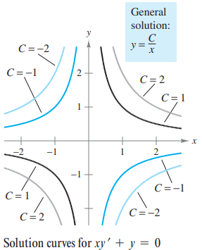

As discussed in Section 4.1, **particular solutions** of a differential equation are obtained from **initial conditions** that give the value of the dependent variable. The term "initial condition" stems from the fact that, often in problems involving time, the value of the dependent variable or one of its derivatives is known at the *initial* time $t=0$. For instance, the second-order differential equation $s''(t)=-32$ having the general solution:

$$s(t) = -16t^2 + C_1t +C_2$$

might have the following initial conditions:

$$s(0) = 80, \quad s'(0)=64$$

In this case, the initial conditions yield the particular solution:

$$s(t) = -16t^2 +64t +80$$

::: {.callout-note title="Example" icon=false appearance="simple"}
For the differential equation $xy'-3y=0$, verify that $y=Cx^3$ is a solution, and find the particular solution determined by the initial condition $y=2$ when $x=-3$.

::: {.callout-tip collapse="true" title="Show Answer" icon=false}
You know that $y=Cx^3$ is a solution because $y'=3Cx^2$ and:
$$xy'-3y = x(3Cx^2)-3(Cx^3) = 0$$

Furthermore, the initial condition $y=2$ when $x=-3$ yields:
$$y = Cx^3 \hspace{2cm} \text{(General Solution)}$$
$$2 = C(-3)^3 \hspace{2cm} \text{(Substitute initial condition)}$$
$$-\frac{2}{27} = C \hspace{2cm} \text{(Solve for C)}$$

and you can conclude that the particular solution is:
$$y = -\frac{2x^3}{27} \hspace{2cm} \text{(Particular Solution)}$$

*(Try checking this solution by substituting for $y$ and $y'$ in the original differential equation!)*
:::
:::

::: {.practice-box}
#### Exercises: Verify Solutions and Find Particular Solutions
1. Determine whether the function $y = x^3$ is a solution to the differential equation $xy' - 3y = 0$.
2. Verify that $y = 2e^{-x} + xe^{-x}$ is a solution to the second-order differential equation $y'' + 2y' + y = 0$.
3. The general solution of the differential equation $y' + 2y = 0$ is given by $y = Ce^{-2x}$. Find the particular solution that satisfies the initial condition $y(0) = 5$.
4. Verify that $y = C_1 \sin(3x) + C_2 \cos(3x)$ is a solution to the differential equation $y'' + 9y = 0$.
5. Given the general solution $y = Cx^2$ for the differential equation $xy' = 2y$, find the particular solution whose graph passes through the point $(2, 12)$.
6. For the differential equation $\frac{dy}{dx} = 4x - 1$, find the particular solution $y=f(x)$ that passes through the point $(1, 3)$.
::: 
---

### 6.1.2 Slope Fields

Solving a differential equation analytically can be difficult or even impossible. However, there is a graphical approach you can use to learn a lot about the solution of 

$$y'=F(x,y) \hspace{3cm} \text{Differential Equation}$$

At each point $(x,y)$ in the $xy$-plane where $F$ is defined, the differential equation determines the slope $y'=F(x,y)$. If you draw short line segments with slope $F(x,y)$ at selected points $(x,y)$ in the domain of $F$, then these line segments form a **slope field**, or a *direction field* for the differential equation $y'=F(x,y)$. Each line segment has the same slope as the solution curve through that point. A slope field shows the general shape of all the solutions.

::: {.callout-note title="Example" icon=false appearance="simple"}
Sketch a slope field for the differential equation $y'=x-y$ for the points $(-1,1)$, $(0,1)$, and $(1,1)$.

::: {.callout-tip collapse="true" title="Show Answer" icon=false}
The slope of the solution curve at any points $(x,y)$ is $F(x,y)=x-y$. 
* The slope at $(-1,1)$ is $y'=-1-1=-2$
* The slope at $(0,1)$ is $y'=0-1=-1$
* The slope at $(1,1)$ is $y'=1-1=0$. 

Draw short line segments at the three points with their respective slopes, as shown below:

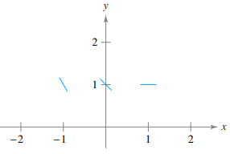
:::
:::

::: {.callout-note title="Example" icon=false appearance="simple"}
Match the slope field with its differential equation.

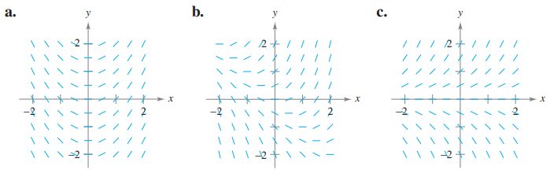

**i)** $y'=x+y$  
**ii)** $y'=x$  
**iii)** $y'=y$  

::: {.callout-tip collapse="true" title="Show Answer" icon=false}
**a)** From Figure 6.3(a), you can see that the slope at any point along the $y$-axis is 0. The only equation that satisfies this condition is $y'=x$. So the graph matches (ii).

**b)** From Figure 6.3(b), you can see that the slope at the point $(1,-1)$ is 0. The only equation that satisfies this condition is $y'=x+y$. So, the graph matches (i).

**c)** From Figure 6.3(c), you can see that the slope at any point along the $x$-axis is 0. The only equation that satisfies this condition is $y'=y$. So, the graph matches (iii).
:::
:::

A solution curve of a differential equation $y'=F(x,y)$ is simply a curve in the $xy$-plane whose tangent line at each point $(x,y)$ has slope equal to $F(x,y)$. This is illustrated in the next example.

::: {.callout-note title="Example" icon=false appearance="simple"}
Sketch a slope field for the differential equation $y' = 2x+y$. Use the slope field to sketch the solution that passes through the point $(1,1)$.

::: {.callout-tip collapse="true" title="Show Answer" icon=false}
Make a table showing the slopes at several points. The table shown is a small sample. The slopes at many other points should be calculated to get a representative slope field.

| $x$ | -2 | -2 | -1 | -1 | 0 | 0 | 1 | 1 | 2 | 2 |
| :--- | :--- | :--- | :--- | :--- | :--- | :--- | :--- | :--- | :--- | :--- |
| $y$ | -1 | 1 | -1 | 1 | -1 | 1 | -1 | 1 | -1 | 1 |
| $y' = 2x+y$ | -5 | -3 | -3 | -1 | -1 | 1 | 1 | 3 | 3 | 5 |

Next, draw line segments at the points with their respective slopes, as shown in Figure 6.4. After the slope field is drawn, start at the initial point $(1,1)$ and move to the right in the direction of the line segment. Continue to draw the solution curve so that it moves parallel to the nearby line segments. Do the same to the left of $(1,1)$. The resulting solution is shown in Figure 6.5.

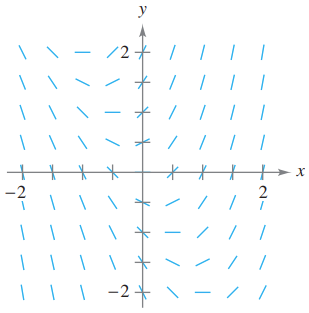
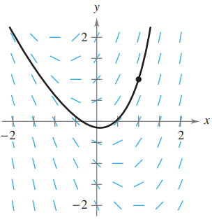

*(Note that the slope field shows that $y'$ increases to infinity as $x$ increases).*
:::
:::

*A note from the textbook:* Drawing a slope field by hand is tedious. In practice, slope fields are usually drawn using a graphing utility.  
*A note from your teacher, me, Cole $\mathbb{R}$idgway:* The TI-84 can do this.

::: {.practice-box}
#### Exercises: Sketch, Match, and Interpret Slope Fields
1. **Sketching:** Sketch a slope field for the differential equation $y' = x + y$ at the nine points indicated below.
   
   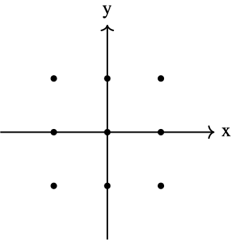
2. **Matching:** Match the differential equation with its slope field.
   
   ::: {layout-ncol=3}
   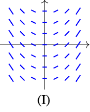
   
   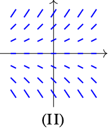
   
   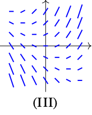
   :::
   
   a) $\frac{dy}{dx} = x + y$
   b) $\frac{dy}{dx} = x$
   c) $\frac{dy}{dx} = y$
3. **Interpretation:** The slope field for the differential equation $\frac{dy}{dx} = y - 2$ is shown below. Sketch the solution curve that passes through the point $(0, 1)$ and the solution curve that passes through $(0, 3)$.

   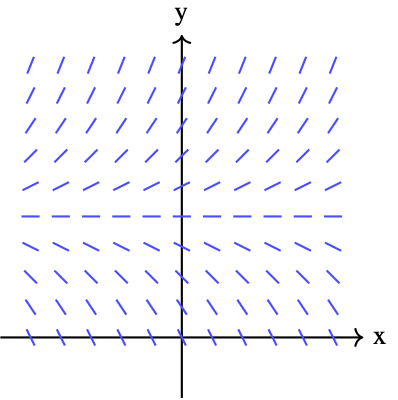

4. Consider the differential equation $\frac{dy}{dx} = \frac{x}{y}$.
   a) On the axes provided, sketch a slope field for the given differential equation at the twelve points indicated.

      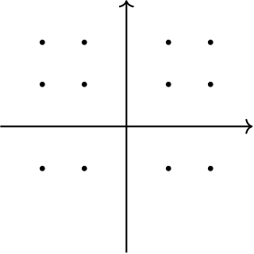

   b) Describe the general shape of the solution curves.
5. Which of the following differential equations generates a slope field where the slopes are parallel along vertical lines?
   a) $\frac{dy}{dx} = x + y$
   b) $\frac{dy}{dx} = xy$
   c) $\frac{dy}{dx} = 2x$
   d) $\frac{dy}{dx} = 2y$
6. **Analysis:** The figure below shows the slope field for a differential equation $\frac{dy}{dx} = f(x,y)$.
   
   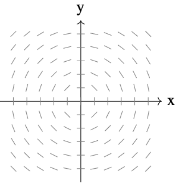

   Based on the slope field, which of the following could be the specific solution $y=f(x)$ passing through $(0,2)$?
   a) $y = x^2 + 2$
   b) $y = \sqrt{4-x^2}$
   c) $y = e^x + 1$
   d) $y = 2$
::: 

::: {.conceptual-box}
#### Conceptual Questions
1. **Visualizing Variable Dependence:** Analytically, a differential equation can depend on $x$, $y$, or both. Geometrically, the layout of the slope field reveals this dependence.
   * If the slopes are identical along any vertical line (moving up and down doesn't change the slope), the differential equation depends only on $x$ (e.g., $y' = 2x$).
   * If the slopes are identical along any horizontal line (moving left and right doesn't change the slope), the differential equation depends only on $y$ (e.g., $y' = 2y$).
   Explain why this geometric symmetry occurs. *(Hint: Consider how changing the coordinate $y$ affects the value of $y'$ in the equation $y'=2x$).*
2. **The Geometry of a Solution Curve:** The text states that a slope field shows the general shape of all solutions. When you sketch a particular solution curve starting at a point $(x_1, y_1)$, you must draw it such that the curve is tangent to every slope segment it passes near. Analytically, this is because $y'$ represents the instantaneous rate of change. Explain why a curve that *crosses* the slope segments at a sharp angle (perpendicularly, for example) cannot be a solution to the differential equation.
3. **Interpreting "Flat" Slopes (Equilibrium):** Consider the differential equation $y' = y - 2$. Analytically, if $y=2$, the derivative $y'$ becomes 0. Geometrically, this creates a horizontal row of flat slope segments at the height $y=2$. If a solution curve starts exactly at the initial condition $y(0)=2$, what does the graph of this particular solution look like for all time $t$?
:::

---

### 6.1.3 Euler's Method

**This is not on the AP Calculus AB Test.** Please see this clip from the movie [*Hidden Figures*](https://www.youtube.com/watch?v=v-pbGAts_Fg).

**Euler's Method** is a numerical approach to approximating the particular solution of the differential equation $$y'=F(x,y)$$ that passes through the point $(x_0,y_0)$. From the given information, you know that the graph of the solution passes through the point $(x_0,y_0)$ and has a slope of $F(x_0,y_0)$ at this point. This gives you a "starting point" for approximating the solution.

From this starting point, you can proceed in the direction indicated by the slope. Using a small step $h$, move along the tangent line until you arrive at the point $(x_1,y_1)$, where:

$$x_1=x_0+h \quad \text{ and } \quad y_1 = y_0 + hF(x_0,y_0)$$

If you think of $(x_1,y_1)$ as a new starting point, you can repeat the process to obtain a second point $(x_2,y_2)$.

::: {.callout-note title="Example: Euler's Method Approximation" icon="false" appearance="simple"}
Use Euler's Method to approximate the particular solution of the differential equation $y' = x - y$ passing through the point $(0,1)$ using step size $h=0.1$. Compare your results with the exact solution $y = 2e^{-x} + x - 1$.


*Use the interactive slider below to change the step size (*$h$) and see how it affects the accuracy of Euler's Method.

```{ojs}
//| echo: false
viewof h = Inputs.range([0.05, 0.5], {
  value: 0.1,
  step: 0.05,
  label: "Step Size (h):"
})
```

```{ojs}
//| echo: false
eulerPlot = {
  // --- Exact solution data (fine resolution) ---
  const exactData = [];
  for (let x = 0; x <= 1.0 + 1e-9; x += 0.01) {
    exactData.push({ x, y: 2 * Math.exp(-x) + x - 1, series: "Exact Solution" });
  }

  // --- Euler approximation data ---
  const eulerData = [];
  let cx = 0;
  let cy = 1;
  eulerData.push({ x: cx, y: cy, series: "Euler Approx" });
  const steps = Math.round(1.0 / h);
  for (let i = 0; i < steps; i++) {
    cy = cy + h * (cx - cy);
    cx = cx + h;
    eulerData.push({ x: cx, y: cy, series: "Euler Approx" });
  }

  // --- Final error at x=1 ---
  const exactAt1 = 2 * Math.exp(-1) + 1 - 1;
  const eulerAt1 = eulerData[eulerData.length - 1].y;
  const err = Math.abs(exactAt1 - eulerAt1).toFixed(4);

  // --- Plot ---
  const allData = [...exactData, ...eulerData];

  return Plot.plot({
    width: 650,
    height: 400,
    grid: true,
    x: { label: "x", domain: [0, 1] },
    y: { label: "y", domain: [0.6, 1.05] },
    color: {
      legend: true,
      domain: ["Exact Solution", "Euler Approx"],
      range: ["green", "steelblue"]
    },
    caption: `Error at x = 1: |exact − Euler| ≈ ${err}`,
    marks: [
      Plot.line(exactData, {
        x: "x", y: "y", stroke: "series", strokeWidth: 2.5
      }),
      Plot.line(eulerData, {
        x: "x", y: "y", stroke: "series",
        strokeWidth: 2, strokeDasharray: "6,4"
      }),
      Plot.dot(eulerData, {
        x: "x", y: "y", fill: "series", r: 4
      })
    ]
  });
}
```

```{ojs}
//| echo: false
eulerTable = {
  const steps = Math.round(1.0 / h);
  let cx = 0;
  let cy = 1;
  const rows = [];

  for (let i = 1; i <= steps; i++) {
    cy = cy + h * (cx - cy);
    cx = cx + h;
    const exact = 2 * Math.exp(-cx) + cx - 1;
    const error = Math.abs(exact - cy);
    rows.push({
      Step: i,
      x: cx.toFixed(2),
      "Euler y": cy.toFixed(4),
      "Exact y": exact.toFixed(4),
      Error: error.toFixed(4)
    });
  }

  return Inputs.table(rows, {
    columns: ["Step", "x", "Euler y", "Exact y", "Error"],
    width: { Step: 50, x: 60, "Euler y": 90, "Exact y": 90, Error: 90 },
    layout: "auto"
  });
}
```

**Analysis:** Notice how the error grows with each step. Because Euler's Method uses the slope at the *beginning* of each interval, any curvature in the actual solution causes the approximation to drift — this accumulation is called **global truncation error**. Try increasing $h$ to see the error grow, or decreasing it to watch the approximation tighten.
:::


## 6.2 Differential Equations: Growth and Decay

::: {.callout-tip title="Objectives" icon=false}
| Key Topics & Formulas | Success Criteria |
| :--- | :--- |
| Use separation of variables to solve a simple differential equation. | I can separate the variables correctly, integrate both sides, and solve for the dependent variable, including applying an initial condition when given. |
| Use exponential function to model growth and decay in applied problems. | I can write and use an exponential growth or decay model to represent a real-world situation and correctly interpret the meaning of the parameters in context. |
: {tbl-colwidths="[40,60]"}
:::

### 6.2.1 Differential Equations

In the preceding section, you learned to analyze visually the solutions of differential equations using slope fields and to approximate solutions numerically using Euler's Method. Analytically, you have learned to solve only two types of differential equations—those of the forms:

$$y'=f(x) \quad \text{ and } \quad y''=f(x)$$

In this section, you will learn how to solve a more general type of differential equation. The strategy is to rewrite the equation so that each variable occurs on only one side of the equation. This strategy is called *separation of variables*. (You will study this strategy in detail in Section 6.3).

::: {.callout-note title="Example" icon=false appearance="simple"}
Solve the differential equation $y'=2x/y$.

::: {.callout-tip collapse="true" title="Show Answer" icon=false}
$$
\begin{align*}
y' &= \frac{2x}{y} && \text{(Write original equation)} \\
yy' &= 2x && \text{(Multiply both sides by } y) \\
\int yy' \, dx &= \int 2x \, dx && \text{(Integrate with respect to } x) \\
\int y \, dy &= \int 2x \, dx && (dy = y' \, dx) \\
\frac{1}{2}y^2 &= x^2 + C_1 && \text{(Apply Power Rule)} \\
y^2 - 2x^2 &= C && \text{(Rewrite, letting } C = 2C_1)
\end{align*}
$$

So, the general solution is given by $y^2 - 2x^2 = C$. *(You can use implicit differentiation to check this result).*
:::
:::

It is very common for people to use either prime notation (like in the previous example) or using Leibniz notation (as shown below). "Separating the variables" feels more natural using Leibniz notation, but many mathematicians use the prime notation because it is faster.

$$
\begin{align*}
\frac{dy}{dx} &= \frac{2x}{y} && \text{(Write original equation)} \\
y \, dy &= 2x \, dx && \text{(Multiply both sides by } y) \\
\int y \, dy &= \int 2x \, dx && \text{(Integrate with respect to } x) \\
\frac{1}{2}y^2 &= x^2 + C_1 && \text{(Apply Power Rule)} \\
y^2 - 2x^2 &= C && \text{(Rewrite, letting } C = 2C_1)
\end{align*}
$$

---

### 6.2.2 Growth and Decay Models

In many applications, the rate of change of a variable $y$ is proportional to the value of $y$. If $y$ is a function of time $t$, the proportion can be written as shown:

$$
\underbrace{\frac{dy}{dt}}_{\text{Rate of change of } y} 
\quad \underbrace{=}_{\text{is}} \quad
\underbrace{ky}_{\text{proportional to } y}
$$

The general solution of this differential equation is given in the following theorem.

::: {.callout-important title="Theorem: Exponential Growth and Decay Model" icon=false}
If $y$ is a differentiable function of $t$ such that $y>0$ and $y'=ky$, for some constant $k$, then:

$$y = Ce^{kt}$$

$C$ is the **initial value** of $y$, and $k$ is the **proportionality constant**. **Exponential growth** occurs when $k>0$, and **exponential decay** occurs when $k<0$.
:::

::: {.callout-note title="Proof: Exponential Growth and Decay Model" icon=false appearance="simple"}
::: {.callout-tip collapse="true" title="Show Proof" icon=false}
$$
\begin{align*}
y' &= ky && \text{(Write original equation)} \\
\frac{y'}{y} &= k && \text{(Separate variables)} \\
\int \frac{y'}{y} \, dt &= \int k \, dt && \text{(Integrate with respect to } t) \\
\int \frac{1}{y} \, dy &= \int k \, dt && (dy=y' \, dt) \\
\ln(y) &= kt + C_1 && \text{(Find antiderivative of each side)} \\
y &= e^{kt}e^{C_1} && \text{(Solve for } y) \\
y &= Ce^{kt} && \text{(Let } C=e^{C_1}) 
\end{align*}
$$

So, all solutions of $y' = ky$ are of the form $y=Ce^{kt}$.
:::
:::

::: {.callout-note title="Example" icon=false appearance="simple"}
The rate of change of $y$ is proportional to $y$. When $t=2, y=4$. What is the value of $y$ when $t=3$?

::: {.callout-tip collapse="true" title="Show Answer" icon=false}
Because $y'=ky$, you know that $y$ and $t$ are related by the equation $y=Ce^{kt}$. You can find the values of the constants $C$ and $k$ by applying the initial conditions.

$$
\begin{align*}
2 &= Ce^0 \quad \Rightarrow \quad C = 2 && \text{(When } t=0 \text{, } y=2) \\
4 &= 2e^{2k} \quad \Rightarrow \quad k = \frac{1}{2}\ln(2) \approx 0.3466 && \text{(When } t=2 \text{, } y=4)
\end{align*}
$$

So, the model is $y \approx 2e^{0.3466t}$. When $t=3$, the value of $y$ is $2e^{0.3466(3)} \approx 5.667$.
:::
:::

Radioactive decay is measured in terms of *half-life*—the number of years required for a half of the atoms in a sample of radioactive material to decay. The half-lives of some common radioactive isotopes are shown below.

| Isotope | Half-Life |
| :--- | :--- |
| Uranium ($^{238}\text{U}$) | 4,470,000,000 years |
| Plutonium ($^{239}\text{Pu}$) | 24,100 years |
| Carbon ($^{14}\text{C}$) | 5,715 years |
| Radium ($^{226}\text{Ra}$) | 1,599 years |
| Einsteinium ($^{276}\text{Es}$) | 276 years |
| Nobelium ($^{257}\text{No}$) | 25 seconds |

::: {.callout-note title="Example" icon=false appearance="simple"}
Suppose that 10 grams of Plutonium-239 ($^{239}\text{Pu}$) was released in the Chernobyl nuclear accident. How long will it take for the 10 grams to decay to 1 gram?

::: {.callout-tip collapse="true" title="Show Answer" icon=false}
Let $y$ represent the mass (in grams) of the plutonium. Because the rate of decay is proportional to $y$, you know that: 

$$y=Ce^{kt}$$

where $t$ is the time in years. To find the values of the constants $C$ and $k$, apply the initial conditions. Using the fact that $y=10$ when $t=0$, you can write:

$$10 = Ce^{k(0)} = Ce^{0}$$

which implies that $C=10$. Next, using the fact that $y=5$ when $t=24,100$, you can write:

$$
\begin{align*}
5 &= 10e^{k(24,100)} \\
\frac{1}{2} &= e^{k(24,100)} \\
\frac{1}{24,100}\ln \left( \frac{1}{2} \right) &= k \\
-0.000028761 &\approx k
\end{align*}
$$

So, the model is:
$$y=10e^{-0.000028761t}$$

To find the time it would take for 10 grams to decay to 1 gram, you can solve for $t$ in the equation:
$$1 =10e^{-0.000028761t}$$

The solution is approximately 80,059 years.^[And this is why we aren't allowed to boil water with cool rocks anymore.]
:::
:::

From the previous example, notice that in an exponential growth or decay problem, it is easy to solve for $C$ when you are given the value of $y$ at $t=0$.

::: {.callout-note title="Example" icon=false appearance="simple"}
Suppose an experimental population of fruit flies increases according to the law of exponential growth. There were 100 flies after the second day of the experiment and 300 flies after the fourth day. Approximately how many flies were in the original population?

::: {.callout-tip collapse="true" title="Show Answer" icon=false}
Let $y=Ce^{kt}$ be the number of flies at time $t$, where $t$ is measured in days. Because $y=100$ when $t=2$ and $y=300$ when $t=4$, you can write:

$$100=Ce^{2k} \quad \text{ and } \quad 300 = Ce^{4k}$$

From the first equation, you know that $C=100e^{-2k}$. Substituting this value into the second equation produces the following:

$$
\begin{align*}
300 &= \left(100e^{-2k}\right)e^{4k} \\
300 &= 100e^{2k} \\
\ln(3) &= 2k \\
\frac{1}{2}\ln(3) &= k \\
0.5493 & \approx k
\end{align*}
$$

So, the exponential growth model is: 
$$y= Ce^{0.5493t}$$

To solve for $C$, reapply the condition $y=100$ when $t=2$ and obtain:

$$
\begin{align*}
100 &= Ce^{0.5493(2)} \\
C &= 100e^{-1.0986} \approx 33
\end{align*}
$$

So, the original population (when $t=0$) consisted of approximately $y=C=33$ flies.
:::
:::

::: {.callout-note title="Example" icon=false appearance="simple"}
Four months after it stops advertising, a manufacturing company notices that its sales have dropped from 100,000 units per month to 80,000 units per month. If the sales follow an exponential pattern of decline, what will they be after another 2 months?

::: {.callout-tip collapse="true" title="Show Answer" icon=false}
Use the exponential decay model $y=Ce^{kt}$, where $t$ is measured in months. From the initial condition $(t=0)$, you know that $C=100,000$. Moreover, because $y=80,000$ when $t=4$, you have:

$$
\begin{align*}
80,000 &= 100,000e^{4k} \\
0.8 &= e^{4k} \\
\ln(0.8) &= 4k \\
-0.0558 &\approx k
\end{align*}
$$

So, after 2 more months $(t=6)$, you can expect the monthly sales rate to be:

$$
\begin{align*}
y &\approx 100,000e^{-0.0558(6)} \\
& \approx 71,500 \text{ units}
\end{align*}
$$
:::
:::

Throughout these examples, you did not actually have to solve the differential equation $y' = ky$. It was only done in the proof! The next example demonstrates a problem whose solution involves the separation of variables technique. The example concerns **Newton's Law of Cooling**, which states that the rate of change in the temperature of an object is proportional to the difference between the object's temperature and the temperature of the surrounding medium.

::: {.callout-note title="Example" icon=false appearance="simple"}
Let $y$ represent the temperature (in $^\circ$F) of an object in a room whose temperature is kept at a constant $60^\circ$F. If the object cools from $100^\circ$F to $90^\circ$F in 10 minutes, how much longer will it take for its temperature to decrease to $80^\circ$F?

::: {.callout-tip collapse="true" title="Show Answer" icon=false}
From Newton's Law of Cooling, you know that the rate of change in $y$ is proportional to the difference between $y$ and $60$. This can be written as:

$$y' = k(y-60), \quad 80 \leq y \leq 100$$

To solve this differential equation, use separation of variables as shown:

$$
\begin{align*}
\frac{dy}{dt} &= k(y-60) && \text{(Differential Equation)} \\
\left( \frac{1}{y-60} \right)dy &= k \, dt && \text{(Separate variables)} \\
\int \left( \frac{1}{y-60} \right)dy &= \int k \, dt && \text{(Integrate each side)} \\
\ln|y-60| &= kt + C_1 && \text{(Find antiderivative of each side)}
\end{align*}
$$

Because $y>60$, $|y-60| = y-60$, and you can omit the absolute value signs. Using exponential notation, you have:

$$y - 60 = e^{kt + C_1} \quad \Rightarrow \quad y=60+Ce^{kt} \quad (\text{letting } C=e^{C_1})$$

Using $y=100$ when $t=0$, you obtain $100=60+Ce^{k(0)} = 60 +C$, which implies that $C=40$. Because $y=90$ when $t=10$:

$$
\begin{align*}
90 &= 60 + 40e^{k(10)} \\
30 &= 40e^{10k} \\
k &= \frac{1}{10}\ln\left(\frac{3}{4}\right) \approx -0.02877
\end{align*}
$$

So, the model is:
$$y = 60 + 40e^{-0.02877t}$$

and finally, when $y=80$, you obtain:

$$
\begin{align*}
80 &= 60 + 40e^{-0.02877t} \\
20 &= 40e^{-0.02877t} \\
\frac{1}{2} &= e^{-0.02877t} \\
\ln \left( \frac{1}{2} \right) &= -0.02877t \\
t &\approx 24.09 \text{ minutes}
\end{align*}
$$

So, it will require about 14.09 *more* minutes for the object to cool to a temperature of $80^\circ$F.
:::
:::

::: {.practice-box}
#### Exercises: Growth and Decay Models

1. Find the general solution of the differential equation $y' = 4xy$.
2. Find the particular solution $y=f(x)$ to the differential equation $\frac{dy}{dx} = e^{x-y}$ with the initial condition $f(0) = \ln(2)$.
3. The rate of change of the number of bacteria in a culture is proportional to the number of bacteria present. If the population of bacteria doubles every 5 hours, how long will it take for the population to triple?
4. A radioactive isotope, "Calc-238," decays at a rate proportional to the amount present. If the half-life of Calc-238 is 1,500 years, what percentage of the original sample will remain after 1,000 years?
5. A metal ingot is heated to $200^\circ$F and then placed in a room where the temperature is a constant $70^\circ$F. After 10 minutes, the ingot cools to $150^\circ$F. According to Newton's Law of Cooling, what will the temperature of the ingot be after 20 minutes?
6. Consider the differential equation $\frac{dy}{dx} = \frac{y-1}{x^2}$, where $x \neq 0$.
   a) Find the particular solution $y=f(x)$ to the differential equation with the initial condition $f(2) = 0$.
   b) For the particular solution found in part (a), find $\lim_{x \to \infty} f(x)$.
:::

::: {.conceptual-box}
#### Conceptual Questions
*Answer the following in 1-3 complete sentences.*

1. **The Necessity of Separation:** Analytically, in earlier sections, you solved differential equations like $y' = 2x$ by simply integrating both sides with respect to $x$. Explain analytically why this direct integration method fails for an equation like $y' = 2y$, and how moving the $y$ term to the left side allows the integration to proceed.
2. **Geometric Meaning of the General Solution:** When you perform indefinite integration to find the general solution of a differential equation (e.g., $y = x^2 + C$), you introduce an arbitrary constant $C$. Geometrically, this general solution represents an infinite "family" of curves. Explain why a single *initial condition*, such as $y(1)=3$, is sufficient to isolate one specific curve from this infinite family.
3. **Analyzing Exponential Growth Rates:** The differential equation for exponential growth is $y' = ky$ (where $k > 0$). In the context of a population model, this equation implies that the rate of growth is proportional to the current population size. Explain why this relationship causes the graph of the population to become steeper and steeper as $y$ increases, rather than maintaining a constant slope.
4. **Asymptotic Behavior in Cooling:** Newton's Law of Cooling models temperature change with the equation $y' = k(y - T_{room})$. Algebraically, as the object's temperature $y$ gets closer to the room temperature $T_{room}$, the value of the derivative $y'$ approaches zero. Describe the visual feature this creates on the graph of Temperature vs. Time as $t \to \infty$.
:::

## 6.3 Separation of Variables and the Logistic Equation

::: {.callout-tip title="Objectives" icon=false}
| Key Topics & Formulas | Success Criteria |
| :--- | :--- |
| Recognize and solve differential equations that can be solved by separation of variables. | I can identify when a differential equation is separable and correctly separate, integrate, and solve for the solution, including applying an initial condition when given. |
| Recognize and solve homogeneous differential equations. | I can recognize a homogeneous differential equation, use an appropriate substitution to simplify it, and solve for the general solution. |
| Use differential equations to model and solve applied problems. | I can set up a differential equation from a real-world situation, solve it correctly, and interpret the solution in the context of the problem. |
| Solve and analyze logistic differential equations. | I can solve a logistic differential equation, identify the carrying capacity, and explain what the solution tells me about long-term behavior. |
: {tbl-colwidths="[40,60]"}
:::

### 6.3.1 Separation of Variables

Consider a differential equation that can be written in the form:
$$M(x) + N(y) \frac{dy}{dx} = 0$$

where $M$ is a continuous function of $x$ alone and $N$ is a continuous function of $y$ alone. As you saw in the preceding section, for this type of equation, all $x$ terms can be collected with $dx$ and all $y$ terms with $dy$, and a solution can be obtained by integration. Such equations are said to be **separable**, and the solution procedure is called *separation of variables*. Below are some examples of differential equations that are separable.

| *Original Differential Equation* | *Rewritten with Variables Separated* |
| :--- | :--- |
| $x^2 + 3y \frac{dy}{dx} = 0$ | $3y \, dy = -x^2 \, dx$ |
| $(\sin x)y' = \cos x$ | $dy = \cot x \, dx$ |
| $\frac{xy'}{e^y + 1} = 2$ | $\frac{1}{e^y + 1} \, dy = \frac{2}{x} \, dx$ |

::: {.callout-note title="Example" icon=false appearance="simple"}
Find the general solution of $(x^2 + 4) \frac{dy}{dx} =xy$.

::: {.callout-tip collapse="true" title="Show Answer" icon=false}
To begin, note that $y=0$ is a solution. To find other solutions, assume that $y\neq 0$ and separate variables as shown:

$$
\begin{align*}
(x^2+4) \, dy &= xy \, dx \qquad && \text{(Differential form)} \\
\frac{1}{y} \, dy &= \frac{x}{x^2+4} \, dx \qquad && \text{(Separate variables)}
\end{align*}
$$

Now integrate:

$$
\begin{align*}
\int \frac{1}{y} \, dy &= \int \frac{x}{x^2+4} \, dx \qquad && \text{(Integrate)} \\
\ln|y| &= \frac{1}{2}\ln(x^2+4) + C_1 \\
\ln|y| &= \ln \sqrt{x^2+4} + C_1 \\
|y| &= e^{C_1} \sqrt{x^2+4} \\
y &= \pm e^{C_1} \sqrt{x^2+4}
\end{align*}
$$

Because $y = 0$ is also a solution, you can write the general solution as:
$$y = C\sqrt{x^2+4}$$
:::
:::

In some cases it is not feasible to write the general solution in the explicit form $y=f(x)$. The next example illustrates such a solution. Implicit differentiation can be used to verify this solution.

::: {.callout-note title="Example" icon=false appearance="simple"}
Given the initial condition $y(0) = 1$, find the particular solution of the equation:
$$xy \, dx + e^{-x^2}(y^2-1)\,dy =0$$

::: {.callout-tip collapse="true" title="Show Answer" icon=false}
Note that $y=0$ is a solution of the differential equation—but this solution does not satisfy the initial condition. So, you can assume that $y \neq 0$. To separate variables, you must rid the first term of $y$ and the second term of $e^{-x^2}$. So, you should multiply by $e^{x^2}/y$ and obtain:

$$
\begin{align*}
xy \, dx + e^{-x^2}(y^2-1)\,dy &=0 \\
e^{-x^2}(y^2-1)\,dy &= -xy \,dx \\
\int \left( y - \frac{1}{y} \right) \,dy &= \int -xe^{x^2}\,dx \\
\frac{y^2}{2}-\ln|y| &= -\frac{1}{2}e^{x^2} +C
\end{align*}
$$

From the initial condition $y(0) = 1$, you have $\frac{1}{2}-0 = -\frac{1}{2} +C$, which implies that $C=1$. So, the particular solution has the implicit form:

$$
\begin{align*}
\frac{y^2}{2} - \ln|y| &= -\frac{1}{2}e^{x^2} + 1 \\
y^2 - \ln \left( y^2 \right) + e^{x^2} &= 2
\end{align*}
$$

*(You can check this by differentiating and rewriting to get the original equation).*
:::
:::

::: {.callout-note title="Example" icon=false appearance="simple"}
Find the equation of the curve that passes through the point $(1,3)$ and has a slope of $y/x^2$ at any point $(x,y)$.

::: {.callout-tip collapse="true" title="Show Answer" icon=false}
Because the slope of the curve is given by $y/x^2$, you have: 
$$\frac{dy}{dx} =\frac{y}{x^2}$$

with the initial condition $y(1)= 3$. Separating variables and integrating produces:

$$
\begin{align*}
\int \frac{1}{y} \, dy &= \int \frac{1}{x^2} \, dx, \quad y \neq 0 \\
\ln|y| &= -\frac{1}{x} + C_1 \\
y &= e^{-(1/x)+C_1} = Ce^{-1/x}
\end{align*}
$$

Because $y=3$ when $x=1$, it follows that $3=Ce^{-1}$ and $C=3e$. So, the equation of the specified curve is:
$$y = (3e)e^{-1/x}=3e^{(x-1)/x}, \quad x>0$$
:::
:::

::: {.practice-box}
#### Exercises: Separation of Variables
1. Find the general solution of the differential equation $\frac{dy}{dx} = 3x^2 e^{-y}$.
2. Find the particular solution $y=f(x)$ to the differential equation $\frac{dy}{dx} = xy^2$ with the initial condition $f(1) = -1$. State the domain of the solution.
3. Find the particular solution $y=f(x)$ to the differential equation $\frac{dy}{dx} = (1+y^2)\cos(x)$ with the initial condition $f(0) = \sqrt{3}$.
4. A curve passes through the point $(0, 2)$ and has a slope of $\frac{2x}{y-1}$ at any point $(x,y)$ where $y \neq 1$. Find the equation of the curve.
5. The rate of change of a quantity $P$ is proportional to the square root of $P$. At time $t=0$, $P=9$, and at time $t=2$, $P=25$. Find the value of $P$ at time $t=3$.
6. Consider the differential equation $\frac{dy}{dx} = \frac{x}{y}$ for $y \neq 0$.
   a) Find the particular solution $y=f(x)$ with the initial condition $f(-2) = -1$.
   b) State the domain of the particular solution found in part (a).
:::

::: {.conceptual-box}
#### Conceptual Questions
*Answer the following in 1-3 complete sentences.*

1. **Identifying Separable Equations:** Analytically, the method of separation of variables requires that the differential equation can be factored into the form $\frac{dy}{dx} = g(x)h(y)$. Explain algebraically why a differential equation like $\frac{dy}{dx} = x + y$ cannot be solved using this method, whereas $\frac{dy}{dx} = x + xy$ can be. *(Hint: Try to separate the $x$ and $y$ terms onto opposite sides for both equations).*
2. **Lost Solutions and Division:** In the example $(x^2 + 4)\frac{dy}{dx} = xy$, the first algebraic step is to divide both sides by $y$ to separate the variables. Analytically, division by zero is undefined.
   * Explain why it is necessary to check if $y=0$ is a solution *before* performing this division.
   * Geometrically, what does the solution $y=0$ look like on a graph, and how does it relate to the slope field along the x-axis?
3. **Implicit vs. Explicit Solutions:** The text notes that sometimes it is not feasible to solve for $y$ explicitly, resulting in an *implicit solution* (e.g., $y^2 - \ln(y^2) + e^{x^2} = C$). Geometrically, an explicit function $y=f(x)$ must pass the vertical line test. Explain why an implicit solution curve derived from a differential equation might fail the vertical line test, yet still be a valid representation of the relationship between $x$ and $y$.
:::

---

### 6.3.2 Homogeneous Differential Equations

Some differential equations that are not separable in $x$ and $y$ can be made separable by a change of variables. This is true for differential equations of the form $y' = f(x,y)$, where $f$ is a **homogeneous function**. The function given by $f(x,y)$ is **homogeneous of degree $n$** if:
$$f(tx,ty) = t^nf(x,y)$$
where $n$ is a real number.

::: {.callout-note title="Example: Identifying Homogeneous Functions" icon=false appearance="simple"}
Determine if the following functions are homogeneous.

**a)** $f(x, y) = x^2y - 4x^3 + 3xy^2$

::: {.callout-tip collapse="true" title="Show Answer" icon=false}
This is a homogeneous function of degree 3 because:
$$
\begin{align*}
f(tx, ty) &= (tx)^2(ty) - 4(tx)^3 + 3(tx)(ty)^2 \\
          &= t^3(x^2y) - t^3(4x^3) + t^3(3xy^2) \\
          &= t^3(x^2y - 4x^3 + 3xy^2) \\
          &= t^3f(x, y)
\end{align*}
$$
:::

**b)** $f(x, y) = xe^{x/y} + y \sin(y/x)$

::: {.callout-tip collapse="true" title="Show Answer" icon=false}
This is a homogeneous function of degree 1 because:
$$
\begin{align*}
f(tx, ty) &= txe^{tx/ty} + ty \sin \left(\frac{ty}{tx}\right) \\
          &= t\left(xe^{x/y} + y \sin \left(\frac{y}{x}\right)\right) \\
          &= tf(x, y)
\end{align*}
$$
:::

**c)** $f(x, y) = x + y^2$

::: {.callout-tip collapse="true" title="Show Answer" icon=false}
This is not a homogeneous function because:
$$f(tx, ty) = tx + t^2y^2 = t(x + ty^2) \neq t^n(x + y^2)$$
:::

**d)** $f(x, y) = x/y$

::: {.callout-tip collapse="true" title="Show Answer" icon=false}
This is a homogeneous function of degree 0 because:
$$f(tx, ty) = \frac{tx}{ty} = t^0 \frac{x}{y}$$
:::
:::

::: {.callout-important title="Definition: Homogeneous Differential Equation" icon=false}
A **homogeneous differential equation** is an equation of the form:
$$M(x,y) \, dx + N(x,y) \, dy = 0$$
where $M$ and $N$ are homogeneous functions of the same degree.
:::

::: {.callout-note title="Example: Identifying Homogeneous Differential Equations" icon=false appearance="simple"}
**a)** $(x^2 + xy) \, dx + y^2 \, dy = 0$ is homogeneous of degree 2.
**b)** $x^3 \, dx = y^3 \, dy$ is homogeneous of degree 3.
**c)** $(x^2+1)\, dx + y^2 \, dy = 0$ is *not* a homogeneous differential equation.
:::

To solve a homogeneous differential equation by the method of separation of variables, use the following change of variables theorem.

::: {.callout-important title="Theorem: Change of Variables for Homogeneous Equations" icon=false}
If $M(x,y) \, dx + N(x,y) \, dy = 0$ is homogeneous, then it can be transformed into a differential equation whose variables are separable by the substitution:
$$y=vx$$
where $v$ is a differentiable function of $x$.
:::

::: {.callout-note title="Example" icon=false appearance="simple"}
Find the general solution of:
$$(x^2 - y^2)dx + 3xy \, dy = 0$$

::: {.callout-tip collapse="true" title="Show Answer" icon=false}
Because $(x^2-y^2)$ and $3xy$ are both homogeneous of degree 2, let $y=vx$ to obtain $dy=x \, dv + v \, dx$. Then, by substitution, you have:

$$
\begin{align*}
(x^2 - v^2x^2) \, dx + 3x(vx)\overbrace{(x \, dv + v \, dx)}^{ dy} &= 0 \\
(x^2 + 2v^2x^2) \, dx + 3x^3v \, dv &= 0 \\
x^2(1 + 2v^2) \, dx + x^2(3vx) \, dv &= 0
\end{align*}
$$

Dividing by $x^2$ and separating variables produces:

$$
\begin{align*}
(1 + 2v^2) \, dx &= -3vx \, dv \\
\int \frac{dx}{x} &= \int \frac{-3v}{1 + 2v^2} \, dv \\
\ln|x| &= -\frac{3}{4} \ln(1 + 2v^2) + C_1 \\
4 \ln|x| &= -3 \ln(1 + 2v^2) + \ln|C| \\
\ln x^4 &= \ln|C(1 + 2v^2)^{-3}| \\
x^4 &= C(1 + 2v^2)^{-3}
\end{align*}
$$

Substituting for $v$ produces the following general solution:

$$
\begin{align*}
x^4 &= C\left[1 + 2\left(\frac{y}{x}\right)^2\right]^{-3} \\
\left(1 + \frac{2y^2}{x^2}\right)^3 x^4 &= C \\
(x^2 + 2y^2)^3 &= Cx^2 \qquad && \text{(General solution)}
\end{align*}
$$

*(You can check this by differentiating and rewriting to get the original equation).*
:::
:::

::: {.practice-box}
#### Exercises: Homogeneous Differential Equations
1. Determine whether the following functions are homogeneous. If they are, state the degree of the function.
   a) $f(x,y) = x^3 + 3x^2y - y^3$
   b) $f(x,y) = \frac{x^2 - y^2}{\sqrt{x^2+y^2}}$
   c) $f(x,y) = x^2 + \sin(x+y)$
2. Show that the differential equation $(x^2 + y^2)dx - 2xy \, dy = 0$ is homogeneous, and find the general solution.
3. Find the general solution of the differential equation $y' = \frac{x+y}{2x}$.
4. Find the particular solution $y=f(x)$ to the differential equation $xx' = y + \sqrt{x^2-y^2}$ with the initial condition $f(1) = 0$. (Assume $x>0$).
5. Find the general solution of the differential equation $y' = \frac{y}{x} + \sec\left(\frac{y}{x}\right)$.
6. Consider the differential equation $(y^2 + xy)dx - x^2 \, dy = 0$.
   a) Verify that the differential equation is homogeneous.
   b) Solve the differential equation by using the substitution $y=vx$.
   c) Verify your solution from part (b) by using the substitution $x=uy$.
:::

::: {.conceptual-box}
#### Conceptual Questions
*Answer the following in 1-3 complete sentences.*

1. **Recognizing Homogeneity Algebraically:** Analytically, the formal test for a homogeneous function is $f(tx, ty) = t^n f(x,y)$. However, for polynomial functions, you can often determine homogeneity by inspecting the exponents. In the expression $x^2y - 4x^3 + 3xy^2$, every term has a "total degree" (sum of exponents) of 3. Explain why an expression like $x^3 + xy$ fails this test and therefore prevents the differential equation from being solved using the homogeneous method.
2. **The Purpose of the Substitution:** The text introduces the substitution $y = vx$ (and consequently $dy = v\,dx + x\,dv$). In the context of solving differential equations, we often use substitutions to simplify an integral. However, in this specific context, what is the primary structural change that occurs to the differential equation after substituting and simplifying?
   a) It transforms a linear equation into a quadratic one.
   b) It transforms a non-separable equation into a separable one.
   c) It eliminates the differential $dx$ entirely.
   d) It makes the equation homogeneous of degree 0.
3. **Geometric Behavior of Homogeneous Slopes:** Many homogeneous differential equations can be rewritten in the form $y' = F\left(\frac{y}{x}\right)$. Analytically, this means the slope depends only on the ratio of the coordinates, not their individual magnitudes. Geometrically, the ratio $\frac{y}{x}$ is constant along any line passing through the origin. Looking at a slope field for a homogeneous equation, what characteristic pattern should appear along any straight line radiating from the origin?
:::

---

### 6.3.3 Applications

::: {.callout-note title="Example: Modeling Population Growth" icon=false appearance="simple"}
The rate of change of the number of coyotes $N(t)$ in a population is directly proportional to $650 - N(t)$, where $t$ is the time in years. When $t = 0$, the population is 300, and when $t = 2$, the population has increased to 500. Find the population when $t = 3$.

::: {.callout-tip collapse="true" title="Show Answer" icon=false}
Because the rate of change of the population is proportional to $650 - N(t)$, you can write the following differential equation:
$$\frac{dN}{dt} = k(650 - N)$$

You can solve this equation using separation of variables:
$$
\begin{align*}
dN &= k(650 - N) \, dt \qquad && \text{(Differential form)} \\
\frac{dN}{650 - N} &= k \, dt \qquad && \text{(Separate variables)} \\
-\ln|650 - N| &= kt + C_1 \qquad && \text{(Integrate)} \\
\ln|650 - N| &= -kt - C_1 \\
650 - N &= e^{-kt - C_1} \qquad && \text{(Assume } N < 650) \\
N &= 650 - Ce^{-kt} \qquad && \text{(General solution)}
\end{align*}
$$

Using $N = 300$ when $t = 0$, you can conclude that $C = 350$, which produces:
$$N = 650 - 350e^{-kt}$$

Then, using $N = 500$ when $t = 2$, it follows that:
$$500 = 650 - 350e^{-2k} \quad \Rightarrow \quad e^{-2k} = \frac{3}{7} \quad \Rightarrow \quad k \approx 0.4236$$

So, the model for the coyote population is:
$$N = 650 - 350e^{-0.4236t} \qquad \text{(Model for population)}$$

When $t = 3$, you can approximate the population to be:
$$N = 650 - 350e^{-0.4236(3)} \approx 552 \text{ coyotes.}$$
:::
:::

A common problem in electrostatics, thermodynamics, and hydrodynamics involves finding a family of curves, each of which is orthogonal to all members of a given family of curves. For example, the figure below shows a family of circles:
$$x^2+y^2=C$$

each of which intersects the lines in the family:
$$y=Kx$$

at right angles. Two such families of curves are said to be **mutually orthogonal**, and each curve in one of the families is called an **orthogonal trajectory** of the other family. In electrostatics, lines of force are orthogonal to the *equipotential curves*. 

In thermodynamics, the flow of heat across a plane surface is orthogonal to the *isothermal curves*. In hydrodynamics, the flow (stream) lines are orthogonal trajectories of the *velocity potential curves*.

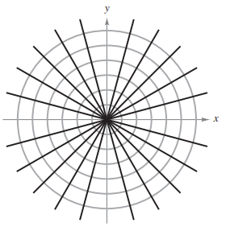

::: {.callout-note title="Example: Orthogonal Trajectories" icon=false appearance="simple"}
Describe the orthogonal trajectories for the family of curves given by:
$$y = \frac{C}{x}$$
for $C \neq 0$. Sketch several members of each family.

::: {.callout-tip collapse="true" title="Show Answer" icon=false}
First, solve the given equation for $C$ and write $xy=C$. Then, by differentiating implicitly with respect to $x$, you obtain the differential equation:

$$
\begin{align*}
xy' + y &= 0 \qquad && \text{(Differential Equation)} \\
x\frac{dy}{dx} &= -y \\
\frac{dy}{dx} &= - \frac{y}{x}
\end{align*}
$$

Because $y'$ represents the slope of the given family of curves at $(x,y)$, it follows that the orthogonal family has the negative reciprocal slope $x/y$. So:
$$\frac{dy}{dx} = \frac{x}{y} \qquad \text{(Slope of orthogonal family)}$$

Now you can find the orthogonal family by separating variables and integrating:
$$
\begin{align*}
\int y \, dy &= \int x \, dx \\
\frac{y^2}{2} &= \frac{x^2}{2} + C_1 \\
y^2 - x^2 &= K
\end{align*}
$$

The centers are at the origin, and the transverse axes are vertical for $K>0$ and horizontal for $K<0$. If $K=0$, the orthogonal trajectories are the lines $y=\pm x$. If $K\neq 0$, the orthogonal trajectories are hyperbolas. Several trajectories are shown below.

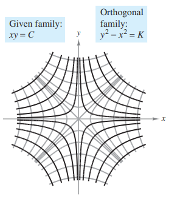
:::
:::

::: {.practice-box}
#### Exercises: Applications of Differential Equations

1. A boiled potato is taken from a pot on a stove and left to cool in a kitchen. The internal temperature of the potato is 91°C at time $t=0$, and the room temperature of the kitchen is a constant 27°C. The internal temperature of the potato at time $t$ minutes can be modeled by the function $H$ that satisfies the differential equation $\frac{dH}{dt} = -\frac{1}{4}(H - 27)$. Find an expression for $H(t)$.
2. Water is draining from a cylindrical barrel. The height $h$ of the water, in meters, changes at a rate modeled by the differential equation $\frac{dh}{dt} = -\frac{1}{10}\sqrt{h}$, where $t$ is the time in days. At time $t=0$, the height of the water is 4 meters.
   a) Find the particular solution $h(t)$ to the differential equation.
   b) According to the model, at what time $t$ will the barrel be completely empty?
3. A population of insects in a controlled environment grows at a rate modeled by the differential equation $\frac{dP}{dt} = \frac{1}{5}(1000 - P)$, where $P$ is the number of insects and $t$ is the time in days. At time $t=0$, there are 200 insects.
   a) Find the particular solution $P(t)$ to the differential equation.
   b) Evaluate $\lim_{t \to \infty} P(t)$ and interpret the meaning of this limit in the context of the problem.
:::

---

### 6.3.4 Logistic Differential Equation

In Section 6.2, the exponential growth model is derived from the fact that the rate of change of a variable $y$ is proportional to the value of $y$. You observed that the differential equation $dy/dt=ky$ has the general solution $y=Ce^{kt}$. Exponential growth is unlimited, but when describing a population, there often exists some upper limit $L$ past which growth cannot occur. 

This upper limit $L$ is called the **carrying capacity**, which is the maximum population $y(t)$ that can be sustained or supported as time $t$ increases. A model that is often used for this type of growth is the **logistic differential equation**:

$$\frac{dy}{dt} = ky \left(1 - \frac{y}{L} \right)$$

where $k$ and $L$ are positive constants. A population that satisfies this equation does not grow without bound, but approaches the carrying capacity $L$, then $dy/dt>0$, and the population increases. If $y$ is greater than $L$, then $dy/dt < 0 $, and the population decreases. The graph of the function $y$ is called the *logistic curve*, as shown below.

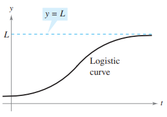

::: {.callout-note title="Example" icon=false appearance="simple"}
Solve the logistic differential equation $\displaystyle \frac{dy}{dt} = ky\left(1 - \frac{y}{L}\right)$.

::: {.callout-tip collapse="true" title="Show Answer" icon=false}
Begin by separating variables.

$$
\begin{align*}
\frac{dy}{dt} &= ky\left(1 - \frac{y}{L}\right) \qquad && \text{(Write differential equation)} \\
\frac{1}{y(1 - y/L)} \, dy &= k \, dt \qquad && \text{(Separate variables)} \\
\int \frac{1}{y(1 - y/L)} \, dy &= \int k \, dt \qquad && \text{(Integrate each side)} \\
\int \left( \frac{1}{y} + \frac{1}{L - y} \right) \, dy &= \int k \, dt \qquad && \text{(Rewrite left side using partial fractions)} \\
\ln|y| - \ln|L - y| &= kt + C \qquad && \text{(Find antiderivative of each side)} \\
\ln \left| \frac{L - y}{y} \right| &= -kt - C \qquad && \text{(Multiply each side by -1 and simplify)} \\
\left| \frac{L - y}{y} \right| &= e^{-kt - C} = e^{-C}e^{-kt} \qquad && \text{(Exponentiate each side)} \\
\frac{L - y}{y} &= be^{-kt} \qquad && \text{(Let } \pm e^{-C} = b)
\end{align*}
$$

Solving this equation for $y$ produces $\displaystyle y = \frac{L}{1 + be^{-kt}}$.
:::
:::

From the previous example, you can conclude that all solutions of the logistic differential equation are of the general form:
$$y = \frac{L}{1+be^{-kt}}$$

::: {.callout-note title="Example" icon=false appearance="simple"}
A state game commission releases 40 elk into a game refuge. After 5 years, the elk population is 104. The commission believes that the environment can support no more than 4000 elk. The growth rate of the elk population $p$ is: 

$$\frac{dp}{dt} = kp \left( 1- \frac{p}{4000} \right), \quad 40 \leq p \leq 4000$$

where $t$ is the number of years.

**a)** Write a model for the elk population in terms of $t$.

**b)** Graph the slope field of the differential equation and the solution that passes through the point $(0,40)$.

**c)** Use the model to estimate the elk population after 15 years.

**d)** Find the limit of the model as $t\to \infty$.

::: {.callout-tip collapse="true" title="Show Answer" icon=false}
**a)** You know that $L=4000$. So, the solution of the equation is of the form:
$$p = \frac{4000}{1 + be^{-kt}}$$

Because $p(0)= 40$, you can solve for $b$ as shown:
$$
\begin{align*}
40 &= \frac{4000}{1 + be^{-k(0)}} \\
40 &= \frac{4000}{1+b} \quad \Rightarrow \quad b=99
\end{align*}
$$

Then, because $p=104$ when $t=5$, you can solve for $k$:
$$104 = \frac{4000}{1+99e^{-k(5)}} \quad \Rightarrow \quad k \approx 0.194$$

So, the model for the elk population is given by $p = \frac{4000}{1+99e^{-0.194t}}$.

**b)** Using a graphing utility, you can graph the slope field of: 
$$\frac{dp}{dt} = 0.194p \left( 1 - \frac{p}{4000} \right)$$
and the solution that passes through $(0,40)$, as shown:

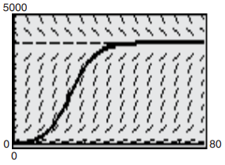

**c)** To estimate the elk population after 15 years, substitute 15 for $t$ in the model:
$$
\begin{align*}
p &= \frac{4000}{1+99e^{-0.194(15)}} \\
p &= \frac{4000}{1+99e^{-2.91}} \approx 626 \text{ elk}
\end{align*}
$$

**d)** As $t$ increases without bound, the denominator of $\frac{4000}{1+99e^{-0.194t}}$ gets closer to 1. So:
$$\lim_{t \to \infty} \frac{4000}{1+99e^{-0.194t}} = 4000$$
:::
:::