## 7.1 Area of a Region Between Two Curves

::: {.callout-tip title="Objectives" icon=false}
| Key Topics & Formulas | Success Criteria |
| :--- | :--- |
| Find the area of a region between two curves using integration | I can set up and evaluate an integral to find the area between two curves by identifying which function is on top and choosing the correct limits. |
| Find the area of a region between intersecting curves using integration | I can find where two curves intersect and use those points to set up and evaluate the integral(s) needed to find the total area. |
| Describe integration as an accumulation process | I can explain how a definite integral represents accumulation and describe it as adding up small pieces to find a total. |
: {tbl-colwidths="[40,60]"}
:::

### 7.1.1 Area of a Region Between Two Curves

::: {.columns}
::: {.column width="60%"}
With a few modifications you can extend the application of definite integrals from the area of a region *under* a curve to the area of a region *between* two curves. Consider two functions $f$ and $g$ that are continuous on the interval $[a,b]$. If, as in Figure 7.1, the graphs of both $f$ and $g$ lie above the $x$-axis, and the graph of $g$ lies below the graph of $f$, you can geometrically interpret the area of the region between the graphs as the area of the region under the graph of $g$ subtracted from the area of the region under the graph of $f$, as shown in Figure 7.2.
:::

::: {.column width="40%"}
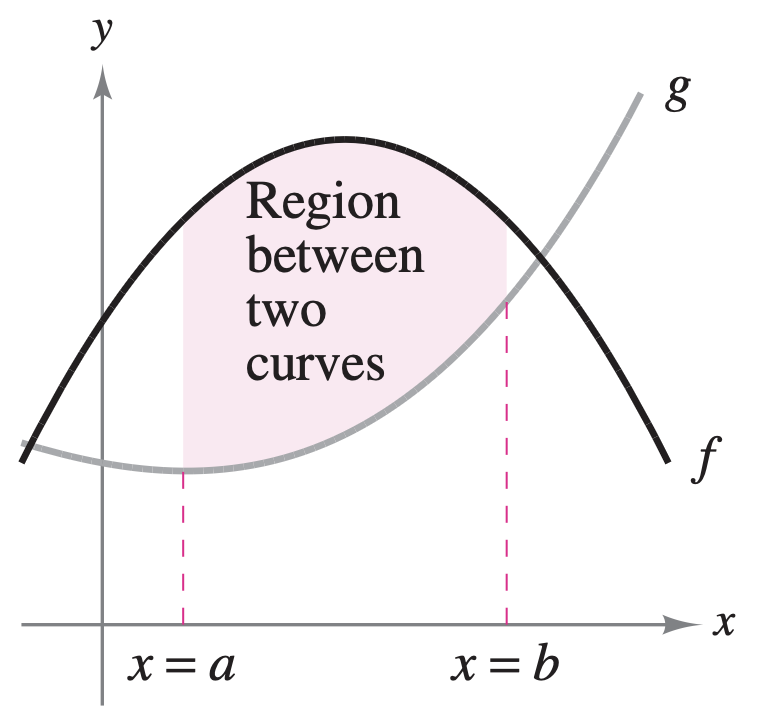
:::
:::

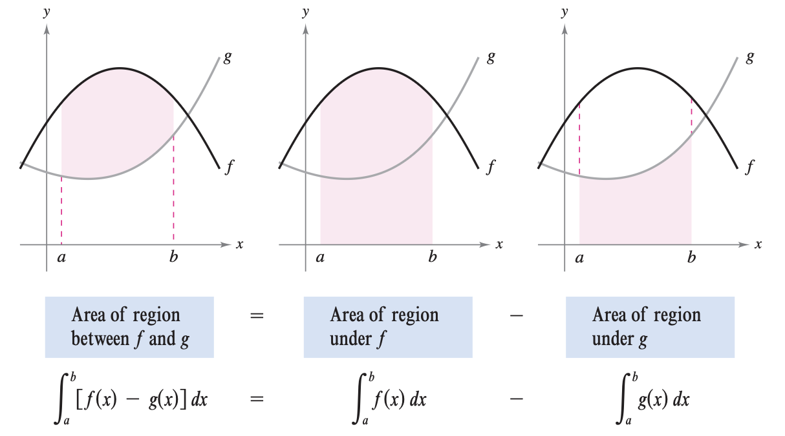

::: {.columns}
::: {.column width="60%"}
To verify the reasonableness of the result shown in Figure 7.2, you can partition the interval $[a,b]$ into $n$ subintervals, each of width $\Delta x$. Then, as shown in Figure 7.3, sketch a **representative rectangle** of width $\Delta x$ and height $f(x_i) - g(x_i)$, where $x_i$ is in the $i$th interval. 

The area of this representative rectangle is:
$$\Delta A_i = (\text{height})(\text{width}) = [f(x_i) - g(x_i)]\Delta x $$

By adding the areas of the $n$ rectangles and taking the limit as $||\Delta x|| \to 0 \, (n \to \infty)$, you obtain:
$$\lim_{n \to \infty} \sum_{i=1}^n [f(x_i) - g(x_i)]\Delta x$$
:::

::: {.column width="40%"}
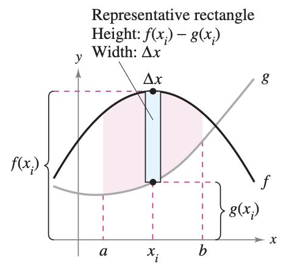
:::
:::

Because $f$ and $g$ are continuous on $[a,b]$, $f-g$ is also continuous on $[a,b]$ and the limit exists. So the area of the given region is:

$$
\begin{align*}
\text{Area} &= \lim_{n \to \infty} \sum_{i=1}^n [f(x_i) - g(x_i)]\Delta x \\
&= \int_a^b [f(x)-g(x)] \, dx
\end{align*}
$$

::: {.callout-note title="Definition: Area of a Region Between Two Curves" icon=false}
If $f$ and $g$ are continuous on $[a,b]$ and $g(x) \leq f(x)$ for all $x$ in $[a,b]$, then the area of the region bounded by the graphs of $f$ and $g$ and the vertical lines $x=a$ and $x=b$ is:
$$A = \int_a^b [f(x)-g(x)] \, dx$$
:::

In Figure 7.1, the graphs of $f$ and $g$ are shown above the $x$-axis. This, however, is not necessary. The same integrand $[f(x)-g(x)]$ can be used as long as $f$ and $g$ are continuous and $g(x) \leq f(x)$ for all $x$ in the interval $[a,b]$. This result is summarized graphically in Figure 7.4.

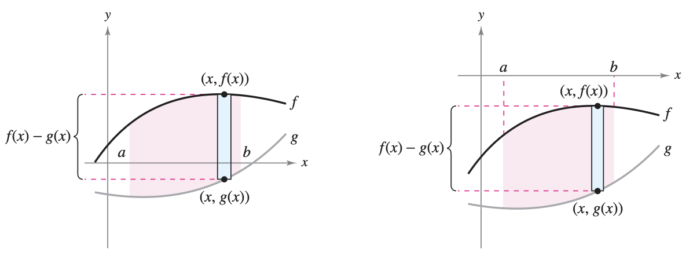

Representative rectangles are used throughout this chapter in various applications of integration. A vertical rectangle (of width $\Delta x$) implies integration with respect to $x$, whereas a horizontal rectangle (of width $\Delta y$) implies integration with respect to $y$.

::: {.callout-warning title="Example" icon=false appearance="simple"}
Find the area of the region bounded by the graphs of $y=x^2+2, y=-x, x=0,$ and $x=1$.

::: {.callout-tip collapse="true" title="Show Answer" icon=false}
Let $g(x)=-x$ and $f(x)=x^2+2$. Then $g(x)\leq f(x)$ for all $x$ in $[0,1]$, as shown in Figure 7.5. So, the area of the representative rectangle is:
$$
\begin{align*}
\Delta A &= [f(x)-g(x)]\Delta x \\
&= [(x^2+2)-(-x)]\Delta x
\end{align*}
$$

and the area of the region is:
$$
\begin{align*}
A = \int_a^b [f(x)-g(x)]\, dx &= \int_0^1 [(x^2+2)-(-x)] \, dx \\
&= \left[ \frac{x^3}{3} + \frac{x^2}{2} + 2x \right]_0^1 \\
&= \frac{1}{3}+\frac{1}{2} + 2 \\
&= \frac{17}{6}
\end{align*}
$$

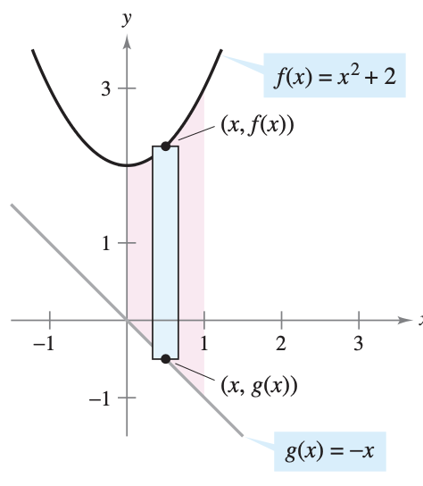
:::
:::

---

### 7.1.2 Area of a Region Between Intersecting Curves

In the previous example, the graphs of $f(x)=x^2+2$ and $g(x)=-x$ do not intersect, and the values of $a$ and $b$ are given explicitly. A more common problem involves the area of a region bounded by two *intersecting* graphs, where the values of $a$ and $b$ must be calculated.

::: {.callout-warning title="Example" icon=false appearance="simple"}
Find the area of the region bounded by the graphs of $f(x)=2-x^2$ and $g(x)=x$.

::: {.callout-tip collapse="true" title="Show Answer" icon=false}
In Figure 7.6, notice that the graphs of $f$ and $g$ have two points of intersection. 

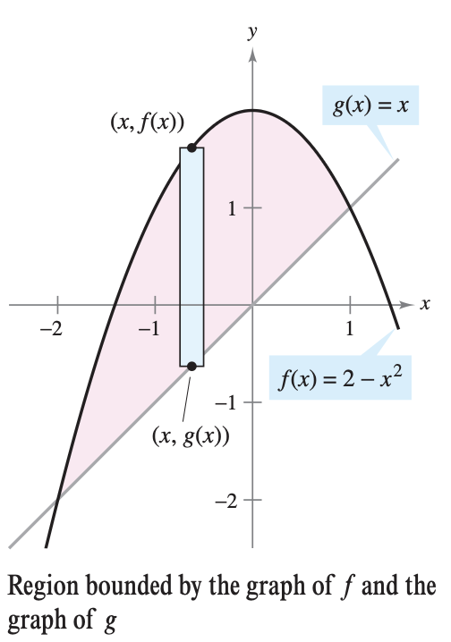

To find the $x$-coordinates of these points, set $f(x)$ and $g(x)$ equal to each other and solve for $x$. 
$$
\begin{align*}
2-x^2 &= x && \text{(Set $f(x)$ equal to $g(x)$)} \\
-x^2-x+2 &= 0 && \text{(Write in general form)} \\
-(x+2)(x-1) &= 0 && \text{(Factor)} \\
x &= -2 \text{ or } 1 && \text{(Solve for $x$)}
\end{align*}
$$

So, $a=-2$ and $b=1$. Because $g(x)\leq f(x)$ for all $x$ in the interval $[-2,1]$, the representative rectangle has an area of:
$$
\begin{align*}
\Delta A &= [f(x)-g(x)] \Delta x\\
&= [(2-x^2) - x] \Delta x
\end{align*}
$$

and the area of the region is:
$$
\begin{align*}
A = \int_{-2}^1 [(2-x^2)-x] \, dx &= \left[ -\frac{x^3}{3} - \frac{x^2}{2} + 2x \right]_{-2}^1 \\
&= \frac{9}{2}
\end{align*}
$$
:::
:::

::: {.callout-warning title="Example" icon=false appearance="simple"}
The sine and cosine curves intersect infinitely many times, bounding regions of equal areas. Find the area of one of these regions.

::: {.callout-tip collapse="true" title="Show Answer" icon=false}
Begin by setting $f(x)$ equal to $g(x)$ and solving:
$$
\begin{align*}
\sin(x) &= \cos(x) && \text{(Set $f(x)$ equal to $g(x)$)} \\
\frac{\sin(x)}{\cos(x)} &= 1 && \text{(Divide each side by $\cos(x)$)} \\
\tan(x) &= 1 && \text{(Trigonometric identity)} \\
x &= \frac{\pi}{4} \text{ or } \frac{5\pi}{4}, \quad 0 \leq x \leq 2\pi && \text{(Solve for $x$)}
\end{align*}
$$

So, $a=\pi/4$ and $b=5\pi/4$. Because $\sin(x) \geq \cos(x)$ for all $x$ in the interval $[\pi/4, 5\pi/4]$, the area of the region is:
$$
\begin{align*}
A = \int_{\pi/4}^{5\pi/4} [\sin(x)-\cos(x)] \, dx &= \bigg[ -\cos(x) - \sin(x) \bigg]_{\pi/4}^{5\pi/4} \\
&= 2\sqrt{2}
\end{align*}
$$
:::
:::

If two curves intersect at more than two points, then to find the area of the region between the curves, you must find all points of intersection and check to see which curve is above the other in each interval determined by these points.

::: {.callout-warning title="Example" icon=false appearance="simple"}
Find the area of the region between the graphs of $f(x)=3x^3-x^2-10x$ and $g(x)=-x^2+2x$.

::: {.callout-tip collapse="true" title="Show Answer" icon=false}
Begin by setting $f(x)=g(x)$ and solving for $x$. This yields the $x$-values at each point of intersection of the two graphs.
$$
\begin{align*}
3x^3 - x^2-10x &= -x^2+2x \\
3x^3-12x &= 0 \\
3x(x-2)(x+2)&= 0 \\
x &= -2, 0, 2
\end{align*}
$$

So, the two graphs intersect when $x = -2, 0, 2$. However, by looking at the graph, notice that $g(x) \leq f(x)$ on the interval $[-2,0]$. However, the graphs switch at the origin, and $f(x)\leq g(x)$ on the interval $[0,2]$.

$$
\begin{align*}
A &= \int_{-2}^0 [f(x)-g(x)] \, dx + \int_0^2 [g(x)-f(x)] \, dx \\
&= \int_{-2}^0 (3x^3-12x) \, dx + \int_0^2 (-3x^3+12x) \, dx \\
&= \left[ \frac{3x^4}{4}-6x^2 \right]_{-2}^0 + \left[ \frac{-3x^4}{4} + 6x^2 \right]_0^2 \\
&= -(12-24) + (-12+24) \\
&= 24
\end{align*}
$$
:::
:::

**NOTICE** that you obtain an incorrect result if you integrate straight from $-2$ to $2$:
$$\int_{-2}^2 [f(x)-g(x)] \, dx = \int_{-2}^2 (3x^3-12x) \, dx = 0$$

If the graph of a function of $y$ is a boundary of a region, it is often convenient to use representative rectangles that are *horizontal* and find the area by integrating with respect to $y$. In general, to determine the area between two curves, you can use:

$$
\begin{align*}
A &= \int_{x_1}^{x_2} \underbrace{[(\text{top curve}) - (\text{bottom curve})]}_{\text{in variable $x$}} \, dx \\
A &= \int_{y_1}^{y_2} \underbrace{[(\text{right curve}) - (\text{left curve})]}_{\text{in variable $y$}} \, dy
\end{align*}
$$

where $(x_1,y_1)$ and $(x_2,y_2)$ are either adjacent points of intersection of the two curves involved or points on the specified boundary lines.

::: {.callout-warning title="Example" icon=false appearance="simple"}
Find the area of a region bounded by the graphs of $x=3-y^2$ and $x=y+1$.

::: {.callout-tip collapse="true" title="Show Answer" icon=false}
Consider:
$$g(y)=3-y^2 \quad \text{ and } \quad f(y) = y+1$$

These two curves intersect when $y=-2$ and $y=1$. Because $f(y)\leq g(y)$ on this interval, you have:
$$\Delta A = [g(y)-f(y)]\Delta y = [(3-y^2)-(y+1)]\Delta y$$

So, the area is:
$$
\begin{align*}
A &= \int_{-2}^1 [(3-y^2)-(y+1)] \, dy \\
&= \int_{-2}^1 (-y^2-y+2) \, dy \\
&= \left[ \frac{-y^3}{3} - \frac{y^2}{2}+2y \right]_{-2}^1 \\
&= \left( -\frac{1}{3}-\frac{1}{2}+2  \right) - \left( \frac{8}{3}-2-4   \right) \\
&= \frac{9}{2}
\end{align*}
$$
:::
:::

Notice that in the previous example, by integrating with respect to $y$ you need only one integral. If you had integrated with respect to $x$, you would have needed two integrals because the upper boundary would have changed at $x=2$. You can see the comparison of the two integrals in Figure 7.7 below.

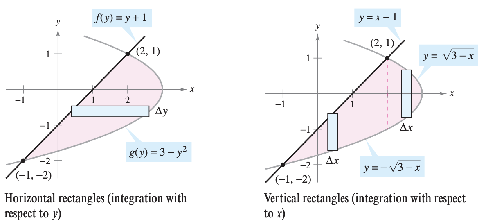

::: {.practice-box}
#### Exercises: Intersecting Curves

1. Find the area of the region bounded by the graphs of $y = e^x$, $y = x$, $x = 0$, and $x = 2$.
   
   ::: {.callout-tip collapse="true" title="Show Answer" icon=false}
   **Solution:**
   First, identify the upper and lower functions on the interval $[0, 2]$. Since $e^x > x$ for all $x$ in this interval, the area $A$ is given by:
   $$A = \int_{0}^{2} (e^x - x) \, dx$$
   Find the antiderivative and evaluate:
   $$A = \left[ e^x - \frac{1}{2}x^2 \right]_{0}^{2} = \left( e^2 - \frac{1}{2}(2)^2 \right) - \left( e^0 - \frac{1}{2}(0)^2 \right)$$
   $$A = (e^2 - 2) - (1 - 0)$$
   $$A = e^2 - 3$$
   :::

2. Find the area of the region completely bounded by the graphs of $f(x) = 2 - x^2$ and $g(x) = x^2 - 6$.
   
   ::: {.callout-tip collapse="true" title="Show Answer" icon=false}
   **Solution:**
   First, find the points of intersection to determine the bounds by setting $f(x) = g(x)$:
   $$2 - x^2 = x^2 - 6$$
   $$2x^2 = 8 \implies x^2 = 4 \implies x = \pm 2$$
   Testing a point in the interval $(-2, 2)$, such as $x = 0$, reveals $f(0) = 2$ and $g(0) = -6$, so $f(x)$ is the upper curve.
   $$A = \int_{-2}^{2} \left( (2 - x^2) - (x^2 - 6) \right) \, dx$$
   $$A = \int_{-2}^{2} (8 - 2x^2) \, dx$$
   Using symmetry (since the integrand is even):
   $$A = 2 \int_{0}^{2} (8 - 2x^2) \, dx$$
   $$A = 2 \left[ 8x - \frac{2}{3}x^3 \right]_{0}^{2}$$
   $$A = 2 \left( 16 - \frac{16}{3} \right) = 2 \left( \frac{48}{3} - \frac{16}{3} \right)$$
   $$A = 2 \left( \frac{32}{3} \right) = \frac{64}{3}$$
   :::

3. Let $R$ be the region enclosed by the graphs of $y = \sqrt{x}$ and $y = \frac{x}{2}$. Find the area of $R$.
   
   ::: {.callout-tip collapse="true" title="Show Answer" icon=false}
   **Solution:**
   Find the points of intersection:
   $$\sqrt{x} = \frac{x}{2}$$
   $$x = \frac{x^2}{4}$$
   $$x^2 - 4x = 0 \implies x(x - 4) = 0 \implies x = 0, x = 4$$
   On the interval $(0, 4)$, $\sqrt{x} > \frac{x}{2}$, so $y = \sqrt{x}$ is the upper curve.
   $$A = \int_{0}^{4} \left( \sqrt{x} - \frac{x}{2} \right) \, dx$$
   $$A = \left[ \frac{2}{3}x^{3/2} - \frac{1}{4}x^2 \right]_{0}^{4}$$
   $$A = \left( \frac{2}{3}(4)^{3/2} - \frac{1}{4}(4)^2 \right) - (0)$$
   $$A = \left( \frac{2}{3}(8) - 4 \right) = \frac{16}{3} - \frac{12}{3}$$
   $$A = \frac{4}{3}$$
   :::

4. Find the area of the region in the first quadrant bounded by the graphs of $y = \sin(x)$, $y = \cos(x)$, and the $y$-axis.
   
   ::: {.callout-tip collapse="true" title="Show Answer" icon=false}
   **Solution:**
   The region is bounded by the $y$-axis ($x = 0$). Find where the curves intersect in the first quadrant:
   $$\sin(x) = \cos(x)$$
   $$\tan(x) = 1 \implies x = \frac{\pi}{4}$$
   On the interval $\left[0, \frac{\pi}{4}\right]$, $\cos(x) \ge \sin(x)$.
   $$A = \int_{0}^{\pi/4} (\cos(x) - \sin(x)) \, dx$$
   $$A = \left[ \sin(x) + \cos(x) \right]_{0}^{\pi/4}$$
   $$A = \left( \sin\left(\frac{\pi}{4}\right) + \cos\left(\frac{\pi}{4}\right) \right) - (\sin(0) + \cos(0))$$
   $$A = \left( \frac{\sqrt{2}}{2} + \frac{\sqrt{2}}{2} \right) - (0 + 1)$$
   $$A = \sqrt{2} - 1$$
   :::

5. Let $R$ be the region bounded by the graphs of $f(x) = x^3 - 3x^2 + 2x$ and $g(x) = 0$. Find the total area of the region $R$.
   
   ::: {.callout-tip collapse="true" title="Show Answer" icon=false}
   **Solution:**
   Find the points of intersection between $f(x)$ and the $x$-axis ($g(x) = 0$):
   $$x^3 - 3x^2 + 2x = 0$$
   $$x(x^2 - 3x + 2) = 0 \implies x(x - 1)(x - 2) = 0 \implies x = 0, 1, 2$$
   The total area requires splitting the integral because the curve crosses the $x$-axis. 
   On $(0, 1)$, $f(x) > 0$. On $(1, 2)$, $f(x) < 0$.
   $$A = \int_{0}^{1} (x^3 - 3x^2 + 2x) \, dx - \int_{1}^{2} (x^3 - 3x^2 + 2x) \, dx$$
   Find the general antiderivative: $F(x) = \frac{1}{4}x^4 - x^3 + x^2$.
   Evaluate the first integral:
   $$F(1) - F(0) = \left( \frac{1}{4} - 1 + 1 \right) - 0 = \frac{1}{4}$$
   Evaluate the second integral:
   $$F(2) - F(1) = \left( \frac{16}{4} - 8 + 4 \right) - \frac{1}{4} = (4 - 8 + 4) - \frac{1}{4} = -\frac{1}{4}$$
   Subtract to find the total absolute area:
   $$A = \frac{1}{4} - \left(-\frac{1}{4}\right) = \frac{1}{4} + \frac{1}{4} = \frac{1}{2}$$
   :::

6. Consider the region bounded by the graphs of $x = y^2 - 4$ and $x = y + 2$.
   **a)** Write an integral expression with respect to $x$ that represents the area of the region. Do not evaluate the integral.
   **b)** Write an integral expression with respect to $y$ that represents the area of the region.
   **c)** Evaluate the integral from part (b) to find the area of the region.

   ::: {.callout-tip collapse="true" title="Show Answer" icon=false}
   **Solution:**
   First, find the points of intersection by setting the equations equal to each other. It is easier to solve for $y$:
   $$y^2 - 4 = y + 2$$
   $$y^2 - y - 6 = 0 \implies (y - 3)(y + 2) = 0 \implies y = 3, y = -2$$
   The intersection points are $(5, 3)$ and $(0, -2)$.
   
   **a)** To integrate with respect to $x$, we must solve both equations for $y$:
   $$x = y^2 - 4 \implies y = \pm\sqrt{x + 4}$$
   $$x = y + 2 \implies y = x - 2$$
   The region must be split at $x = 0$ because the lower boundary changes.
   $$A = \int_{-4}^{0} \left( \sqrt{x+4} - (-\sqrt{x+4}) \right) \, dx + \int_{0}^{5} \left( \sqrt{x+4} - (x - 2) \right) \, dx$$
   
   **b)** To integrate with respect to $y$, the "right" curve is $x = y + 2$ and the "left" curve is $x = y^2 - 4$.
   $$A = \int_{-2}^{3} \left( (y + 2) - (y^2 - 4) \right) \, dy$$
   $$A = \int_{-2}^{3} (-y^2 + y + 6) \, dy$$
   
   **c)** Evaluate the integral from part (b):
   $$A = \left[ -\frac{1}{3}y^3 + \frac{1}{2}y^2 + 6y \right]_{-2}^{3}$$
   Evaluate at upper bound $y = 3$:
   $$-\frac{1}{3}(27) + \frac{1}{2}(9) + 6(3) = -9 + \frac{9}{2} + 18 = 9 + \frac{9}{2} = \frac{27}{2}$$
   Evaluate at lower bound $y = -2$:
   $$-\frac{1}{3}(-8) + \frac{1}{2}(4) + 6(-2) = \frac{8}{3} + 2 - 12 = \frac{8}{3} - 10 = \frac{8}{3} - \frac{30}{3} = -\frac{22}{3}$$
   Subtract to find the total area:
   $$A = \frac{27}{2} - \left( -\frac{22}{3} \right) = \frac{81}{6} + \frac{44}{6} = \frac{125}{6}$$
   :::
:::

---

### 7.1.3 Integration as an Accumulation Process

In this section, the integration formula for the area between two curves was developed by using a rectangle as the *representative element*. For each new application in the remaining sections of this chapter, an appropriate representative element will be constructed using precalculus formulas you already know. Each integration formula will then be obtained by summing or accumulating these representative elements.

<br>
<div style="text-align: center; font-size: 1.1em;">
**Known precalculus formula** $\implies$ **Representative element** $\implies$ **New integration formula**
</div>
<br>

For example, in this section the area formula was developed as follows:

<br>
<div style="text-align: center; font-size: 1.1em;">
$A=(\text{height})(\text{width})$ $\implies$ $\Delta A = [f(x)-g(x)]\Delta x$ $\implies$ $A=\displaystyle \int_a^b [f(x)-g(x)] \, dx$
</div>
<br>


::: {.callout-warning title="Example" icon=false appearance="simple"}
Find the area of the region bounded by the graph of $y=4-x^2$ and the $x$-axis. Describe the integration as an accumulation process.

::: {.callout-tip collapse="true" title="Show Answer" icon=false}
The area is given by: 
$$A = \int_{-2}^2 \left(4-x^2\right) \, dx$$

You can think of the integration as an accumulation of the areas of the rectangles formed as the representative rectangles slide from $x=-2$ to $x=2$, as shown via this [Desmos Interactive Graph](https://www.desmos.com/calculator/zaref1t6bq).
:::
:::


::: {.conceptual-box}
#### Conceptual Questions
*Answer the following in 1-3 complete sentences.*

1. **The Geometry of Accumulation:** In the integral $\int_a^b [f(x)-g(x)] \, dx$, we are accumulating the areas of infinitely many representative rectangles. Geometrically, what specific parts of a single rectangle do the expressions $[f(x) - g(x)]$ and $dx$ represent?
2. **Area Below the $x$-axis:** Even if two curves are completely below the $x$-axis, evaluating $\int_a^b [\text{top} - \text{bottom}] \, dx$ always results in a positive physical area. Algebraically, why does this specific subtraction guarantee a positive number for the height of your rectangles?
3. **Crossing Curves:** Suppose $f(x)$ and $g(x)$ intersect at $x=0$, trading places as the "top" curve. If you evaluate the single integral $\int_{-2}^2 [f(x) - g(x)] \, dx$ without splitting it at the intersection, why will your answer fail to represent the total area? What does this single integral actually calculate?
4. **Choosing $dy$ over $dx$:** Sometimes it is much more efficient to integrate with respect to $y$ instead of $x$. Geometrically, what happens to your vertical representative rectangles ($dx$) that forces you to write multiple integrals, and how do horizontal rectangles ($dy$) fix this?
5. **Right vs. Left:** For vertical rectangles ($dx$), we find the height using $[\text{Top} - \text{Bottom}]$. For horizontal rectangles ($dy$), the integrand is $[\text{Right} - \text{Left}]$. Explain why the "right" curve must be the first term in the subtraction.
:::

## 7.2 Volume: The Disk Method

::: {.callout-tip title="Objectives" icon=false}
| Key Topics & Formulas | Success Criteria |
| :--- | :--- |
| Find the volume of a solid of revolution using the disk method | I can set up and evaluate an integral using the disk method by writing the radius in terms of the variable and choosing the correct limits. |
| Find the volume of a solid of revolution using the washer method | I can set up and evaluate an integral using the washer method by identifying the outer and inner radii and using the correct limits. |
| Find the volume of a solid with known cross sections | I can write an expression for the area of each cross section and use it to set up and evaluate an integral for the volume. |
: {tbl-colwidths="[40,60]"}
:::

### 7.2.1 The Disk Method

::: {.columns}
::: {.column width="60%"}
In Chapter 4 we mentioned that area is only one of the *many* applications of the definite integral. Another important application is its use in finding the volume of a three-dimensional solid. In this section you will study a particular type of three-dimensional solid—one whose cross sections are similar. Solids of revolution are used commonly in engineering and manufacturing. Some examples are axles, funnels, pills, bottles, and pistons!

If a region in the plane is revolved about a line, the resulting solid is a **solid of revolution**, and the line is called the **axis of revolution**. The simplest such solid is a right circular cylinder or **disk** which is formed by revolving a rectangle about an axis adjacent to one side of the rectangle, as shown in Figure 7.8. 
:::

::: {.column width="40%"}
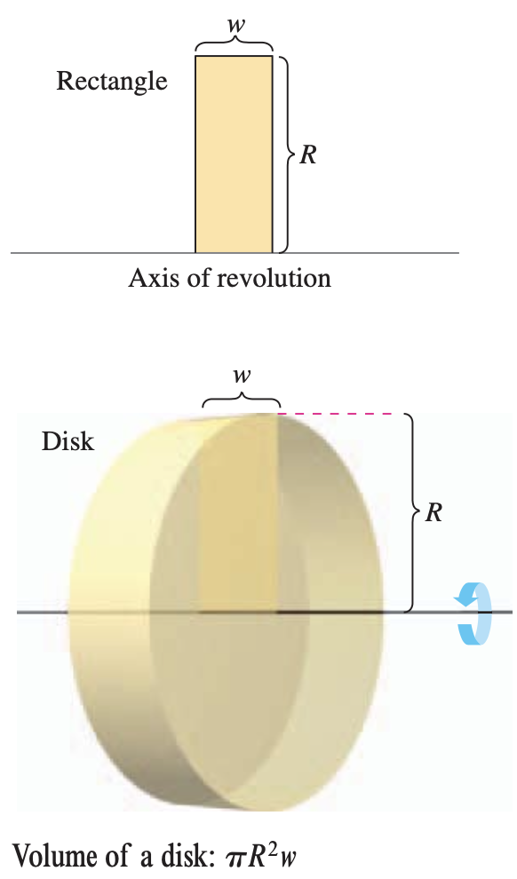
:::
:::

The volume of such a disk is:
$$
\begin{align*}
\text{Volume of disk} &= (\text{area of disk})(\text{width of disk}) \\
&= \pi R^2 w
\end{align*}
$$
where $R$ is the radius of the disk and $w$ is the width.

To see how to use the volume of a disk to find the volume of a general solid of revolution, consider a solid of revolution formed by revolving the plane region in Figure 7.9 about the indicated axis. To determine the volume of this solid, consider a representative rectangle in the plane region. When this rectangle is revolved about the axis of revolution, it generates a representative disk whose volume is:
$$\Delta V = \pi R^2 \Delta x$$

Approximating the volume of the solid by $n$ such disks of width $\Delta x$ and radius $R(x_i)$ produces:
$$
\begin{align*}
\text{Volume of solid} &\approx \sum_{i=1}^n \pi [R(x_i)]^2 \Delta x \\
&= \pi \sum_{i=1}^n [R(x_i)]^2 \Delta x
\end{align*}
$$

This approximation appears to become better and better as $||\Delta||\to 0 \, (n\to \infty)$.

::: {.callout-note title="Definition: Volume of a Solid" icon=false}
$$\text{Volume of a solid} = \lim_{||\Delta || \to 0} \pi \sum_{i=1}^n [R(x_i)]^2 \Delta x = \pi \int_a^b [R(x)]^2 \, dx$$
:::

Schematically, the disk method looks like this:

<br>
<div style="text-align: center; font-size: 1.1em;">
**Volume of disk** <br> $V = \pi R^2 w$ $\implies$ $\Delta V = \pi [R(x_i)]^2 \Delta x$ $\implies$ **Solid of revolution** <br> $V = \displaystyle \pi \int_a^b [R(x)]^2 \, dx$
</div>
<br>

A similar formula can be derived if the axis of revolution is vertical.

::: {.callout-important title="The Disk Method" icon=false}
To find the volume of a solid of revolution with the **disk method**, use one of the following:

::: {layout-ncol=2}
***Horizontal Axis of Revolution***
$\displaystyle \text{Volume} = V = \pi \int_a^b [R(x)]^2 \, dx$

***Vertical Axis of Revolution***
$\displaystyle \text{Volume} = V = \pi \int_a^b [R(y)]^2 \, dy$
:::
:::

Note that in Figure 7.9, you can determine the variable of integration by placing a representative rectangle in the plane region "perpendicular" to the axis of revolution. If the width of the rectangle is $\Delta x$, integrate with respect to $x$, and if the width of the rectangle is $\Delta y$, integrate with respect to $y$. 

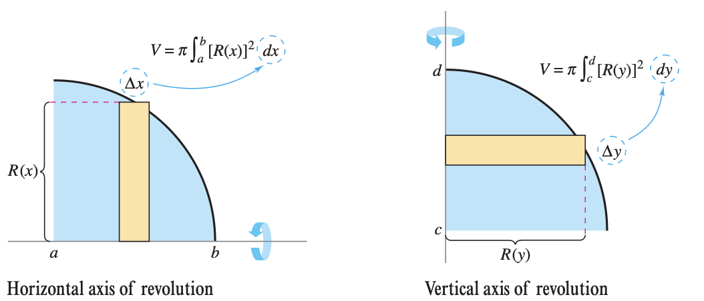

The simplest application of the disk method involves a plane region bounded by the graph of $f$ and the $x$-axis. If the axis of revolution is the $x$-axis, the radius $R(x)$ is simply $f(x)$.

::: {.callout-warning title="Example" icon=false appearance="simple"}
Find the volume of the solid formed by revolving the region bounded by the graph of $f(x)= \sqrt{\sin(x)}$ and the $x$-axis ($0 \leq x \leq \pi$) about the $x$-axis.

::: {.callout-tip collapse="true" title="Show Answer" icon=false}
Draw the representative rectangle to see that the radius of this solid is:
$$
\begin{align*}
R(x) &= f(x) \\
&= \sqrt{\sin(x)}
\end{align*}
$$

So, the volume of the solid of revolution is:
$$
\begin{align*}
V = \pi \int_a^b [R(x)]^2 \, dx &= \pi \int_0^\pi \Big( \sqrt{\sin(x)} \Big)^2 \, dx \\
&= \pi \int_0^\pi \sin(x) \, dx \\
&= \pi \Big[ -\cos(x) \Big]_0^\pi \\
&= \pi(1+1) \\
&= 2\pi
\end{align*}
$$

**Interactive Visualization:** Use the slider below to revolve the curve $f(x) = \sqrt{\sin(x)}$ around the $x$-axis.
```{=html}
<iframe src="widget-disk-sqrt-sinx.html" width="100%" height="580"
        style="border:none; border-radius:8px;"></iframe>
```
:::
:::


::: {.callout-warning title="Example" icon=false appearance="simple"}
Find the volume of the solid formed by revolving the region bounded by $f(x) = 2-x^2$ and $g(x)=1$ about the line $y=1$.

::: {.callout-tip collapse="true" title="Show Answer" icon=false}
By equating $f(x)$ and $g(x)$, you can determine the two graphs intersect when $x= \pm 1$. To find the radius, subtract $g(x)$ from $f(x)$.
$$
\begin{align*}
R(x) &= f(x)-g(x) \\
&= (2-x^2)-1 \\
&= 1-x^2
\end{align*}
$$

Finally, integrate between $-1$ and $1$ to find the volume.
$$
\begin{align*}
V = \pi \int_a^b [R(x)]^2 \, dx &= \pi \int_{-1}^1 (1-x^2)^2 \, dx \\
&= \pi \int_{-1}^1 (1-2x^2+x^4) \, dx \\
&= \pi \left[ x - \frac{2x^3}{3} + \frac{x^5}{5} \right]_{-1}^1 \\
&= \frac{16\pi}{15}
\end{align*}
$$

**Interactive Visualization:** Use the slider below to revolve the curve $f(x) = 2 - x^2$ around the line $y=1$.
```{=html}
<iframe src="widget-2-minus-x-squared.html" width="100%" height="580"
        style="border:none; border-radius:8px;"></iframe>
```

:::
:::

::: {.practice-box}
#### Exercises: The Disk Method

1. Find the volume of the solid generated when the region bounded by the graphs of $y = \sqrt{x}$, $y = 0$, and $x = 4$ is revolved about the $x$-axis.
   
   ::: {.callout-tip collapse="true" title="Show Answer" icon=false}
   **Solution:**
   Use the disk method. The radius of a representative disk is $r(x) = \sqrt{x}$. 
   Set up the integral with respect to $x$ from $x = 0$ to $x = 4$:
   $$V = \pi \int_{0}^{4} (\sqrt{x})^2 \, dx$$
   Simplify the integrand:
   $$V = \pi \int_{0}^{4} x \, dx$$
   Find the antiderivative and evaluate:
   $$V = \pi \left[ \frac{1}{2}x^2 \right]_{0}^{4}$$
   $$V = \pi \left( \frac{1}{2}(4)^2 - \frac{1}{2}(0)^2 \right)$$
   $$V = \pi \left( \frac{16}{2} - 0 \right)$$
   $$V = 8\pi$$
   :::

2. Find the volume of the solid generated when the region bounded by the graphs of $y = x^3$, $x = 0$, and $y = 8$ is revolved about the $y$-axis.
   
   ::: {.callout-tip collapse="true" title="Show Answer" icon=false}
   **Solution:**
   Because the region is revolved around the $y$-axis, use the disk method with respect to $y$. First, solve the given function for $x$ to find the radius $r(y)$:
   $$y = x^3 \implies x = \sqrt[3]{y} = y^{1/3}$$
   Set up the integral from $y = 0$ to $y = 8$:
   $$V = \pi \int_{0}^{8} \left(y^{1/3}\right)^2 \, dy$$
   $$V = \pi \int_{0}^{8} y^{2/3} \, dy$$
   Find the antiderivative and evaluate:
   $$V = \pi \left[ \frac{3}{5}y^{5/3} \right]_{0}^{8}$$
   $$V = \pi \left( \frac{3}{5}(8)^{5/3} - 0 \right)$$
   Since $8^{1/3} = 2$, we have $8^{5/3} = 2^5 = 32$:
   $$V = \pi \left( \frac{3}{5}(32) \right)$$
   $$V = \frac{96\pi}{5}$$
   :::

3. Find the volume of the solid generated when the region bounded by the graphs of $y = 2 - x^2$ and $y = 1$ is revolved about the horizontal line $y = 1$.
   
   ::: {.callout-tip collapse="true" title="Show Answer" icon=false}
   **Solution:**
   Find the bounds of integration by setting the equations equal to each other:
   $$2 - x^2 = 1 \implies x^2 = 1 \implies x = \pm 1$$
   Use the disk method. The axis of revolution is $y = 1$, so the radius of the disk is the distance from the upper curve to the line $y = 1$:
   $$r(x) = (2 - x^2) - 1 = 1 - x^2$$
   Set up the integral from $x = -1$ to $x = 1$:
   $$V = \pi \int_{-1}^{1} (1 - x^2)^2 \, dx$$
   Expand the integrand:
   $$V = \pi \int_{-1}^{1} (1 - 2x^2 + x^4) \, dx$$
   Because the integrand is an even function, we can use symmetry:
   $$V = 2\pi \int_{0}^{1} (1 - 2x^2 + x^4) \, dx$$
   Find the antiderivative and evaluate:
   $$V = 2\pi \left[ x - \frac{2}{3}x^3 + \frac{1}{5}x^5 \right]_{0}^{1}$$
   $$V = 2\pi \left( 1 - \frac{2}{3} + \frac{1}{5} \right) - (0)$$
   Find a common denominator (15) for the fractions:
   $$V = 2\pi \left( \frac{15}{15} - \frac{10}{15} + \frac{3}{15} \right)$$
   $$V = 2\pi \left( \frac{8}{15} \right)$$
   $$V = \frac{16\pi}{15}$$
   :::

4. Let $R$ be the region enclosed by the graph of $f(x) = \frac{1}{x}$, the $x$-axis, and the vertical lines $x=1$ and $x=e$. Which of the following expressions represents the volume of the solid generated when $R$ is revolved about the $x$-axis?

   **(A)** $\pi \int_1^e \frac{1}{x} \, dx$

   **(B)** $\pi \int_1^e \frac{1}{x^2} \, dx$

   **(C)** $2\pi \int_1^e \frac{1}{x^2} \, dx$
   
   **(D)** $\pi \int_1^e \ln(x) \, dx$

   ::: {.callout-tip collapse="true" title="Show Answer" icon=false}
   **Solution:**
   Using the disk method around the $x$-axis, the formula for volume is $V = \pi \int_{a}^{b} [r(x)]^2 \, dx$.
   The radius is given by the function $r(x) = \frac{1}{x}$, and the bounds are from $x = 1$ to $x = e$.
   $$V = \pi \int_{1}^{e} \left( \frac{1}{x} \right)^2 \, dx$$
   $$V = \pi \int_{1}^{e} \frac{1}{x^2} \, dx$$
   This matches expression **(B)**.
   :::

5. Let $R$ be the region in the first quadrant bounded by the graph of $y = 4 - x^2$ and the coordinate axes.
   **a)** Find the area of $R$.
   **b)** Find the volume of the solid generated when $R$ is revolved about the $x$-axis.
   **c)** Find the volume of the solid generated when $R$ is revolved about the $y$-axis.

   ::: {.callout-tip collapse="true" title="Show Answer" icon=false}
   **Solution:**
   First, establish the boundaries for the region in the first quadrant. The curve intersects the $y$-axis at $y = 4$ and the $x$-axis where $4 - x^2 = 0 \implies x = 2$.
   
   **a)** Set up the integral for the area from $x = 0$ to $x = 2$:
   $$A = \int_{0}^{2} (4 - x^2) \, dx$$
   $$A = \left[ 4x - \frac{1}{3}x^3 \right]_{0}^{2}$$
   $$A = \left( 4(2) - \frac{1}{3}(8) \right) - 0$$
   $$A = 8 - \frac{8}{3} = \frac{24}{3} - \frac{8}{3} = \frac{16}{3}$$
   
   **b)** Use the disk method with respect to $x$:
   $$V_x = \pi \int_{0}^{2} (4 - x^2)^2 \, dx$$
   $$V_x = \pi \int_{0}^{2} (16 - 8x^2 + x^4) \, dx$$
   $$V_x = \pi \left[ 16x - \frac{8}{3}x^3 + \frac{1}{5}x^5 \right]_{0}^{2}$$
   $$V_x = \pi \left( 16(2) - \frac{8}{3}(8) + \frac{1}{5}(32) \right)$$
   $$V_x = \pi \left( 32 - \frac{64}{3} + \frac{32}{5} \right)$$
   Find a common denominator of 15:
   $$V_x = \pi \left( \frac{480}{15} - \frac{320}{15} + \frac{96}{15} \right) = \pi \left( \frac{256}{15} \right) = \frac{256\pi}{15}$$
   
   **c)** Use the disk method with respect to $y$. First, solve the equation for $x$:
   $$y = 4 - x^2 \implies x^2 = 4 - y \implies x = \sqrt{4 - y}$$
   The bounds for $y$ are from $y = 0$ to $y = 4$.
   $$V_y = \pi \int_{0}^{4} (\sqrt{4 - y})^2 \, dy$$
   $$V_y = \pi \int_{0}^{4} (4 - y) \, dy$$
   $$V_y = \pi \left[ 4y - \frac{1}{2}y^2 \right]_{0}^{4}$$
   $$V_y = \pi \left( 4(4) - \frac{1}{2}(16) \right) - 0$$
   $$V_y = \pi (16 - 8) = 8\pi$$
   :::
:::
---

### 7.2.2 The Washer Method

::: {.columns}
::: {.column width="60%"}
The disk method can be extended to cover solids of revolution with holes by replacing the representative disk with a representative **washer**. The washer is formed by revolving a rectangle about an axis, as shown in the figure. If $r$ and $R$ are the inner and outer radii of the washer and $w$ is the width of the washer, the volume is given by:
$$\text{Volume of washer} = \pi (R^2 - r^2)w$$
:::

::: {.column width="40%"}
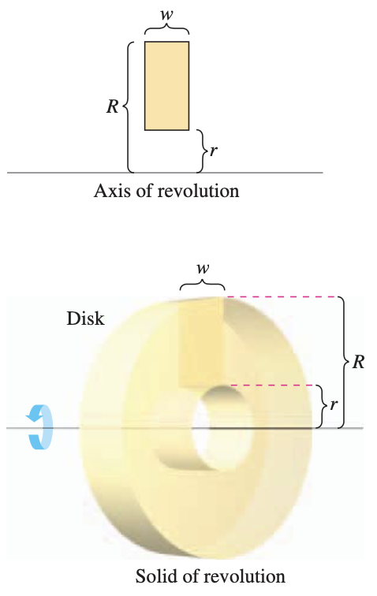
:::
:::

To see how this concept can be used to find the volume of a solid of revolution, consider a region bounded by an **outer radius** $R(x)$ and an **inner radius** $r(x)$, as shown in Figure 7.11 below. If the region is revolved about its axis of revolution, the volume of the resulting solid is given by the **washer method**.

::: {.callout-important title="The Washer Method" icon=false}
The volume of a solid generated by the washer method is given by:
$$V = \pi \int_a^b \left([R(x)]^2 - [r(x)]^2 \right) \, dx$$
:::

Note that the integral involving the inner radius represents the volume of the hole and is *subtracted* from the integral involving the outer radius.

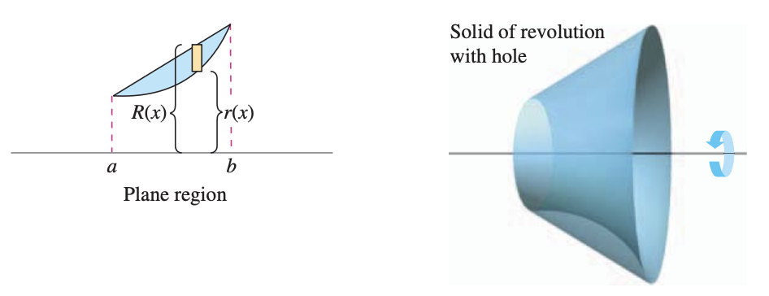

::: {.callout-warning title="Example" icon=false appearance="simple"}
Find the volume of the solid formed by revolving the region bounded by the graphs of $y=\sqrt{x}$ and $y = x^2$ about the $x$-axis.

::: {.callout-tip collapse="true" title="Show Answer" icon=false}
::: {.columns}
::: {.column width="35%"}
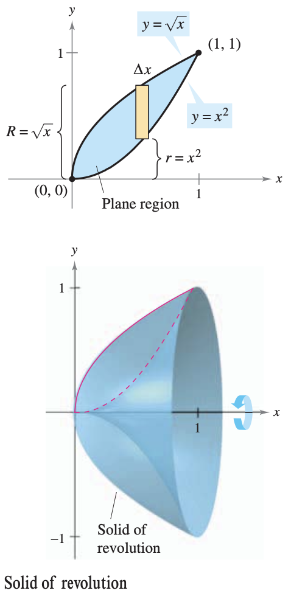
:::

::: {.column width="65%"}
You can see that the outer and inner radii are as follows:
$$
\begin{align*}
R(x) &= \sqrt{x} \qquad && \text{(Outer radius)} \\
r(x) &= x^2 \qquad && \text{(Inner radius)}
\end{align*}
$$

Integrating between $0$ and $1$ produces:
$$
\begin{align*}
V &= \pi \int_a^b \left( [R(x)]^2 - [r(x)]^2 \right) \, dx \\
&= \pi \int_0^1 \left[ (\sqrt{x})^2 - (x^2)^2 \right] \, dx \\
&= \pi \int_0^1 (x-x^4) \, dx \\
&= \pi \left[ \frac{x^2}{2} - \frac{x^5}{5} \right]_0^1 \\
&= \frac{3\pi}{10}
\end{align*}
$$
:::
:::

**Interactive Visualization:** Use the slider below to revolve the region bounded by $y=\sqrt{x}$ and $y=x^2$ around the $x$-axis.
```{=html}
<iframe src="widget-washer-sqrt-x-and-x2.html" width="100%" height="580"
        style="border:none; border-radius:8px;"></iframe>
```
:::
:::

In each example so far, the axis of revolution has been *horizontal* and you have integrated with respect to $x$. In the next example, the axis of revolution is *vertical* and you integrate with respect to $y$. In this example, you need two separate integrals to compute the volume.

::: {.callout-warning title="Example" icon=false appearance="simple"}
Find the volume of the solid formed by revolving the region bounded by the graphs of $y=x^2+1$, $y=0$, $x=0$, and $x=1$ about the $y$-axis, as shown in Figure 7.13.

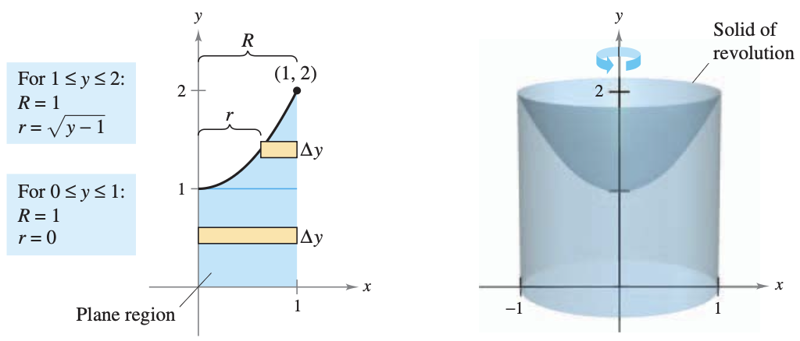

::: {.callout-tip collapse="true" title="Show Answer" icon=false}
For the region shown, the outer radius is simply $R=1$. There is, however, no convenient formula that represents the inner radius. When $0 \leq y \leq 1$, $r=0$, but when $1 \leq y \leq 2$, $r$ is determined by the equation $y=x^2+1$, which implies that $r = \sqrt{y-1}$.
$$
r(y) = 
\begin{cases}
0, & 0 \leq y \leq 1 \\
\sqrt{y-1}, & 1 \leq y \leq 2
\end{cases}
$$

Using this definition of the inner radius, you can use two integrals to find the volume. 
$$
\begin{align*}
V &= \pi \int_0^1 (1^2-0^2) \, dy + \pi \int_1^2 [1^2 - (\sqrt{y-1})^2] \, dy \qquad && \text{(Apply washer method)} \\
&= \pi \int_0^1 1 \, dy + \pi \int_1^2 (2-y) \, dy \qquad && \text{(Simplify)} \\
&= \pi \Bigg[ y \Bigg]_0^1 + \pi \Bigg[ 2y-\frac{y^2}{2} \Bigg]_1^2 \qquad && \text{(Integrate)} \\
&= \pi + \pi \left( 4-2-2+\frac{1}{2} \right) \\
&= \frac{3\pi}{2}
\end{align*}
$$

Note that the first integral $\pi \int_0^1 1 \, dy$ represents the volume of a right circular cylinder of radius 1 and height 1. This portion of the volume could have been determined without using calculus.

**Interactive Visualization:** Use the slider below to revolve the region bounded by $y=x^2+1$, $y=0$, $x=0$, and $x=1$ around the $y$-axis.
```{=html}
<iframe src="widget-washer-x2-plus1-y-axis.html" width="100%" height="580"
        style="border:none; border-radius:8px;"></iframe>
```
:::
:::

::: {.callout-warning title="Example" icon=false appearance="simple"}
A manufacturer drills a hole through the center of a metal sphere of radius 5 inches. The hole has a radius of 3 inches. What is the volume of the resulting metal ring?

::: {.callout-tip collapse="true" title="Show Answer" icon=false}
You can imagine the ring to be generated by a segment of the circle whose equation is $x^2+y^2 = 25$. Because the radius of the hole is 3 inches, you can let $y=3$ and solve the equation $x^2+y^2=25$ to determine that the limits of integration are $x=\pm4$. So, the inner and outer radii are $r(x)=3$ and $R(x)=\sqrt{25-x^2}$ and the volume is given by:
$$
\begin{align*}
V = \pi \int_a^b \left( [R(x)]^2 - [r(x)]^2 \right) \, dx &= \pi \int_{-4}^4 \left[\left(\sqrt{25-x^2} \right)^2 - (3)^2\right] \, dx \\
&= \pi \int_{-4}^4 (16-x^2)\, dx \\
&= \pi \Bigg[ 16x-\frac{x^3}{3} \Bigg]_{-4}^4 \\
&= \frac{256\pi}{3} \text{ in}^3
\end{align*}
$$

**Interactive Visualization:** Use the slider below to visualize the solid formed by revolving the region between the outer radius $R(x) = \sqrt{25-x^2}$ and the inner radius $r(x) = 3$ around the $x$-axis.
```{=html}
<iframe src="widget-washer-sphere-drilled.html" width="100%" height="580"
        style="border:none; border-radius:8px;"></iframe>
```
:::
:::

::: {.practice-box}
#### Exercises: The Washer Method

1. Let $R$ be the region bounded by the graphs of $y = x^2$ and $y = 2x$. Find the volume of the solid generated when $R$ is revolved about the $x$-axis.
   
   ::: {.callout-tip collapse="true" title="Show Answer" icon=false}
   **Solution:**
   First, find the points of intersection to determine the bounds:
   $$x^2 = 2x \implies x^2 - 2x = 0 \implies x(x - 2) = 0 \implies x = 0, x = 2$$
   Use the washer method. The outer radius is the top curve $R(x) = 2x$, and the inner radius is the bottom curve $r(x) = x^2$.
   $$V = \pi \int_{0}^{2} \left( (2x)^2 - (x^2)^2 \right) \, dx$$
   $$V = \pi \int_{0}^{2} (4x^2 - x^4) \, dx$$
   Find the antiderivative and evaluate:
   $$V = \pi \left[ \frac{4}{3}x^3 - \frac{1}{5}x^5 \right]_{0}^{2}$$
   $$V = \pi \left( \frac{4}{3}(8) - \frac{1}{5}(32) \right) - 0$$
   $$V = \pi \left( \frac{32}{3} - \frac{32}{5} \right)$$
   Find a common denominator of 15:
   $$V = \pi \left( \frac{160}{15} - \frac{96}{15} \right) = \frac{64\pi}{15}$$
   :::

2. Let $R$ be the region bounded by the graph of $x = y^2$ and the vertical line $x = 4$. Write, but do not evaluate, an integral expression for the volume of the solid generated when $R$ is revolved about the $y$-axis.
   
   ::: {.callout-tip collapse="true" title="Show Answer" icon=false}
   **Solution:**
   Find the points of intersection for the $y$-bounds:
   $$y^2 = 4 \implies y = \pm 2$$
   Use the washer method with respect to $y$. The outer radius is the vertical line $R(y) = 4$, and the inner radius is the curve $r(y) = y^2$.
   $$V = \pi \int_{-2}^{2} \left( (4)^2 - (y^2)^2 \right) \, dy$$
   $$V = \pi \int_{-2}^{2} (16 - y^4) \, dy$$
   *Note: Because of symmetry across the $x$-axis, this can also be written as $V = 2\pi \int_{0}^{2} (16 - y^4) \, dy$.*
   :::

3. Let $R$ be the region enclosed by the graphs of $y = \sqrt{x}$ and $y = x^2$. Which of the following integrals represents the volume of the solid generated when $R$ is revolved about the horizontal line $y = 2$?
   
   **(A)** $\pi \int_0^1 \left( (2 - x^2)^2 - (2 - \sqrt{x})^2 \right) \, dx$

   **(B)** $\pi \int_0^1 \left( (2 - \sqrt{x})^2 - (2 - x^2)^2 \right) \, dx$

   **(C)** $\pi \int_0^1 \left( \sqrt{x} - x^2 \right)^2 \, dx$

   **(D)** $\pi \int_0^1 \left( (\sqrt{x})^2 - (x^2)^2 \right) \, dx$

   ::: {.callout-tip collapse="true" title="Show Answer" icon=false}
   **Solution:**
   The points of intersection are $x = 0$ and $x = 1$. On this interval, $\sqrt{x} \ge x^2$. 
   The axis of revolution is $y = 2$, which is above the region. 
   The outer radius $R(x)$ is the distance from the axis of revolution to the bottom curve: $R(x) = 2 - x^2$.
   The inner radius $r(x)$ is the distance from the axis of revolution to the top curve: $r(x) = 2 - \sqrt{x}$.
   Set up the washer method integral:
   $$V = \pi \int_{0}^{1} \left( (2 - x^2)^2 - (2 - \sqrt{x})^2 \right) \, dx$$
   This matches expression **(A)**.
   :::

4. Let $R$ be the region bounded by the graphs of $y = x^2$ and $y = 4$. Write, but do not evaluate, an integral expression for the volume of the solid generated when $R$ is revolved about the horizontal line $y = 5$.
   
   ::: {.callout-tip collapse="true" title="Show Answer" icon=false}
   **Solution:**
   Find the intersection points for the bounds:
   $$x^2 = 4 \implies x = \pm 2$$
   The axis of revolution is $y = 5$, which is above the region.
   The outer radius $R(x)$ is the distance from $y = 5$ to the bottom curve $y = x^2$, so $R(x) = 5 - x^2$.
   The inner radius $r(x)$ is the distance from $y = 5$ to the top curve $y = 4$, so $r(x) = 5 - 4 = 1$.
   Set up the integral using the washer method:
   $$V = \pi \int_{-2}^{2} \left( (5 - x^2)^2 - (1)^2 \right) \, dx$$
   $$V = \pi \int_{-2}^{2} \left( (5 - x^2)^2 - 1 \right) \, dx$$
   :::

5. Let $R$ be the region bounded by the graph of $y = e^x$, the horizontal line $y = 1$, and the vertical line $x = 2$.
   **a)** Find the area of $R$.
   **b)** Find the volume of the solid generated when $R$ is revolved about the $x$-axis.
   **c)** Write, but do not evaluate, an integral expression for the volume of the solid generated when $R$ is revolved about the horizontal line $y = -1$.

   ::: {.callout-tip collapse="true" title="Show Answer" icon=false}
   **Solution:**
   First, find where $y = e^x$ intersects $y = 1$: $e^x = 1 \implies x = 0$. So the bounds are $x = 0$ to $x = 2$.
   
   **a)** Set up the integral for the area with $y = e^x$ as the top curve and $y = 1$ as the bottom curve:
   $$A = \int_{0}^{2} (e^x - 1) \, dx$$
   $$A = \left[ e^x - x \right]_{0}^{2} = (e^2 - 2) - (e^0 - 0)$$
   $$A = e^2 - 2 - 1 = e^2 - 3$$
   
   **b)** Use the washer method around the $x$-axis ($y = 0$). Outer radius $R(x) = e^x$, inner radius $r(x) = 1$.
   $$V = \pi \int_{0}^{2} \left( (e^x)^2 - (1)^2 \right) \, dx$$
   $$V = \pi \int_{0}^{2} (e^{2x} - 1) \, dx$$
   $$V = \pi \left[ \frac{1}{2}e^{2x} - x \right]_{0}^{2}$$
   $$V = \pi \left( \left(\frac{1}{2}e^{4} - 2\right) - \left(\frac{1}{2}e^{0} - 0\right) \right)$$
   $$V = \pi \left( \frac{1}{2}e^4 - 2 - \frac{1}{2} \right) = \pi \left( \frac{1}{2}e^4 - \frac{5}{2} \right) = \frac{\pi}{2}(e^4 - 5)$$
   
   **c)** The axis of revolution is $y = -1$, which is below the region.
   The outer radius $R(x)$ is the distance from $y = -1$ to the top curve $y = e^x$, so $R(x) = e^x - (-1) = e^x + 1$.
   The inner radius $r(x)$ is the distance from $y = -1$ to the bottom curve $y = 1$, so $r(x) = 1 - (-1) = 2$.
   Set up the washer method integral:
   $$V = \pi \int_{0}^{2} \left( (e^x + 1)^2 - (2)^2 \right) \, dx$$
   $$V = \pi \int_{0}^{2} \left( (e^x + 1)^2 - 4 \right) \, dx$$
   :::
:::

::: {.conceptual-box}
#### Conceptual Questions
*Answer the following in 1-3 complete sentences.*

1. **Disk vs. Washer:** Geometrically, what specific feature of a bounded region and its relationship to the axis of revolution forces you to use the washer method instead of the disk method?
2. **The Classic Algebra Mistake:** When setting up a washer method integral, a common mistake is to write the integrand as $\pi [R(x) - r(x)]^2$. Algebraically and geometrically, why is this incorrect, and why must it be written as $\pi([R(x)]^2 - [r(x)]^2)$ instead?
3. **Choosing the Variable ($dx$ vs. $dy$):** If you are revolving a region around a vertical axis (like the y-axis or $x=3$), you must integrate with respect to $y$. Geometrically, why does a vertical axis of revolution force your representative rectangles to have a width of $dy$?
4. **Shifted Axes of Revolution:** Suppose you are revolving a region around the line $y = -2$ instead of the $x$-axis ($y = 0$). How do you use the "Top $-$ Bottom" concept to correctly write the radius $R(x)$, and why does this result in adding 2 to your function?
5. **The Geometry of the Integrand:** Integration is an accumulation process. In the disk method formula $V = \int_a^b \pi [R(x)]^2 \, dx$, what specific 3D geometric shape does the expression $\pi [R(x)]^2 \, dx$ represent before the integral adds them all together?
:::

---

### 7.2.3 Solids with Known Cross Sections

With the disk method, you can find the volume of a solid having a circular cross section whose area is $A=\pi R^2$. This method can be generalized to solids of any shape, as long as you know a formula for the area of an arbitrary cross section. Some common cross sections are squares, rectangles, triangles, semicircles, and trapezoids.

::: {.callout-important title="Volumes of Solids with Known Cross Sections" icon=false}
1. For cross sections of area $A(x)$ taken perpendicular to the $x$-axis:
   $$\text{Volume} = \int_a^b A(x) \, dx$$
2. For cross sections of area $A(y)$ taken perpendicular to the $y$-axis:
   $$\text{Volume} = \int_c^d A(y) \, dy$$
:::

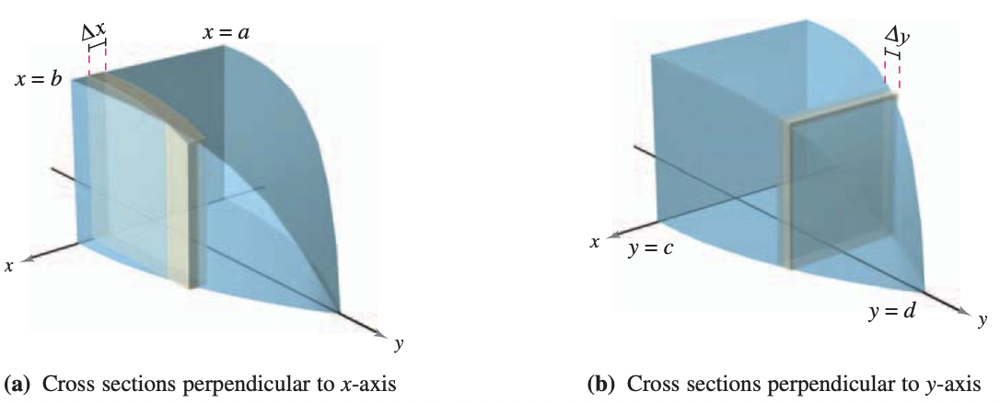

::: {.callout-warning title="Example" icon=false appearance="simple"}
Find the volume of the solid shown. The base of the solid is the region bounded by the lines:
$$f(x) = 1 - \frac{x}{2}, \quad g(x) = -1+\frac{x}{2}, \quad \text{ and } \quad x=0$$
The cross sections perpendicular to the $x$-axis are equilateral triangles.

::: {layout-ncol=2}
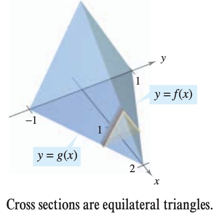

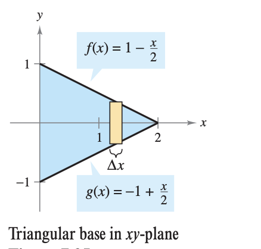
:::

::: {.callout-tip collapse="true" title="Show Answer" icon=false}
The base and area of each triangular cross section are as follows:
$$
\begin{align*}
\text{Base} &= \left( 1 - \frac{x}{2} \right) - \left(-1 + \frac{x}{2} \right) = 2-x \qquad && \text{(Length of base)} \\
\text{Area}&= \frac{\sqrt{3}}{4} (\text{base})^2 \qquad && \text{(Area of equilateral triangle)} \\
A(x) &= \frac{\sqrt{3}}{4}(2-x)^2 \qquad && \text{(Area of cross section)}
\end{align*}
$$

Because $x$ ranges from 0 to 2, the volume of the solid is:
$$
\begin{align*}
V = \int_a^b A(x) \, dx &= \int_0^2 \frac{\sqrt{3}}{4}(2-x)^2 \, dx \\
&= -\frac{\sqrt{3}}{4} \Bigg[ \frac{(2-x)^3}{3} \Bigg]_0^2 \\
&= \frac{2\sqrt{3}}{3}
\end{align*}
$$
:::
:::

::: {.callout-warning title="Example" icon=false appearance="simple"}
Prove that the volume of a pyramid with a square base is $V=\frac{1}{3}hB$, where $h$ is the height of the pyramid and $B$ is the area of the base.

::: {.callout-tip collapse="true" title="Show Answer" icon=false}
You can intersect a pyramid with a plane parallel to the base at height $y$ to form a square cross section whose sides are of length $b'$. Using similar triangles, you can show that: 
$$\frac{b'}{b} = \frac{h-y}{h} \quad \text{ or } \quad b'=\frac{b}{h}(h-y)$$

where $b$ is the length of the sides of the base of the pyramid. So:
$$A(y) = (b')^2 = \frac{b^2}{h^2}(h-y)^2$$

Integrating between $0$ and $h$ produces:
$$
\begin{align*}
V = \int_0^h A(y) \, dy &= \int_0^h \frac{b^2}{h^2}(h-y)^2 \, dy \\
&= \frac{b^2}{h^2} \int_0^h (h-y)^2 \, dy \\
&= -\frac{b^2}{h^2} \left[ \frac{(h-y)^3}{3} \right]_0^h \\
&= \frac{b^2}{h^2} \left( \frac{h^3}{3} \right) \\
&= \frac{1}{3}hB \qquad (B=b^2)
\end{align*}
$$
:::
:::

::: {.practice-box}
#### Exercises: Solids with Known Cross Sections

1. Let $R$ be the region bounded by the graph of $y = \sqrt{x}$, the $x$-axis, and the vertical line $x = 9$. The region $R$ is the base of a solid. For this solid, the cross sections perpendicular to the $x$-axis are squares. Find the volume of the solid.
   
   ::: {.callout-tip collapse="true" title="Show Answer" icon=false}
   **Solution:**
   The base of the square cross section spans from the $x$-axis to the curve, so the side length is $s(x) = \sqrt{x} - 0 = \sqrt{x}$.
   The area of a square is $A(x) = [s(x)]^2$, so:
   $$A(x) = (\sqrt{x})^2 = x$$
   The region goes from $x = 0$ to $x = 9$. Integrate the area function to find the volume:
   $$V = \int_{0}^{9} x \, dx$$
   $$V = \left[ \frac{1}{2}x^2 \right]_{0}^{9}$$
   $$V = \frac{1}{2}(9)^2 - \frac{1}{2}(0)^2$$
   $$V = \frac{81}{2}$$
   :::

2. Let $R$ be the region bounded by the graphs of $y = 2 - x^2$ and $y = 0$. The region $R$ is the base of a solid. For this solid, the cross sections perpendicular to the $x$-axis are semicircles. Find the volume of the solid.
   
   ::: {.callout-tip collapse="true" title="Show Answer" icon=false}
   **Solution:**
   First, find the points of intersection to establish the bounds:
   $$2 - x^2 = 0 \implies x^2 = 2 \implies x = \pm \sqrt{2}$$
   The diameter of the semicircle is the distance from the $x$-axis to the curve, so $d(x) = 2 - x^2$.
   The radius is half the diameter: $r(x) = \frac{2 - x^2}{2}$.
   The area of a semicircle is $A(x) = \frac{\pi}{2}[r(x)]^2$:
   $$A(x) = \frac{\pi}{2} \left( \frac{2 - x^2}{2} \right)^2 = \frac{\pi}{2} \left( \frac{(2 - x^2)^2}{4} \right) = \frac{\pi}{8} (2 - x^2)^2$$
   Integrate the area function from $-\sqrt{2}$ to $\sqrt{2}$. Because the area function is even, we can use symmetry:
   $$V = 2 \int_{0}^{\sqrt{2}} \frac{\pi}{8} (4 - 4x^2 + x^4) \, dx$$
   $$V = \frac{\pi}{4} \left[ 4x - \frac{4}{3}x^3 + \frac{1}{5}x^5 \right]_{0}^{\sqrt{2}}$$
   Evaluate at $x = \sqrt{2}$:
   $$V = \frac{\pi}{4} \left( 4\sqrt{2} - \frac{4}{3}(\sqrt{2})^3 + \frac{1}{5}(\sqrt{2})^5 \right)$$
   $$V = \frac{\pi}{4} \left( 4\sqrt{2} - \frac{4}{3}(2\sqrt{2}) + \frac{1}{5}(4\sqrt{2}) \right)$$
   $$V = \frac{\pi}{4} \left( 4\sqrt{2} - \frac{8\sqrt{2}}{3} + \frac{4\sqrt{2}}{5} \right)$$
   Find a common denominator of 15:
   $$V = \frac{\pi}{4} \left( \frac{60\sqrt{2}}{15} - \frac{40\sqrt{2}}{15} + \frac{12\sqrt{2}}{15} \right)$$
   $$V = \frac{\pi}{4} \left( \frac{32\sqrt{2}}{15} \right) = \frac{8\pi\sqrt{2}}{15}$$
   :::

3. Let $R$ be the region bounded by the graphs of $y = e^x$, $y = 1$, and $x = 3$. The region $R$ is the base of a solid. For this solid, the cross sections perpendicular to the $x$-axis are rectangles whose heights are twice the lengths of their bases in region $R$. Write, but do not evaluate, an integral expression for the volume of the solid.
   
   ::: {.callout-tip collapse="true" title="Show Answer" icon=false}
   **Solution:**
   The base of the rectangle lies in the region $R$, bounded above by $y = e^x$ and below by $y = 1$.
   The length of the base is $b(x) = e^x - 1$.
   The height of the rectangle is given as twice the base: $h(x) = 2(e^x - 1)$.
   The area of a rectangle is $A(x) = b(x) \cdot h(x)$:
   $$A(x) = (e^x - 1) \cdot 2(e^x - 1) = 2(e^x - 1)^2$$
   The region starts where $e^x = 1 \implies x = 0$ and ends at the vertical line $x = 3$.
   $$V = \int_{0}^{3} 2(e^x - 1)^2 \, dx$$
   :::

4. Let $R$ be the region bounded by the graph of $y = \ln(x)$, the $x$-axis, and the vertical line $x = e$. The region $R$ is the base of a solid. For this solid, the cross sections perpendicular to the $x$-axis are squares. Which of the following integrals represents the volume of the solid?
   
   **(A)** $\int_1^e \ln(x) \, dx$

   **(B)** $\int_1^e (\ln(x))^2 \, dx$

   **(C)** $\pi \int_1^e (\ln(x))^2 \, dx$

   **(D)** $\pi \int_1^e \left(\frac{\ln(x)}{2}\right)^2 \, dx$

   ::: {.callout-tip collapse="true" title="Show Answer" icon=false}
   **Solution:**
   The base of the square spans from the $x$-axis ($y = 0$) to the curve $y = \ln(x)$. The length of the side is $s(x) = \ln(x) - 0 = \ln(x)$.
   The area of the square cross section is $A(x) = [s(x)]^2 = (\ln(x))^2$.
   The bounds are from where the curve intersects the $x$-axis ($\ln(x) = 0 \implies x = 1$) to the line $x = e$.
   The volume is the integral of the area function:
   $$V = \int_{1}^{e} (\ln(x))^2 \, dx$$
   This matches expression **(B)**.
   :::

5. Let $R$ be the region enclosed by the graphs of $x = y^2$ and $x = 4$. The region $R$ is the base of a solid. For this solid, the cross sections perpendicular to the $y$-axis are equilateral triangles. Write, but do not evaluate, an integral expression for the volume of the solid.
   
   ::: {.callout-tip collapse="true" title="Show Answer" icon=false}
   **Solution:**
   The cross sections are perpendicular to the $y$-axis, so we must integrate with respect to $y$. 
   Find the intersection points for the $y$-bounds: $y^2 = 4 \implies y = \pm 2$.
   The side length of the equilateral triangle spans horizontally from the right curve ($x = 4$) to the left curve ($x = y^2$):
   $$s(y) = 4 - y^2$$
   The area of an equilateral triangle with side length $s$ is $A = \frac{\sqrt{3}}{4}s^2$.
   $$A(y) = \frac{\sqrt{3}}{4}(4 - y^2)^2$$
   Set up the integral from $y = -2$ to $y = 2$:
   $$V = \int_{-2}^{2} \frac{\sqrt{3}}{4}(4 - y^2)^2 \, dy$$
   :::

6. Let $R$ be the region bounded by the graphs of $y = \sin(x)$ and the $x$-axis for $0 \leq x \leq \pi$. 
   **a)** Find the area of $R$.
   **b)** The region $R$ is the base of a solid. For this solid, the cross sections perpendicular to the $x$-axis are squares. Find the volume of the solid.
   **c)** The region $R$ is the base of another solid. For this solid, the cross sections perpendicular to the $x$-axis are semicircles with their diameters across the base. Find the volume of the solid.

   ::: {.callout-tip collapse="true" title="Show Answer" icon=false}
   **Solution:**
   **a)** Set up the integral for the area under the sine curve:
   $$A = \int_{0}^{\pi} \sin(x) \, dx$$
   $$A = \left[ -\cos(x) \right]_{0}^{\pi}$$
   $$A = (-\cos(\pi)) - (-\cos(0))$$
   $$A = (-(-1)) - (-1) = 1 + 1 = 2$$
   
   **b)** The side length of the square is $s(x) = \sin(x)$. The area is $A(x) = \sin^2(x)$.
   $$V = \int_{0}^{\pi} \sin^2(x) \, dx$$
   Use the power-reducing half-angle identity: $\sin^2(x) = \frac{1 - \cos(2x)}{2}$.
   $$V = \int_{0}^{\pi} \left( \frac{1}{2} - \frac{1}{2}\cos(2x) \right) \, dx$$
   $$V = \left[ \frac{1}{2}x - \frac{1}{4}\sin(2x) \right]_{0}^{\pi}$$
   $$V = \left( \frac{1}{2}(\pi) - \frac{1}{4}\sin(2\pi) \right) - \left( 0 - \frac{1}{4}\sin(0) \right)$$
   $$V = \left( \frac{\pi}{2} - 0 \right) - (0) = \frac{\pi}{2}$$
   
   **c)** The diameter of the semicircle is $d(x) = \sin(x)$, so the radius is $r(x) = \frac{1}{2}\sin(x)$.
   The area of the semicircular cross section is $A(x) = \frac{\pi}{2}[r(x)]^2$:
   $$A(x) = \frac{\pi}{2} \left( \frac{1}{2}\sin(x) \right)^2 = \frac{\pi}{2} \left( \frac{1}{4}\sin^2(x) \right) = \frac{\pi}{8}\sin^2(x)$$
   $$V = \int_{0}^{\pi} \frac{\pi}{8}\sin^2(x) \, dx = \frac{\pi}{8} \int_{0}^{\pi} \sin^2(x) \, dx$$
   Using the result from part (b), we know that $\int_{0}^{\pi} \sin^2(x) \, dx = \frac{\pi}{2}$.
   $$V = \frac{\pi}{8} \left( \frac{\pi}{2} \right) = \frac{\pi^2}{16}$$
   :::
:::


## 7.3 Volume: The Shell Method

::: {.callout-tip title="Objectives" icon=false}
| **Key Topics & Formulas** | **Success Criteria** | 
| :--- | :--- |
| Find the volume of a solid of revolution using the shell method | I can set up and evaluate an integral using the shell method by identifying the radius and height and choosing the correct limits. |
| Compare the uses of the disk method and the shell method | I can decide which method (disk/washer or shell) is easier for a problem and explain my choice based on how the region is oriented. |
:::

### The Shell Method

In this section, you will study an alternative method for finding the volume of a solid of revolution. This method is called the **shell method** because it uses cylindrical shells. 

To begin, consider a representative rectangle as shown below:

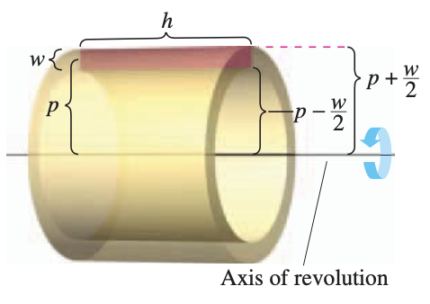

where $w$ is the width of the rectangle, $h$ is the height of the rectangle, and $p$ is the distance between the axis of revolution and the *center* of the rectangle. When this rectangle is revolved about its axis of revolution, it forms a cylindrical shell (or tube) of thickness $w$. To find the volume of this shell, consider two cylinders. The radius of the larger cylinder corresponds to the outer radius of the shell, and the radius of the smaller cylinder corresponds to the inner radius of the shell. Because $p$ is the average radius of the shell, you know the outer radius is $p+(w/2)$ and the inner radius is $p-(w/2)$.

$$p+\frac{w}{2} \quad \text{Outer radius}$$
$$p-\frac{w}{2} \quad \text{Inner radius}$$

So, the volume of the shell is
$$\begin{aligned} \text{Volume of shell} &= (\text{volume of cylinder}) - (\text{volume of hole}) \\ &= \pi \left( p + \frac{w}{2} \right)^2 h - \pi \left( p - \frac{w}{2} \right)^2h \\ &= 2\pi p h w \\ &= 2 \pi (\text{average radius}) (\text{height}) (\text{thickness}) \end{aligned}$$

::: {.grid}
::: {.g-col-12 .g-col-md-7}
You can use this formula to find the volume of a solid of revolution. Assume that the plane region in the figure on the right is revolved about a line to form the indicated solid. If you consider a horizontal rectangle of width $\Delta y$, then, as the plane region is revolved about a line parallel to the $x$-axis, the rectangle generates a representative shell whose volume is 
$$\Delta V = 2 \pi [ p(y)h(y)] \Delta y$$

You can approximate the volume of the solid by $n$ such shells of thickness $\Delta y$, height $h(y_i)$, and average radius $p(y_i)$.
:::
::: {.g-col-12 .g-col-md-5}
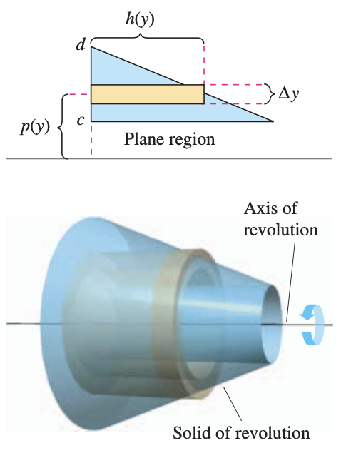
:::
:::

$$\text{Volume of solid} \approx \sum_{i=1}^n 2 \pi [ p(y_i)h(y_i)] \Delta  y = 2\pi  \sum_{i=1}^n [ p(y_i)h(y_i)] \Delta y$$

This approximation appears to become better and better as $||\Delta|| \to 0$ ($n \to \infty$). So, the volume of the solid is 
$$\begin{aligned} \text{Volume of solid} &= \lim_{||\Delta || \to 0} 2\pi  \sum_{i=1}^n [ p(y_i)h(y_i)] \Delta y \\ &= 2\pi \int_c^d [p(y)h(y)] \, dy \end{aligned}$$

::: {.callout-note title="Definition: The Shell Method" icon=false}
To find the volume of a solid of revolution with the **shell method**, use one of the following, as shown in the figure below.

**Horizontal Axis of Revolution:**
$$V = 2\pi \int_c^d p(y)h(y) \, dy$$

**Vertical Axis of Revolution:**
$$V = 2\pi \int_a^b p(x)h(x) \, dx$$
:::

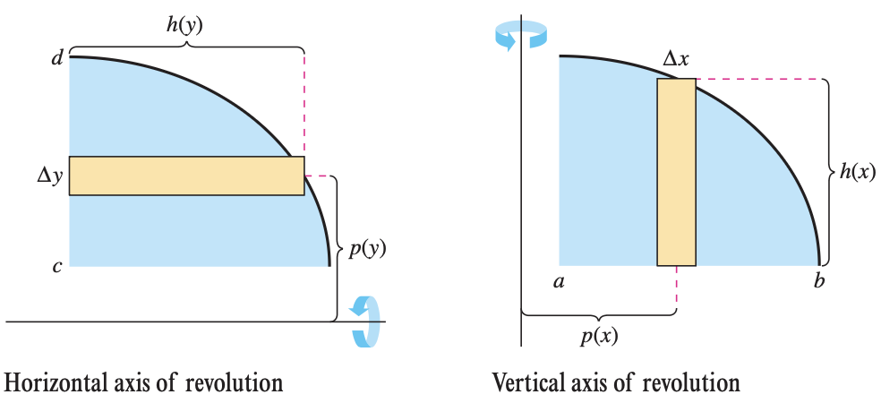

**Example:**
Find the volume of the solid of revolution formed by revolving the region bounded by 
$$y = x - x^3$$
and the $x$-axis, $0 \leq x \leq 1$, about the $y$-axis.

::: {.grid}
::: {.g-col-12 .g-col-md-7}
Because the axis of revolution is vertical, use a vertical representative rectangle, as shown in the figure. The width $\Delta x$ indicates that $x$ is the variable of integration. The distance from the center of the rectangle to the axis of revolution is $p(x)=x$, and the height of the rectangle is 
$$h(x)=x-x^3$$
:::
::: {.g-col-12 .g-col-md-5}
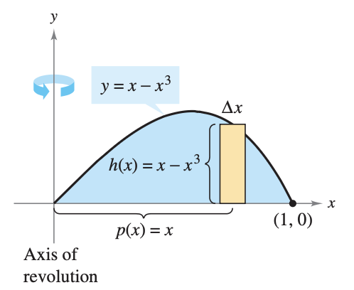
:::
:::

Because $x$ ranges from 0 to 1, the volume of the solid is
$$\begin{aligned} V &= 2\pi \int_0^1 x(x-x^3)\,dx && \text{Shell Method} \\ &= 2\pi \int_0^1 (-x^4 + x^2)\,dx && \text{Simplify} \\ &= 2\pi \left[ -\frac{x^5}{5} + \frac{x^3}{3} \right]_0^1 && \text{Integrate} \\ &= 2\pi \left( -\frac{1}{5} + \frac{1}{3} \right) \\ &= \frac{4\pi}{15} \end{aligned}$$


**Example:**
Find the volume of the solid of revolution formed by revolving the region bounded by the graph of 
$$x = e^{-y^2}$$
and the $y$-axis ($0 \leq y \leq 1$) about the $x$-axis.

::: {.grid}
::: {.g-col-12 .g-col-md-7}
Because the axis of revolution is horizontal, use a horizontal representative rectangle. The width $\Delta y$ indicates that $y$ is the variable of integration. The distance from the center of the rectangle to the axis of revolution is $p(y)=y$, and the height of the rectangle is 
$$h(y) = e^{-y^2}$$
:::
::: {.g-col-12 .g-col-md-5}
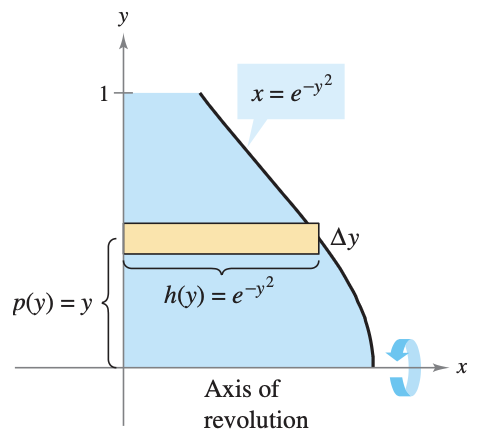
:::
:::

Because $y$ ranges from 0 to 1, the volume of the solid is
$$\begin{aligned} V &= 2\pi \int_0^1 y e^{-y^2} \, dy && \text{Shell Method} \\ &= -\pi \left[ e^{-y^2} \right]_0^1 \\ &= \pi \left( 1 - \frac{1}{e} \right) \\ &\approx 1.986 \end{aligned}$$

### Comparison of Disk and Shell Methods
The disk and shell methods can be distinguished as follows. For the disk method, the representative rectangle is always *perpendicular* to the axis of revolution, whereas for the shell method, the representative rectangle is always *parallel* to the axis of revolution, as shown in the figure below.

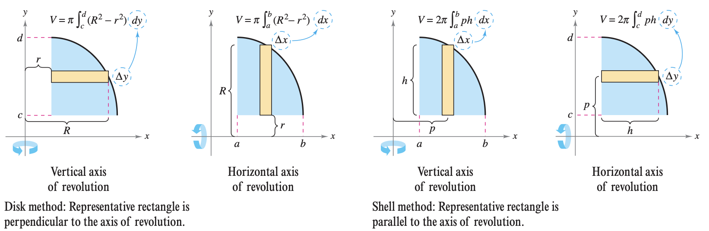

Depending on the situation, it may be more convenient to use one over the other.

**Example:**
Find the volume of the solid formed by revolving the region bounded by the graphs of 
$$y = x^2+1, \quad y=0, \quad x=0, \quad \text{ and } \quad x=1$$
about the $y$-axis.

This is the exact same problem as **Example 7.10**. So, we can once again see this by using the washer method:
$$\begin{aligned} V &= \pi \int_0^1 (1^2-0^2) \, dy + \pi \int_1^2 [1^2 - (\sqrt{y-1})^2] \, dy && \text{Apply washer method.} \\ &= \pi \int_0^1 1 \, dy + \pi \int_1^2 (2-y) \, dy && \text{Simplify.} \\ &= \pi \Bigg[ y \Bigg]_0^1 + \Bigg[ 2y-\frac{y^2}{2} \Bigg]_1^2 && \text{Integrate.} \\ &= \pi + \pi \left( 4-2-2+\frac{1}{2} \right) \\ &= \frac{3\pi}{2} \end{aligned}$$

However, the shell method only requires one integral to find the volume:
$$\begin{aligned} V &= 2\pi \int_a^b p(x)h(x) \, dx \\ &= 2\pi \int_0^1 x(x^2+1) \, dx \\ &= 2\pi \left[ \frac{x^4}{4} + \frac{x^2}{2} \right]_0^1 \\ &= 2\pi \left( \frac{3}{4} \right) \\ &= \frac{3 \pi}{2} \end{aligned}$$

In some cases, solving for $x$ is very difficult (or even impossible). In such cases you must use a vertical rectangle (of width $\Delta x$), thus making $x$ the variable of integration. The position (horizontal or vertical) of the axis of revolution then determines the method to be used. 

**Example:**
Find the volume of the solid formed by revolving the region bounded by the graphs of $y=x^3+x+1$, $y=1$, and $x=1$ about the line $x=2$, as shown in the figure below.

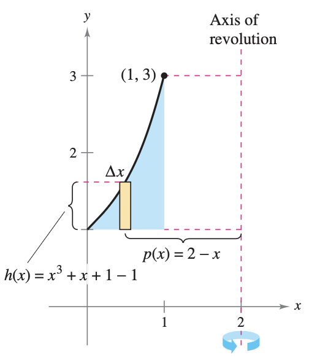

In the equation $y=x^3+x+1$, you cannot easily solve for $x$ in terms of $y$ (see Newton's Method). Therefore, the variable of integration must be $x$ and you should choose a vertical representative rectangle. Because the rectangle is parallel to the axis of revolution, use the shell method and obtain
$$\begin{aligned} V = 2\pi \int_a^b p(x)h(x) \, dx &= 2\pi \int_0^1 (2-x)(x^3+x+1-1) \, dx \\ &= 2\pi \int_0^1 (-x^4 + 2x^3 - x^2 + 2x) \, dx \\ &= 2\pi \left[ - \frac{x^5}{5} + \frac{x^4}{2} - \frac{x^3}{3} + x^2 \right]_0^1 \\ &= 2\pi \left( -\frac{1}{5} + \frac{1}{2} - \frac{1}{3} + 1 \right) \\ &= \frac{29\pi}{15} \end{aligned}$$

---

::: {.practice-box}
#### Exercises: The Shell Method

1. Let $R$ be the region bounded by the graphs of $y = x^2$, $y = 0$, and $x = 2$. Use the shell method to find the volume of the solid generated when $R$ is revolved about the $y$-axis.
   
   ::: {.callout-tip collapse="true" title="Show Answer" icon=false}
   **Solution:**
   Using the shell method to revolve around the $y$-axis requires integrating with respect to $x$. 
   The radius of a cylindrical shell is the distance from the $y$-axis to a vertical slice: $p(x) = x$.
   The height of the shell is the top curve minus the bottom curve: $h(x) = x^2 - 0 = x^2$.
   The region is bounded from $x = 0$ to $x = 2$.
   Set up the integral:
   $$V = 2\pi \int_{0}^{2} p(x)h(x) \, dx$$
   $$V = 2\pi \int_{0}^{2} (x)(x^2) \, dx$$
   $$V = 2\pi \int_{0}^{2} x^3 \, dx$$
   Find the antiderivative and evaluate:
   $$V = 2\pi \left[ \frac{1}{4}x^4 \right]_{0}^{2}$$
   $$V = 2\pi \left( \frac{1}{4}(16) - 0 \right)$$
   $$V = 2\pi (4) = 8\pi$$
   :::

2. Let $R$ be the region bounded by the graphs of $x = y^2$ and $x = 4$. Use the shell method to find the volume of the solid generated when $R$ is revolved about the $x$-axis.
   
   ::: {.callout-tip collapse="true" title="Show Answer" icon=false}
   **Solution:**
   Using the shell method to revolve around the $x$-axis requires integrating with respect to $y$.
   Because the region is symmetric across the $x$-axis, revolving just the top half of the region (from $y = 0$ to $y = 2$) will generate the entire solid. 
   The radius of a cylindrical shell is the distance from the $x$-axis: $p(y) = y$.
   The height of the shell spans horizontally from the left curve to the right vertical line: $h(y) = 4 - y^2$.
   Set up the integral:
   $$V = 2\pi \int_{0}^{2} y(4 - y^2) \, dy$$
   $$V = 2\pi \int_{0}^{2} (4y - y^3) \, dy$$
   Find the antiderivative and evaluate:
   $$V = 2\pi \left[ 2y^2 - \frac{1}{4}y^4 \right]_{0}^{2}$$
   $$V = 2\pi \left( \left( 2(4) - \frac{1}{4}(16) \right) - 0 \right)$$
   $$V = 2\pi (8 - 4)$$
   $$V = 2\pi (4) = 8\pi$$
   :::

3. Let $R$ be the region bounded by the graphs of $y = \sqrt{x}$, $y = 0$, and $x = 4$. Write, but do not evaluate, an integral expression using the shell method for the volume of the solid generated when $R$ is revolved about the vertical line $x = 6$.
   
   ::: {.callout-tip collapse="true" title="Show Answer" icon=false}
   **Solution:**
   Using the shell method around a vertical axis requires integrating with respect to $x$. The bounds are from $x = 0$ to $x = 4$.
   The axis of revolution is $x = 6$, which is to the right of the region. The radius of a shell is the distance from a generic vertical slice $x$ to the axis $x = 6$: $p(x) = 6 - x$.
   The height of the shell is $h(x) = \sqrt{x} - 0 = \sqrt{x}$.
   Set up the integral:
   $$V = 2\pi \int_{0}^{4} (6 - x)\sqrt{x} \, dx$$
   :::

4. Let $R$ be the region in the first quadrant bounded by the graph of $y = \sin(x^2)$, the $x$-axis, and the vertical line $x = \sqrt{\pi}$. Which of the following integrals represents the volume of the solid generated when $R$ is revolved about the $y$-axis?
   
   **(A)** $\pi \int_0^{\sqrt{\pi}} (\sin(x^2))^2 \, dx$
   
   **(B)** $2\pi \int_0^{\sqrt{\pi}} x \sin(x^2) \, dx$
   
   **(C)** $2\pi \int_0^{\pi} y \sin(y^2) \, dy$
   
   **(D)** $\pi \int_0^{\sqrt{\pi}} x^2 \sin(x^2) \, dx$

   ::: {.callout-tip collapse="true" title="Show Answer" icon=false}
   **Solution:**
   To revolve around the $y$-axis using the shell method, we integrate with respect to $x$.
   The radius of the shell is $p(x) = x$.
   The height of the shell is the distance from the $x$-axis to the curve: $h(x) = \sin(x^2)$.
   The bounds are given as $x = 0$ to $x = \sqrt{\pi}$.
   Using the formula $V = 2\pi \int_{a}^{b} p(x)h(x) \, dx$:
   $$V = 2\pi \int_{0}^{\sqrt{\pi}} x \sin(x^2) \, dx$$
   This matches expression **(B)**.
   :::

5. Let $R$ be the region bounded by the graphs of $y = x^3 - x^4$ and the $x$-axis.
   **a)** Briefly explain why using the disk/washer method to find the volume of the solid generated when $R$ is revolved about the $y$-axis would be difficult.
   **b)** Write an integral expression using the shell method that represents the volume of the solid generated when $R$ is revolved about the $y$-axis.
   **c)** Evaluate the integral from part (b) to find the volume of the solid.

   ::: {.callout-tip collapse="true" title="Show Answer" icon=false}
   **Solution:**
   First, find the points of intersection to establish the bounds:
   $$x^3 - x^4 = 0 \implies x^3(1 - x) = 0 \implies x = 0, x = 1$$
   
   **a)** To use the washer method around the $y$-axis, you must integrate with respect to $y$. This requires solving the equation $y = x^3 - x^4$ for $x$ in terms of $y$ to find the inner and outer radii. Because it is a 4th-degree polynomial, isolating $x$ is analytically extremely difficult or impossible for standard calculus students.
   
   **b)** Using the shell method allows us to integrate with respect to $x$. 
   The radius is $p(x) = x$ and the height is $h(x) = x^3 - x^4$.
   $$V = 2\pi \int_{0}^{1} x(x^3 - x^4) \, dx$$
   
   **c)** Evaluate the integral:
   $$V = 2\pi \int_{0}^{1} (x^4 - x^5) \, dx$$
   $$V = 2\pi \left[ \frac{1}{5}x^5 - \frac{1}{6}x^6 \right]_{0}^{1}$$
   $$V = 2\pi \left( \left( \frac{1}{5} - \frac{1}{6} \right) - 0 \right)$$
   Find a common denominator of 30:
   $$V = 2\pi \left( \frac{6}{30} - \frac{5}{30} \right) = 2\pi \left( \frac{1}{30} \right) = \frac{\pi}{15}$$
   :::
:::

::: {.conceptual-box}
#### Conceptual Questions

1. **The Fundamental Difference**
   When setting up a volume integral, your first step is drawing a representative rectangle. Geometrically, what is the single most important difference in how this rectangle is oriented relative to the axis of revolution for the Shell method compared to the Disk/Washer method?
   
   ::: {.callout-tip collapse="true" title="Possible Answer" icon=false}
   **Possible Answer:** For the Disk and Washer methods, the representative rectangle is always drawn *perpendicular* to the axis of revolution. For the Shell method, the representative rectangle is always drawn *parallel* to the axis of revolution.
   :::

2. **Unrolling the Shell**
   If you slice open a single cylindrical shell and flatten it out, it forms a rectangular slab. In the integral $2\pi \int p(x)h(x) \, dx$, the expression $2\pi p(x) \cdot h(x) \cdot dx$ calculates the volume of this slab. Geometrically, which specific dimensions of the flattened slab do $2\pi p(x)$ and $h(x)$ represent?
   
   ::: {.callout-tip collapse="true" title="Possible Answer" icon=false}
   **Possible Answer:** The expression $2\pi p(x)$ represents the length of the flattened slab, which corresponds to the circumference of the original unrolled cylindrical shell. The expression $h(x)$ represents the height of the rectangular slab, which corresponds exactly to the height of the original shell.
   :::

3. **Shifted Axes and the Radius $p(x)$**
   When revolving a region in the first quadrant around the y-axis, the radius of the shell is simply $p(x) = x$. If you revolve that exact same region around the vertical line $x = 5$ instead, how do you use the "Right $-$ Left" concept to write the new algebraic expression for the radius $p(x)$?
   
   ::: {.callout-tip collapse="true" title="Possible Answer" icon=false}
   **Possible Answer:** The radius $p(x)$ is the physical distance between the axis of revolution and the representative rectangle. Using the "Right $-$ Left" framework, the vertical line $x = 5$ is further to the right than the region in the first quadrant, making it the "Right" value. The position of the representative rectangle is simply $x$, making it the "Left" value. Therefore, the distance is $5 - x$.
   :::

4. **The Algebraic Wall**
   Suppose a region is bounded by $y = x^3 + x + 1$, $y=0$, $x=0$, and $x=1$, and you revolve it around the y-axis. Algebraically, why is it practically impossible to use the Washer method for this problem, forcing you to use the Shell method instead?
   
   ::: {.callout-tip collapse="true" title="Possible Answer" icon=false}
   **Possible Answer:** To use the Washer method around a vertical axis (the y-axis), you are forced to integrate with respect to $y$. This means you must solve the boundary equation $y = x^3 + x + 1$ for $x$ in terms of $y$. Algebraically isolating $x$ in a polynomial with both cubic and linear terms is incredibly difficult, creating an "algebraic wall." The Shell method avoids this entirely by allowing you to integrate with respect to $x$, using the function exactly as it is written.
   :::

5. **Axes and Variables ($dx$ vs. $dy$)**
   You are revolving a region around a *vertical* axis. If you use the Washer method, you must integrate with respect to $y$ ($dy$). If you use the Shell method, what variable must you integrate with respect to, and geometrically, why does the method dictate this choice?
   
   ::: {.callout-tip collapse="true" title="Possible Answer" icon=false}
   **Possible Answer:** For the Shell method around a vertical axis, you must integrate with respect to $x$ ($dx$). Geometrically, the Shell method requires the representative rectangle to be parallel to the axis of revolution. A rectangle parallel to a vertical axis must be drawn vertically. The infinitesimally small width (or thickness) of a vertical rectangle is measured along the x-axis, which dictates a width of $dx$.
   :::
:::